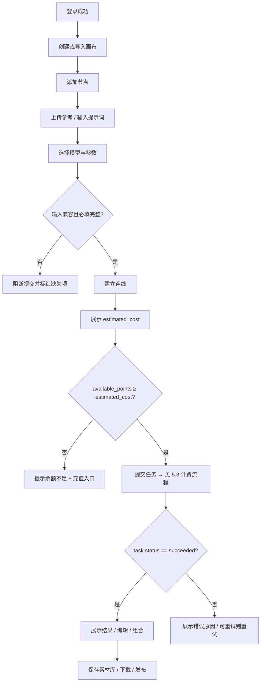
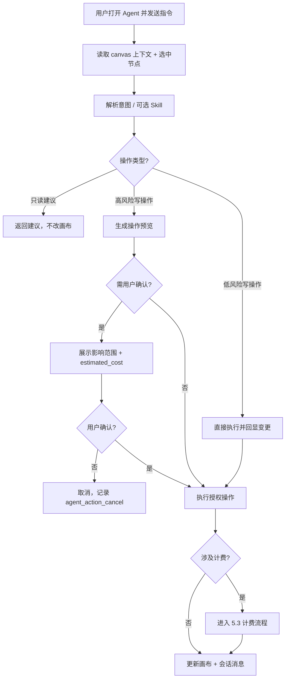
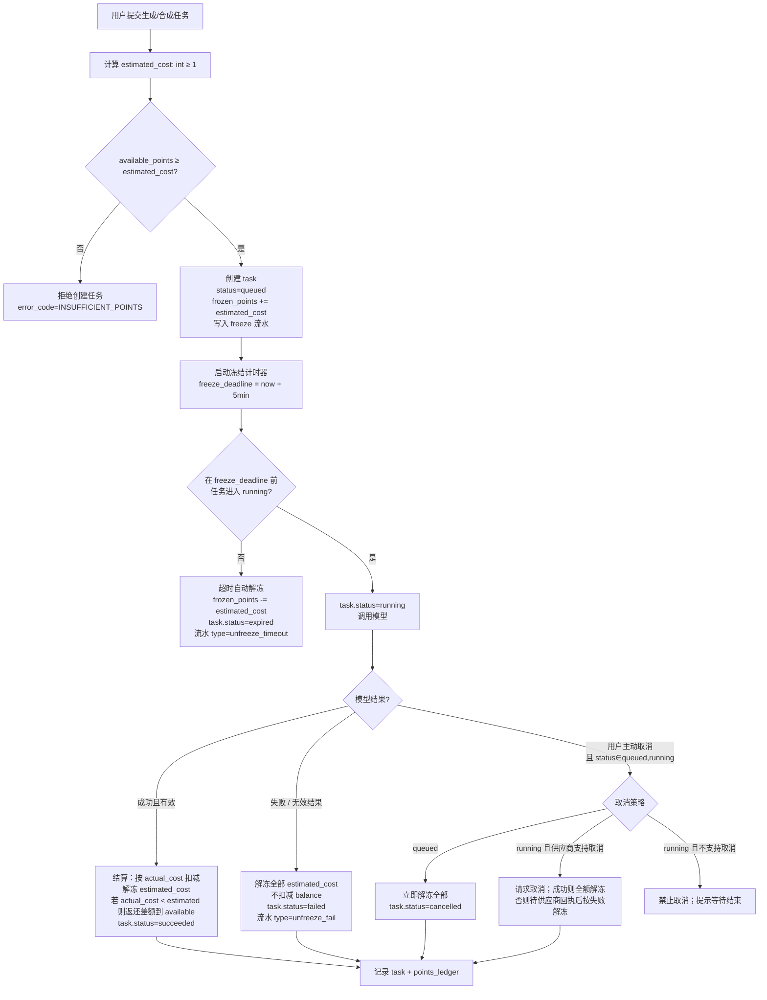
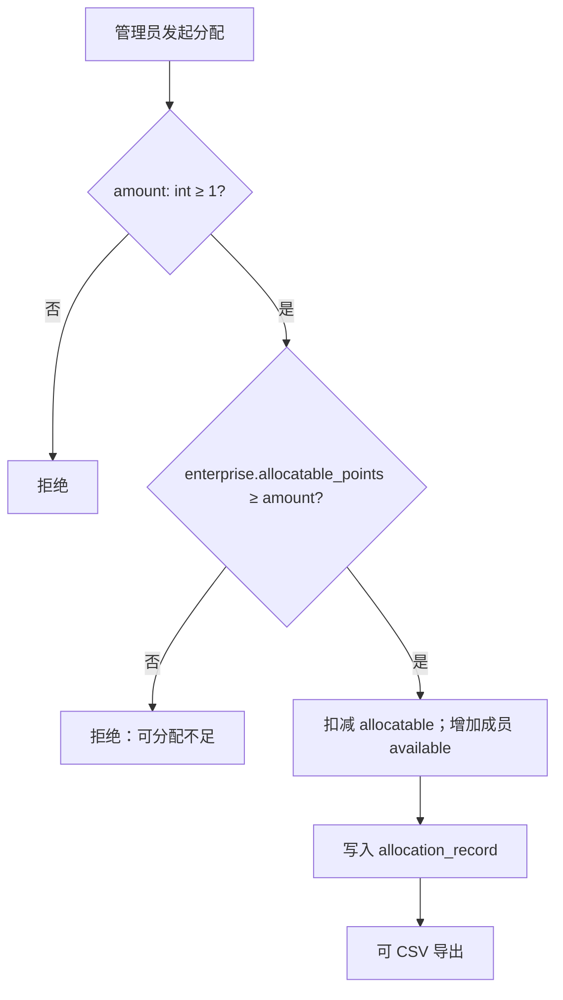
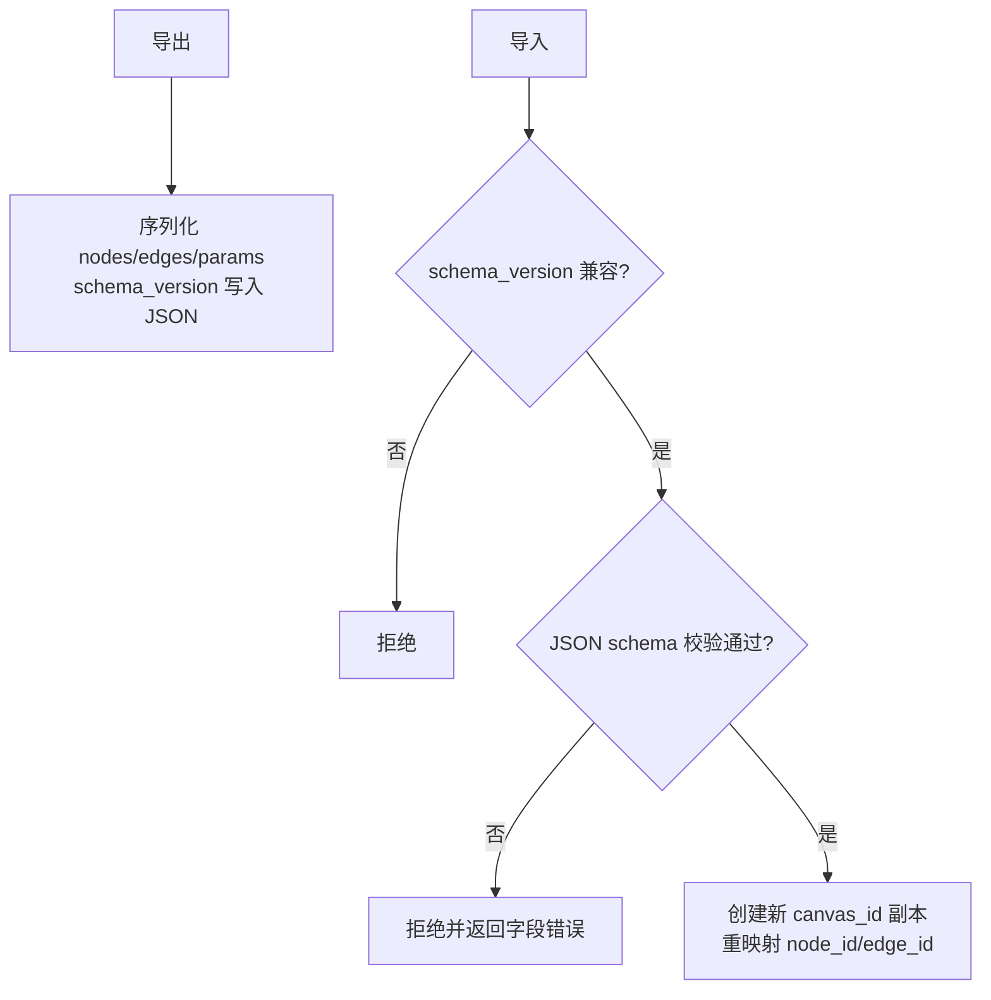

# VibePaper 产品需求文档（PRD）

> **文档性质**：工程契约（非需求备忘）  
> **检验标准**：当所有需求方消失后，仅凭本文档，新团队能否交付功能一致、无关键漏洞的产品？  
> **文档依据**：《VibePaper 项目执行计划.xlsx》（功能范围与优先级权威来源）+《VibePaper 产品功能清单》+《PRD 七大核心组件框架》  
> **优先级原则**：P0/P1/P2 以执行计划「任务清单」为准；本文 §4.3、§6、附录 A 与之对齐并补全工程契约细节（流程/数据字典/权限/异常/埋点等）  
> **文档版本**：V2.1  
> **文档状态**：待产品、设计、技术与测试评审签字  
> **编制日期**：2026-07-29  
> **修订**：V2.0 七大组件补全 → V2.1 按执行计划回写范围与优先级（纠正此前以 PRD 改计划的方向）

---

## 0. 文档使用说明

### 0.1 七大核心组件（缺一不可）

| # | 组件 | 作用 | 本文位置 |
|---|---|---|---|
| 1 | 业务流程图 | 可验证逻辑路径（含异常分支与判断条件） | §5 |
| 2 | 数据字典 | 字段类型、约束、生成规则唯一化 | §8 |
| 3 | 权限矩阵 | 角色 × 操作 × 数据范围 × 冲突策略 | §9 |
| 4 | 异常场景清单 | 每个主流程配套异常验证表 | §5 各节附、§10 |
| 5 | 埋点规范 | 事件名、触发条件、必传参数 | §11 |
| 6 | 兼容性边界 | 支持环境精确到版本号 | §0.2 |
| 7 | 术语一致性声明 | 全文唯一用词，禁止同义词混用 | §1 |

### 0.2 兼容性边界（体验一致性底线）

**浏览器支持（V1.0 / P0–P1）：**

| 浏览器 | 最低版本 | 支持范围 |
|---|---|---|
| Chrome | 100+ | 全部功能 |
| Edge | 100+ | 全部功能 |
| Safari | 16+ | 基础创作（画布、节点、生成、素材库、Agent 对话） |
| Safari | 17+ | 画布高级视觉效果与未来实时协作（若上线） |
| Firefox | 不支持 V1.0 | — |

**设备与平台：**

| 环境 | V1.0 支持 |
|---|---|
| 桌面端（≥1280px 宽） | 完整创作能力 |
| 平板（768–1279px） | 仅浏览与素材预览，不保证创作操作 |
| 移动端（&lt;768px） | **不支持 V1.0** |
| 操作系统 | Windows 10+、macOS 12+ |

**运行时依赖：**

- WebGL 2.0 或 Canvas 2D（画布渲染回退路径须在技术选型中明确）
- 本地存储可用（自动保存草稿依赖 IndexedDB / localStorage）
- 第三方模型 API 可达；离线模式不在 V1.0 范围

**风险色标约定（全文统一）：**

| 标记 | 含义 |
|---|---|
| 🔴 | 异常场景未定义或存在安全/资金风险 |
| 🟡 | 数据约束模糊或待业务确认 |
| 🟢 | 已通过检查、可直接开发 |

---

## 1. 术语一致性声明（沟通成本灭火器）

> **强制规则**：同一概念全文仅使用下表「标准术语」。禁止使用「同义词」列中的词指代同一对象。评审时发现混用即退回修订。

| 标准术语 | 英文标识 | 定义 | 唯一标识字段 | 禁止混用 |
|---|---|---|---|---|
| 画布 | Canvas | 用户创建的可视化工作流容器 | `canvas_id` | 工作区、白板、项目、空间（「管理空间」指导航区域，非画布本身） |
| 节点 | Node | 画布中的功能单元（文本/图片/视频/音频/合成/导演台等卡片） | `node_id` | 模块、组件、卡片（UI 可称「卡片」，数据与接口一律称「节点」） |
| 连线 | Edge | 节点间数据引用关系，左侧输入、右侧输出 | `edge_id` | 连接、箭头、管道 |
| 任务 | Task | 一次模型调用或合成执行的计费与状态实体 | `task_id` | 作业、请求、生成（「生成」指用户动作，「任务」指系统实体） |
| 点数 | Points | 平台虚拟计费单位，**整数**，最小单位 1 | `points` / `frozen_points` | 积分、代币、Token（Token 专指 LLM token） |
| 冻结点数 | Frozen Points | 任务提交后预扣、结算前不可再消费的点数 | `frozen_points` | 预扣、锁定、占用（对外文案可用「预扣」，数据字段统一 `frozen_points`） |
| 素材 | Asset | 可复用的多媒体文件实体 | `asset_id` | 资源、文件、媒体 |
| 会话 | Session | Agent 与用户的一轮连续对话上下文 | `session_id` | 聊天、对话（UI 可称「对话」，实体称「会话」） |
| Skill | Skill | 可复用的 Agent 指令包 | `skill_id` | 技能包、提示词模板（对外可称「技能」） |
| 企业 | Enterprise | 团队组织实体，拥有共享点数与素材 | `enterprise_id` | 团队、组织、公司（UI「企业中心」对应此实体） |
| 管理空间 | Workspace Hub | 登录后导航区域：画布列表、历史、创意广场、个人中心入口 | — | 不得与「画布」混用 |
| Agent | Agent | 可读取画布上下文并执行授权操作的对话助手 | — | 助手、机器人、Copilot |

---

## 2. 项目概述

### 2.1 项目名称

VibePaper——矩阵像素 AI 原生节点化画布创作工具。

### 2.2 项目背景

影视短片、创意广告和概念设定等内容生产通常需在文本工具、图片/视频生成平台、剪辑软件与素材管理工具间反复切换，存在：

- 创作链路分散，素材、提示词与生成结果难以统一管理；
- 多模态上下游关系不直观，修改上游后难追踪影响；
- AI 工具门槛高，用户需分别理解多模型与参数；
- 团队素材、点数与成员权限缺少集中管理；
- 创作经验难沉淀与复用。

本项目建设以**无限画布**为容器、以**节点**为内容单元、以**连线**表达数据引用、以 **Agent** 驱动流程的多模态内容生产平台，使用户在同一画布内完成「创意—生成—编辑—组合—导出」。

### 2.3 产品定位

面向个人创作者和内容生产团队的 AI 原生节点化多媒体创作平台。

### 2.4 核心设计理念

- **全链路**：灵感、资料、生成到成品输出均在画布内完成。
- **节点化**：文本、图片、视频、音频及工具均以节点表示，连线建立引用。
- **AI 原生**：Agent 理解画布上下文并执行创建、编辑与编排。
- **持续成长**：会话历史、Skill、长期记忆沉淀偏好。
- **低门槛**：同时支持拖拽操作与自然语言操作。

---

## 3. 项目目标与成功指标

### 3.1 业务目标

- 建立覆盖文本、图片、视频、音频的统一 AI 创作入口。
- 支持个人付费及企业点数分配两类商业模式。
- 通过创意广场、可复用画布、素材库和 Skill 提升复用率。
- 建立模型、计费、审核、监控与运营后台，支撑持续运营。

### 3.2 用户目标

- 无需跨平台完成多模态创作。
- 直观看到素材与生成任务的上下游关系。
- 通过 Agent 用自然语言创建或调整工作流。
- 个人与团队可复用画布、素材、Skill 及历史会话。

### 3.3 成功指标（须与 §11 埋点对齐）

| 指标 | 定义 | 目标 | 对应埋点事件 |
|---|---|---|---|
| 首次创作完成率 | 新用户首次进入后成功生成至少一项内容的比例 | 立项确认基线 | `task_generate_success`（新用户 cohort） |
| 核心任务成功率 | 提交任务后返回可用结果且用户未取消的比例 | ≥95% | `task_generate_success` / `task_generate_fail` |
| 创作闭环率 | 创建画布后至少一次生成并下载/保存/发布 | 立项确认 | `asset_download` / `asset_save_to_library` / `canvas_publish` |
| Agent 执行成功率 | Agent 发起的画布操作正确完成且无需人工修正 | 立项确认 | `agent_action_success` / `agent_action_fail` |
| 素材复用率 | 再次拖入画布或用于生成的素材占比 | 立项确认 | `asset_drag_to_canvas` |
| 付费转化率 | 活跃用户中完成点数充值或企业充值的比例 | 立项确认 | `points_recharge_success` |

### 3.4 非目标

首期不以替代专业影视后期软件为目标；不提供复杂时间线剪辑、调色、专业音频混音或三维建模。后台标记为「构思」的功能须独立范围确认后再进入研发。

---

## 4. 用户、场景与范围

### 4.1 目标用户

| 用户角色 | 核心诉求 | 主要功能 |
|---|---|---|
| 个人创作者 | 快速完成多模态创作 | 画布、节点、Agent、素材库 |
| 影视/广告从业者 | 管理复杂素材关系并形成可复用流程 | 连线、编组、堆叠、导演台、合成 |
| 企业成员 | 使用团队点数与共享素材协同 | 企业素材库、团队点数、画布复用 |
| 企业管理员 | 管理成员、点数、素材与用量 | 成员管理、点数分配、统计、企业设置 |
| 企业所有者 | 企业最终控制权 | 改名、解散、管理员权限全集 |
| 平台运营人员 | 管理用户、模型、计费、内容与活动 | 后台管理系统 |
| 平台运维人员 | 保障调用、队列与稳定性 | 监控、告警、备份 |

### 4.2 核心使用场景

1. **影视短片**：剧本拆解 → 角色/场景图 → 分镜视频 → 合成 → 下载。
2. **创意商片**：产品素材上传 → 风格图 → 动态视频 → 多版本比较与导出。
3. **概念设定**：描述 → 多方案图 → 扩图/超分 → 素材沉淀。
4. **Agent 自动创作**：描述目标 → Agent 规划节点 → 创建并连接 → 调用模型 → 返回结果。
5. **团队协作（非实时编辑）**：管理员分配点数 → 成员使用共享素材创作 → 企业查看用量。🟢 V1.0 **不支持**多人同时编辑同一画布；冲突策略见 §9.3。

### 4.3 优先级范围（对齐执行计划）

> 下列范围摘自《VibePaper 项目执行计划.xlsx》任务清单统计（P0:50 / P1:58 / P2:3）。编号对照见 **附录 A**。

| 优先级 | 范围摘要 | 执行计划对应 |
|---|---|---|
| **P0** | 注册登录与个人中心；**订阅菜单**（点数/订阅方案/购买点数/界面设置）；画布 CRUD/导入导出；无限画布（含一键整理）；节点与连线；文本/图片/音频生成与结果展示下载；视频**生成**；个人素材库基础；Agent 对话/画布操作/**偏好与用量**；任务历史；生成状态与异常；后端画布/连线/生成/任务队列/模型网关/点数冻结结算与流水/存储素材/认证 | F-01~F-04、F-07~F-08、F-09-01、F-10、F-13-01/02、F-14~F-15、F-19、F-23、F-25、F-34；B-01~B-05、B-06-01、B-07-01、B-08、B-11~B-20、B-25~B-27 |
| **P1** | 编组/堆叠；图片加工（裁剪/扩图/超分/**Seedance**）；视频剪辑/提帧/超分/**Seedance**/下载存库；合成与导演台；企业素材转入；Skill；对话历史与会话片段；**画布分享**；**奖励签到**；**邀请中心**；创意广场；企业中心全套；**公告查看**；后台用户/内容审核/模型/API/定价/充值套餐/交易/公告/审计等 | F-05~F-06、F-09-02/03、F-11~F-12、F-13-03、F-16~F-17、F-20~F-22、F-24、F-26~F-33；B-06-02、B-07-02、B-09~B-10、B-21~B-24、B-28~B-29、B-31~B-38、B-40~B-47 |
| **P2** | **记忆系统**（短期+长期）；后台**会员体系**管理 | F-18；B-30、B-39 |

### 4.4 范围约束

- 第三方模型能力、价格、时长与内容限制受供应商约束。
- 「100% 复刻」仅指已确认功能与关键交互，不含商标、受版权素材、私有算法与不可获取内部实现。
- 支付、发票、内容审核与隐私功能上线前须完成合规审查。

---

## 5. 业务流程图（核心骨架）

> **改进标准**：凡涉及状态变更、多角色协作、资金/资源流转的场景，必须用带异常分支的流程图呈现；每个菱形判断节点标注**具体条件**（例：`available_points ≥ estimated_cost`），禁止「是否充足」等模糊表述。

### 5.1 创作主流程

#### 5.1 异常场景验证表

| 异常类型 | 系统行为 | 用户反馈 | 责任方 |
|---|---|---|---|
| 画布自动保存冲突（`version` 落后） | 拒绝覆盖，拉取最新版并提示合并 | Toast：「画布已在其他会话更新，请刷新」 | 前端+后端 |
| 节点被删除但仍有进行中任务 | 任务继续至终态；结果写入任务历史，不挂回已删节点 | 任务历史可见；画布上无该节点 | 后端 |
| 上游节点输出被切换 | 下游标记 `edge.valid=false`（灰色），不自动重跑 | 下游提示「上游输出已变更」 | 前端 |
| 导入 JSON 版本不兼容 | 拒绝导入，返回 `schema_version` 要求 | 弹窗说明最低兼容版本 | 后端+前端 |

---

### 5.2 Agent 决策与执行流程

#### 5.2.1 Agent 确认触发阈值（强制量化）🟢

| 操作类别 | 是否必须确认 | 触发条件（具体） |
|---|---|---|
| 创建/连接/排列节点（无计费） | 否 | 单次变更节点数 ≤ 20 |
| 批量创建节点 | 是 | 单次拟创建节点数 **&gt; 20** |
| 修改节点参数 | 是 | 任一数值参数相对原值变化幅度 **≥ 30%**；或切换模型 |
| 删除节点/连线 | 是 | 删除节点数 ≥ 1，或删除含有效下游的连线 |
| 发起生成任务 | 是 | 凡 `estimated_cost ≥ 1` |
| 覆盖节点当前输出 | 是 | 目标节点已有 `current_output_id` |
| 批量删除 / 清空画布 | 是 | 任意 |
| 消耗点数的合成 | 是 | 任意 |

#### 5.2 异常场景验证表

| 异常类型 | 系统行为 | 用户反馈 | 责任方 |
|---|---|---|---|
| Agent 规划超时（&gt;30s 无完整计划） | 终止本轮规划，不改画布 | 「Agent 响应超时，请重试」 | 后端 |
| Agent 拟执行超权限操作 | 拒绝并列出权限不足项 | 「无权执行：…」 | 后端 |
| 用户确认前画布已被本地其他操作修改 | 作废预览，要求重新规划 | 「画布已变更，请重新发送指令」 | 前端 |
| Agent 执行中途用户关闭面板 | 已提交任务继续；未提交的预览作废 | 任务在节点/历史中可见 | 前端+后端 |

---

### 5.3 计费与点数状态机（资金流转·必须可视化）🟢

#### 5.3.1 点数账户状态

| 字段 | 含义 |
|---|---|
| `available_points` | 可消费余额 = `balance` − `frozen_points` |
| `frozen_points` | 已冻结、待结算总额 |
| `balance` | 账面总点数（含冻结） |

#### 5.3.2 BPMN 风格计费流程图

#### 5.3.3 冻结 / 解冻 / 退还规则（契约）🟢

| 规则 ID | 条件 | 系统行为 |
|---|---|---|
| BILL-01 | 提交时 `available_points ≥ estimated_cost` | 冻结 `estimated_cost`；`task.status=queued` |
| BILL-02 | 提交后 **5 分钟**内未进入 `running` | **超时自动解冻**；`task.status=expired`；不扣费 |
| BILL-03 | 模型返回成功且结果通过校验 | 按 `actual_cost` 结算；解冻预扣；差额退回 available |
| BILL-04 | 模型失败 / 超时终态 / 结果无效 | **全额解冻**，不扣费 |
| BILL-05 | 用户取消且仍为 `queued` | 全额解冻 |
| BILL-06 | `actual_cost` 计算规则 | V1.0：`actual_cost = estimated_cost`（供应商若返回用量再调价须走配置变更）；🟡 差异化结算待确认 |
| BILL-07 | 企业成员消费 | 优先扣成员被分配余额；不足则 **不**自动借企业池（除非企业开启「共享池」配置，默认关闭） |

#### 5.3 异常场景验证表

| 异常类型 | 系统行为 | 用户反馈 | 责任方 |
|---|---|---|---|
| 模型调用超时（30s 无首包 / 供应商超时配置） | 有限重试 **最多 2 次**（间隔 2s、5s）；仍失败则 `failed` + 全额解冻 | 「服务繁忙，请重试」；点数已退回 | 后端 |
| 冻结与结算并发双写 | 以 `task_id` 幂等键；流水唯一约束 `(task_id, ledger_type)` | 无感知；监控告警重复尝试 | 后端 |
| 用户任务执行中注销账户 | 进行中任务标记 `cancelled_by_account_deletion`；全额解冻未结算点数；已成功任务结果按隐私策略删除或匿名化（见合规） | 注销流程提示「未完成任务将取消并退还冻结点数」 | 后端 |
| 结算时 `actual_cost > available+frozen`（异常配置） | 拒绝超额扣减；告警；任务标 `settlement_error`；保留冻结待人工 | 「计费异常，已通知客服」 | 后端+运营 |
| 企业管理员回收成员点数时成员有冻结 | 仅可回收 `available`；冻结部分不可回收直至任务终态 | 「存在进行中任务冻结点数，可回收 X」 | 后端 |

---

### 5.4 企业点数分配流程

#### 5.4 异常场景验证表

| 异常类型 | 系统行为 | 用户反馈 | 责任方 |
|---|---|---|---|
| 并发分配导致超卖 | 行锁/事务；失败方回滚 | 「可分配点数不足，请刷新」 | 后端 |
| 回收量 &gt; 成员 available | 拒绝；不触及 frozen | 「最多可回收 N 点」 | 后端 |
| 非管理员调用接口 | 403 | 「权限不足」 | 后端 |

---

### 5.5 画布导入 / 导出流程

---

## 6. 功能需求

> 本节按执行计划模块补全；括号内优先级以 xlsx 为准。工程契约细节（状态机、异常、埋点）见 §5 / §8–§11。

### 6.1 FR-CANVAS：无限画布

#### 6.1.1 画布操作（P0）

- 提供可无限平移和缩放的创作区域。
- 选择模式与抓手模式切换。
- 适应视图与**一键整理**（P0，对应 F-02-02）。
- 左侧入口、右键菜单或双击空白处新建节点。
- 移动、缩放、复制、删除、框选、编辑节点。
- 删除节点须提示影响范围（下游节点列表），并同步删除关联连线。

#### 6.1.2 连线系统（P0）

- 左侧输入端、右侧输出端。
- 从输出端拖至兼容输入端建立连线。
- 点击输出端可呼出节点类型列表，选择后自动创建并连接下游。
- 阻止：自连接、重复连线、不兼容类型连接。
- 状态色：蓝色=有效、灰色=无效、黑色=选中；**颜色不得作为唯一信息**，须同步文案/图标。
- 下游可读有效上游的当前输出。

#### 6.1.3 编组与堆叠（P1｜F-05/F-06）

- 框选多节点可编组；设颜色；网格或水平布局；取消编组保留坐标与连线。
- 多节点可堆叠为一张卡片并拼图预览；双击展开，点空白收起；可拉出单节点或取消堆叠。
- 编组/堆叠支持批量下载可下载内容。

### 6.2 FR-NODE：内容节点与创作

#### 6.2.1 文本节点（P0｜F-07）

- 新增、Markdown/富文本编辑、AI 文本生成。
- 上传参考、选模型、设份数、预览消耗；结果可编辑并保存至素材库；生成历史。
- 🟡 Markdown ↔ 富文本是否无损双向转换：见 §14 待确认。

#### 6.2.2 图片节点

**P0（F-08-01/02｜B-06-01）**

- 上传或模型生成；模型/分辨率/风格/份数；消耗预览与提交。
- 生成历史列表；单图/四宫格/九宫格结果展示；全屏预览、下载、保存素材库；历史结果切换为当前输出。

**P1（B-06-02）**

- 图片裁剪（单图/四宫格/九宫格）、扩图、超分。
- Seedance 2.0 素材认证对接；状态展示黄/绿/红及失败原因。

#### 6.2.3 视频节点

**P0（F-09-01｜B-07-01）**

- AI 生成视频；模型选择；参数（运镜/风格/份数）；消耗预览。

**P1（F-09-02/03｜B-07-02）**

- 剪辑（拖动首尾边界确认时间范围）；提取帧（拖动时间轴截取当前帧）。
- 超分；Seedance 2.0 认证；下载；存入素材库；全屏展示；生成历史。

#### 6.2.4 音频节点（P0｜F-10）

- 上传参考或模型生成；模型/风格/份数；试听、下载、素材库。

#### 6.2.5 通用生成规则（P0｜F-34）

- 提交前校验：必填参数、输入引用、模型 `status=enabled`、`available_points ≥ estimated_cost`。
- 节点任务状态机：`idle → queued → running → succeeded | failed | cancelled | expired`。
- 失败展示可读错误码映射文案；`retryable=true` 时提供重试（重新走 §5.3）；支持取消。
- 多份结果保留在节点历史；用户指定 `current_output_id`。
- 点数不足提示并提供充值入口。

### 6.3 FR-ENHANCE：生成增强（P1｜F-11/F-12）

#### 6.3.1 合成节点

- 多视频输入、指定顺序预览；合成前显示 `estimated_cost`；成功返回可播放可下载视频。

#### 6.3.2 导演台节点

- 可作为图片/视频上游；增删场景与模型；调颜色/位置/大小/姿势/视角；「拍照」渲染为图片输出。

### 6.4 FR-ASSET：个人素材库（P0 基础｜P1 企业转入）

- **P0（F-13-01/02）**：侧边栏；图标/列表模式；本地上传或从节点保存；拖入或菜单导入画布；下载、替换、重命名、预览、删除（二次确认；被引用须提示影响）。
- **P1（F-13-03）**：有权限的个人素材可添加至企业素材库。

### 6.5 FR-AGENT：Agent 对话系统

#### 6.5.1 对话与执行（P0｜F-14/B-26/B-27）

- 右下角打开/收起；读取当前画布节点、连线与选中内容。
- 多轮对话与创作建议；可创建、修改、连接、排列节点；支持全流程自动创作编排。
- **重要操作确认规则以 §5.2.1 为准**，不可仅写「重要操作需确认」。

#### 6.5.2 面板、偏好与用量（P0｜F-15）

- 打开/收起对话框；对话重置。
- 偏好设置：默认文本/图片/视频模型及分辨率。
- 展示当前对话用量：Token 总量、各模型消耗、点数消耗。

#### 6.5.3 会话历史（P1｜F-17/B-29）

- 查看当前画布及其他画布对话历史；新建对话。
- 保存会话片段至可复用历史；将片段导入当前对话。

#### 6.5.4 Skill 系统（P1｜F-16/B-28）

- 浏览、搜索、选择、切换、查看。
- 创建方式：空白 / 从当前对话生成 / 上传 Markdown。
- 至少含名称、描述、指令；上传校验格式、大小、内容安全。

#### 6.5.5 记忆系统（P2｜F-18/B-30）

- 短期记忆：理解当前 session 创作上下文。
- 长期记忆：记录用户偏好/风格/方向/习惯；支持查看与删除；后端含嵌入与检索。

### 6.6 FR-WORKSPACE：管理空间

#### 6.6.1 画布管理（P0｜F-01）

- 新建、进入、重命名、导入、导出、删除（二次确认）。
- 导入/导出为版本化 JSON（`schema_version`），校验兼容性。
- 列表：名称、缩略图、更新时间、当前画布标记。

#### 6.6.2 历史记录（P0｜F-23）

- 字段：时间、缩略图、模态、模型、点数、提示词、状态、结果链接。
- 按提示词、模型、状态、模态、时间筛选；重置、刷新、复制提示词；跳转对应画布。

#### 6.6.3 画布分享（P1｜F-20/B-23）

- 生成共享链接；管理共享状态（公开 / 私密 / 仅链接）。
- 支持上传到创意工坊（与创意广场联动）。
- 权限控制：未授权访客仅可按链接策略访问。

#### 6.6.4 创意广场（P1｜F-24/B-24）

- 浏览、搜索、全屏预览公开作品；查看节点流程；克隆允许复用的公开画布至个人管理空间。
- 克隆生成独立 `canvas_id`，不得修改原作品；可删除自己上传的作品。

#### 6.6.5 个人中心（P0｜F-25）

- 账户身份信息、当前剩余点数、点数消耗概览（图表）。
- 每日签到入口（签到能力详见 §6.9，P1）；界面设置；退出登录。

### 6.7 FR-ACCOUNT：订阅、奖励与邀请

#### 6.7.1 订阅菜单（P0｜F-19/B-20）

- 查看用户名、用户 ID、个人点数、总可用点数。
- 个人订阅方案展示与订阅；购买点数；订单与支付回调（合规后启用真实支付）。
- 企业方案优势展示；获取顾问联系方式。
- 界面设置：亮/暗主题、中/英文。

#### 6.7.2 奖励与签到（P1｜F-21/B-21）

- 每日签到按钮与签到状态；连续签到判定与奖励发放。
- 每日任务列表、完成判定与奖励领取。

#### 6.7.3 邀请中心（P1｜F-22/B-22）

- 查看我的邀请码与邀请链接；邀请人数与成功记录。
- 输入邀请码接受邀请；邀请关系绑定与奖励发放。
- 查看指南；反馈建议入口。

#### 6.7.4 公告查看（P1｜F-33/B-46）

- 用户端查看公告列表与详情弹窗；已读/未读标记。
- 后台公告 CRUD、发布与下架（见 §6.9）。

### 6.8 FR-ENTERPRISE：企业中心（P1｜F-26~F-32）

- 管理员复制邀请链接；有效链接加入企业。
- 展示企业码、名称、总点数、可分配点数。
- 查看成员；分配/回收点数；移出成员。
- 分配操作记录：时间、类型、对象、数值、操作后余额；可搜索与 CSV 导出。
- 企业素材库共享管理；企业点数充值；用量统计（企业/个人 + 时间筛选）。
- **仅企业所有者**可改名或解散（二次确认）。

### 6.9 FR-ADMIN：后台管理系统（P1 为主｜会员 P2）

**P1（B-38、B-40~B-47 等）**

- 用户列表/详情/启用禁用/封禁/注销（软删）。
- 公开画布内容审核、下架及批量处理。
- 模型配置启停、默认参数；第三方 API Key、限流、健康监控、调用日志。
- 模型差异化定价与折扣；充值套餐 CRUD；交易记录与退款。
- 公告管理；审计日志（操作人、时间、对象、变更前后值、IP）。

**P2（B-39）**

- 会员等级 CRUD、权益定义、定价、升级续费规则、会员状态。

敏感操作须二次确认 + 权限校验。删除用户、内容下架、点数变更、企业解散为高风险操作。

---

## 7. 验收标准

### 7.1 画布与节点

| 编号 | Given | When | Then |
|---|---|---|---|
| AC-01 | 用户已进入画布 | 平移、缩放并适应视图 | 响应流畅，节点相对位置与连线不变 |
| AC-02 | 画布可编辑 | 左侧/右键/双击新增节点 | 三种方式均创建正确类型节点 |
| AC-03 | 存在多节点 | 框选、移动、复制、删除 | 仅影响选中节点；刷新后一致 |
| AC-04 | 存在多节点 | 一键整理 | 节点不重叠，连线仍指向原节点 |

### 7.2 连线

| 编号 | Given | When | Then |
|---|---|---|---|
| AC-05 | 存在兼容上下游 | 输出端连至输入端 | 蓝色有效连线，下游可读上游输出 |
| AC-06 | 从输出端打开列表 | 选择兼容节点类型 | 创建下游并自动连线 |
| AC-07 | 自连/重复/不兼容 | 松开连线 | 拒绝并说明原因 |
| AC-08 | 已有连线 | 选中删除 | 连线移除，下游不再引用 |

### 7.3 内容生成与计费

| 编号 | Given | When | Then |
|---|---|---|---|
| AC-09 | 有效提示词与参数 | 切换模型或参数 | `estimated_cost` 实时更新 |
| AC-10 | `available_points ≥ estimated_cost` | 提交任务 | 状态机流转正确；成功展示并保存结果；流水可追溯 |
| AC-11 | `available_points &lt; estimated_cost` | 提交 | 不创建收费任务；提示不足 + 充值入口 |
| AC-12 | 模型失败或超时重试耗尽 | 终态 failed | 全额解冻；节点展示错误原因 |
| AC-12b | 任务 `queued` 超过 5 分钟未 running | 系统定时任务 | `expired` + 自动解冻；用户可见退回 |
| AC-13 | 多结果任务 | 用户选择其一 | 成为 `current_output`；其余留历史 |

### 7.4 素材与项目

| 编号 | Given | When | Then |
|---|---|---|---|
| AC-14 | 节点有结果 | 保存素材库 | 出现在个人素材库且可拖入画布 |
| AC-15 | 有效画布 | 导出后导入 | 节点、参数、坐标、连线与兼容素材引用可恢复（新 ID） |
| AC-16 | 素材被引用 | 删除 | 提示影响 + 二次确认 |
| AC-17 | 公开可复用作品 | 克隆 | 个人独立副本；原作不变 |

### 7.5 Agent

| 编号 | Given | When | Then |
|---|---|---|---|
| AC-18 | 画布有节点连线 | 询问工作流 | 正确描述关键上下游 |
| AC-19 | 明确创作目标 | Agent 执行 | 正确创建连接；参数符合指令 |
| AC-20 | 拟执行 §5.2.1 需确认操作 | 未确认前 | 不提交；确认后才执行 |
| AC-20b | 参数变化 ≥30% | Agent 拟修改 | 必须弹出确认 |
| AC-21 | 多轮修改 | 继续指令 | 保持会话上下文，不重复无关节点 |
| AC-22 | 删除长期记忆 | 再查看 | 不可见且不参与上下文 |

### 7.6 企业与后台

| 编号 | Given | When | Then |
|---|---|---|---|
| AC-23 | 可分配充足 | 分配点数 | allocatable 与成员余额正确；有分配记录 |
| AC-24 | 成员 available 足够 | 回收 | 双方更新；有记录；不回收 frozen |
| AC-25 | 普通成员 | 改名/解散 | 拒绝 |
| AC-26 | 后台改模型状态/价格 | 保存 | 新任务用新配置；历史不改写 |
| AC-27 | 点数变更/内容下架 | 完成 | 审计日志含操作者、时间、对象、前后值 |

---

## 8. 数据字典（系统一致性基石）

> **强制**：关键字段必须在本表有唯一类型与约束。未入表字段不得进入接口契约。

### 8.1 标识与生成规则

| 字段名 | 类型 | 约束 | 生成规则 | 示例 | 关联流程 |
|---|---|---|---|---|---|
| `user_id` | string | 非空，不可变 | UUIDv4 | `a1b2c3d4-e5f6-7890-abcd-ef1234567890` | 账号 |
| `canvas_id` | string | 非空，不可变 | UUIDv4 | 同上格式 | §5.1 / §5.5 |
| `node_id` | string | 画布内唯一 | UUIDv4；导入时重新生成并维护映射表 | — | §5.1 |
| `edge_id` | string | 画布内唯一 | UUIDv4；导入重映射 | — | §5.1 |
| `task_id` | string | 全局唯一 | UUIDv4 | — | §5.3 |
| `asset_id` | string | 全局唯一 | UUIDv4 | — | 素材 |
| `session_id` | string | 全局唯一 | UUIDv4 | — | Agent |
| `skill_id` | string | 全局唯一 | UUIDv4 | — | Skill |
| `enterprise_id` | string | 全局唯一 | UUIDv4 | — | §5.4 |
| `ledger_id` | string | 全局唯一 | UUIDv4 | — | §5.3 |
| `schema_version` | string | semver | 导出时写入，当前 `1.0.0` | `1.0.0` | §5.5 |

### 8.2 点数与计费字段

| 字段名 | 类型 | 约束 | 示例 | 关联流程 |
|---|---|---|---|---|
| `balance` | int | ≥0 | 1000 | §5.3 |
| `frozen_points` | int | ≥0；≤ balance | 50 | [计费流程-冻结] |
| `available_points` | int | 计算字段：`balance - frozen_points`；≥0 | 950 | [计费流程-步骤校验] |
| `estimated_cost` | int | ≥1 | 12 | 提交前预览 |
| `actual_cost` | int | ≥0；V1.0 默认 = estimated_cost | 12 | 结算 |
| `freeze_deadline` | datetime (ISO8601 UTC) | 创建任务时 = now+5min | `2026-07-29T02:05:00Z` | 超时解冻 |
| `ledger_type` | enum | `freeze` / `unfreeze_timeout` / `unfreeze_fail` / `unfreeze_cancel` / `settle` / `recharge` / `allocate` / `recycle` | `freeze` | 流水 |
| `points`（流水变动） | int | 非 0；冻结/扣减为负方向在流水中用 `direction` 表达 | -50 | 流水 |

> 🟢 **点数为整数，不支持小数。** 若未来支持分位，须单独版本升级数据字典与全部计费逻辑。

### 8.3 任务与节点状态

| 字段名 | 类型 | 约束 / 枚举 | 示例 | 关联流程 |
|---|---|---|---|---|
| `task.status` | enum | `queued` / `running` / `succeeded` / `failed` / `cancelled` / `expired` / `settlement_error` | `running` | §5.3 |
| `node.type` | enum | `text` / `image` / `video` / `audio` / `compose` / `director` | `image` | 画布 |
| `edge.valid` | bool | — | true | 连线 |
| `error_code` | string | 稳定枚举，见 §10.2 | `MODEL_TIMEOUT` | 异常 |
| `retryable` | bool | — | true | 失败重试 |
| `current_output_id` | string \| null | 指向结果对象 ID | — | 节点输出 |
| `canvas.version` | int | ≥1；每次成功保存 +1 | 42 | 并发控制 |

### 8.4 核心对象一览

| 对象 | 关键字段（详见上表及接口文档展开） |
|---|---|
| 用户 | `user_id`、身份、状态、`balance`/`frozen_points`、企业归属、偏好 |
| 画布 | `canvas_id`、名称、所有者、`version`、缩略图、nodes、edges、权限 |
| 节点 | `node_id`、`type`、位置、尺寸、参数、状态、`current_output_id`、历史 |
| 连线 | `edge_id`、源/目标节点与端口、`valid` |
| 素材 | `asset_id`、类型、URL、所有者、企业归属、元数据、认证状态 |
| 任务 | `task_id`、`node_id`、模型、输入、参数、`status`、结果、错误、费用、`freeze_deadline` |
| 点数流水 | `ledger_id`、账户、`ledger_type`、数量、前后余额、`task_id` |
| 会话 | `session_id`、`canvas_id`、消息、token 用量、点数消耗 |
| Skill | `skill_id`、名称、描述、指令、所有者、来源、版本 |
| 企业 | `enterprise_id`、名称、所有者、总点数、allocatable、成员配额 |

---

## 9. 权限矩阵（安全与协作标尺）

> 用 **角色 × 操作 × 数据范围** 替代散文描述。未列出的操作默认 **拒绝**。

### 9.1 角色定义

| 角色代码 | 说明 |
|---|---|
| `guest` | 未登录 |
| `user` | 登录个人用户 |
| `ent_member` | 企业成员 |
| `ent_admin` | 企业管理员 |
| `ent_owner` | 企业所有者 |
| `ops_admin` | 平台运营管理员 |
| `super_admin` | 超级管理员 |

### 9.2 权限矩阵（节选·强制覆盖资金/隐私/协作）

| 角色 | 操作 | 允许数据范围 | 冲突 / 并发策略 |
|---|---|---|---|
| `guest` | 浏览创意广场 | 仅 `visibility=public` 且审核通过 | 只读 |
| `user` | CRUD 画布 | 仅 `owner_id = self` | 同用户多标签页：`canvas.version` 乐观锁；冲突时拒绝覆盖，提示刷新 |
| `user` | CRUD 个人素材 | 仅本人 | 删除前检查引用 |
| `user` | 导出生成结果 | 本人任务成功结果；**未付费/未结算成功的结果不可导出**（无 `succeeded` 结算不得下载） | — |
| `ent_member` | 使用企业素材 | 本企业 `enterprise_assets` | 只读或企业策略允许的上传 |
| `ent_member` | 修改节点参数 | 仅本人创建的画布内节点 | V1.0 无多人实时编辑；若未来开启：保留最后提交版本，标记冲突字段 |
| `ent_admin` | 查看成员任务历史 | 本企业成员的任务元数据（模型、点数、状态、时间）；**默认不可查看提示词全文与结果文件**，除非企业设置 `admin_can_view_content=true`（默认 false） | — |
| `ent_admin` | 分配/回收点数 | 本企业 allocatable / 成员 available | 事务；不可回收 frozen |
| `ent_admin` | 移出成员 | 非 owner | 移出前冻结任务按 BILL 解冻到成员个人或企业池（🟡 归属待确认，建议：解冻回企业 allocatable） |
| `ent_owner` | 改名 / 解散企业 | 本企业 | 解散二次确认；解散后资源按合规归档 |
| `ops_admin` | 下架公开画布 | 全平台公开内容 | 审计日志 |
| `ops_admin` | 调整模型定价 | 全平台 | 仅影响新任务 |
| `super_admin` | 管理管理员与安全配置 | 全平台 | 审计 + 双人复核（P2） |

### 9.3 协作与冲突（V1.0 明确边界）🟢

| 场景 | V1.0 策略 |
|---|---|
| 两人同时编辑同一画布 | **不支持**实时协作。画布仅所有者可写；P1 通过「画布分享」（公开/私密/仅链接）与「克隆副本」协作，见 §6.6.3 |
| 同账号多端写入 | 乐观锁 `version`；失败方提示刷新；**不**自动静默覆盖 |
| Agent 与用户同时改同一节点 | 以时间序最后一次成功保存为准；Agent 高风险操作须确认，降低覆盖意外 |

---

## 10. 异常场景总清单（稳定性保障）

> 每个主流程至少 3 类异常；以下为跨模块汇总，详细表见 §5。

### 10.1 强制覆盖清单

| ID | 异常类型 | 系统行为 | 用户反馈 | 责任方 |
|---|---|---|---|---|
| EX-01 | 模型超时 | 重试≤2；失败则终止任务并解冻 | 「服务繁忙，请重试」 | 后端 |
| EX-02 | 模型返回无效/空结果 | `failed` + 全额解冻 | 「生成结果无效」 | 后端 |
| EX-03 | 点数不足 | 不创建任务 | 「余额不足」+ 充值 | 前端+后端 |
| EX-04 | 冻结超时 5min | `expired` + 解冻 | 「任务排队超时，点数已退回」 | 后端 |
| EX-05 | 用户取消 queued | 解冻 | 「已取消」 | 后端 |
| EX-06 | 注销时有进行中任务 | 取消未结算任务并解冻 | 注销须知中明示 | 后端 |
| EX-07 | 上传恶意/超限文件 | 拒绝存储 | 明确错误原因 | 后端 |
| EX-08 | 第三方内容安全拦截 | 任务失败；按 BILL-04 解冻 | 「内容未通过安全审核」 | 后端 |
| EX-09 | 画布 version 冲突 | 拒绝保存 | 「请刷新后重试」 | 前端+后端 |
| EX-10 | Agent 越权 | 拒绝 | 列出无权限操作 | 后端 |

### 10.2 稳定错误码（节选）

| error_code | 含义 | retryable |
|---|---|---|
| `INSUFFICIENT_POINTS` | 可用点数不足 | false |
| `MODEL_TIMEOUT` | 模型超时 | true |
| `MODEL_UNAVAILABLE` | 模型下线/熔断 | true |
| `CONTENT_BLOCKED` | 内容安全拦截 | false |
| `INVALID_INPUT` | 参数/引用不合法 | false |
| `FREEZE_EXPIRED` | 排队超时解冻 | true（可重新提交） |
| `VERSION_CONFLICT` | 画布版本冲突 | true |
| `PERMISSION_DENIED` | 无权限 | false |

---

## 11. 埋点规范（数据驱动依据）

> 禁止只写「需监控任务成功率」。必须定义事件名、触发条件与必传参数。

### 11.1 核心事件

#### `task_generate_submit`

- **触发条件**：用户或 Agent 确认后成功创建任务（已通过点数校验并完成冻结）
- **必传参数**：
  - `task_id` (string)
  - `user_id` (string)
  - `node_id` (string)
  - `model_type` (string, e.g. `"qwen-max"`)
  - `estimated_cost` (int)
  - `source` (enum: `user` \| `agent`)

#### `task_generate_success`

- **触发条件**：模型返回**有效结果**且用户**未**在终态前取消；`task.status` 变为 `succeeded` 并完成结算
- **必传参数**：
  - `task_id` (string)
  - `model_type` (string)
  - `process_time` (int, ms) — 从 `running` 到 `succeeded`
  - `actual_cost` (int)
  - `output_count` (int)

#### `task_generate_fail`

- **触发条件**：`task.status` ∈ `failed` / `expired` / `settlement_error`
- **必传参数**：`task_id`、`model_type`、`error_code`、`process_time`、`points_unfrozen` (int)

#### `task_generate_cancel`

- **触发条件**：用户或注销流程取消任务成功
- **必传参数**：`task_id`、`from_status`、`points_unfrozen`

#### `agent_confirm_show` / `agent_confirm_accept` / `agent_confirm_reject`

- **触发条件**：分别对应确认框展示、接受、拒绝
- **必传参数**：`session_id`、`action_type`、`confirm_reason`（如 `param_delta_ge_30` / `cost_ge_1` / `delete`）

#### `agent_action_success` / `agent_action_fail`

- **触发条件**：Agent 写操作完成或失败
- **必传参数**：`session_id`、`action_type`、`node_count_affected`、`error_code`（失败时）

#### `points_freeze` / `points_unfreeze` / `points_settle`

- **触发条件**：对应流水写入成功
- **必传参数**：`ledger_id`、`task_id`、`amount`、`ledger_type`、`balance_after`

#### `asset_save_to_library` / `asset_download` / `asset_drag_to_canvas`

- **必传参数**：`asset_id`、`asset_type`、`canvas_id`（若有）

#### `canvas_publish` / `canvas_clone`

- **必传参数**：`canvas_id`、`source_canvas_id`（克隆时）

#### `points_recharge_success`

- **必传参数**：`order_id`、`points`、`amount_cny`（或等价）、`channel`

### 11.2 指标计算口径

| 指标 | 口径 |
|---|---|
| 核心任务成功率 | `count(task_generate_success) / count(task_generate_submit)`（同一 `task_id` 不重复计） |
| Agent 执行成功率 | `agent_action_success / (success+fail)`，不含用户主动 `confirm_reject` |

---

## 12. 非功能需求

### 12.1 性能

- 常规画布操作目标 50–60 FPS；节点较多时不得阻塞基础平移缩放。
- 非生成类接口正常负载 P95 ≤ 1s。
- 首屏可交互 ≤ 3s；超大画布懒加载/分区渲染。
- 上传、生成、合成须可感知进度或状态。

### 12.2 稳定性与一致性

- 自动保存 + `canvas.version` 乐观锁。
- 任务/计费/流水幂等；禁止重复扣费。
- 第三方超时有限重试（见 EX-01）。
- 任务状态与点数结算可追溯（`task_id` ↔ `ledger_id`）。

### 12.3 安全与合规

- API Key、支付与身份信息不得明文进普通日志。
- 用户仅能访问本人或已授权企业数据（§9）。
- 上传校验格式、大小、恶意内容。
- 公开作品须内容安全检测或审核。
- 隐私政策、用户协议、版权投诉、账号注销（含 EX-06）。

### 12.4 可访问性

- 核心操作提供键盘替代与明确焦点。
- 颜色状态须配合文字/图标。

### 12.5 可观测性

- 日志字段至少：`task_id`、`user_id`、模型、耗时、状态、`error_code`、实际费用。
- 对成功率、错误率、队列积压、点数异常设告警。

---

## 13. 依赖、约束与风险

| 风险/依赖 | 影响 | 措施 | 风险色 |
|---|---|---|---|
| 第三方模型不稳定或变价 | 失败、成本失控 | 健康检查、熔断、备用模型、动态定价 | 🟡 |
| 大画布节点过多 | 卡顿、保存失败 | 虚拟化、增量保存、压测 | 🟡 |
| 多媒体存储成本 | CDN/存储费用 | 分层存储、配额、转码 | 🟡 |
| Agent 误操作 | 错扣费、丢内容 | §5.2.1 确认、预览、撤销、审计 | 🟢 规则已量化 |
| 点数并发 | 重复扣费 | 事务、幂等键、冻结结算 | 🟢 状态机已定义 |
| 内容版权与安全 | 合规风险 | 检测、审核、投诉 | 🟡 |
| 「100% 复刻」膨胀 | 范围失控 | 功能对照表与验收基线 | 🟡 |

---

## 14. 待确认事项（确认前不得当作已定契约）

| # | 事项 | 影响组件 | 建议默认（待批） |
|---|---|---|---|
| 1 | 独立品牌还是内部原型 | 品牌/合规 | — |
| 2 | 首期是否含真实支付充值 | 计费/法务 | P0 含订阅菜单与点数购买接口；真实支付可模拟回调后切换 | 
| 3 | 首期模型清单 | 节点/计费 | 须列出具体 model_type |
| 4 | `actual_cost` 是否可异于 estimated | BILL-06 | V1.0 相等 |
| 5 | 企业是否区分 owner/admin/member | §9 | **是**（本文已按此写） |
| 6 | 是否多人实时协作 | §9.3 | V1.0 **否**；P1 用分享链接 |
| 7 | 公开画布先审后发 vs 先发后审 | 创意广场 | 建议先审后发 |
| 8 | 存储配额/大小/保留期 | 素材 | 待定数值 |
| 9 | Seedance 认证接口与状态枚举 | 图片/视频 P1 | 执行计划已排 P1，接口细节待供应商确认 |
| 10 | Markdown↔富文本无损 | 文本节点 | 待定 |
| 11 | 管理员能否看成员提示词/结果 | §9.2 | 默认否 |
| 12 | 成员移出时冻结点数归属 | §9.2 | 建议退回企业 allocatable |
| 13 | 邀请奖励与签到奖励的点数规则 | §6.7 | 待运营给出数值表 |
| 14 | 个人订阅方案档位与权益 | §6.7.1 / B-39 | 套餐内容待定；后台会员管理为 P2 |

---

## 15. 里程碑建议（对齐执行计划优先级）

1. **需求确认**：以执行计划 xlsx 为范围基线；本 PRD 工程契约评审签字。  
2. **原型与技术验证**：大画布性能、节点执行、模型调用、**计费闭环（含超时解冻）**。  
3. **MVP（P0）**：执行计划全部 P0 任务（用户端创作闭环 + 订阅/点数 + Agent 基础 + 计费流水；**不含**运营后台，后台为 P1）。  
4. **内测与压测**：核心流程、扣费准确性、画布性能。  
5. **P1 增强**：编组堆叠、音视频加工与 Seedance、合成/导演台、Skill/会话史、分享/签到/邀请/公告、创意广场、企业中心、运营后台。  
6. **P2**：记忆系统、后台会员体系。  

具体日期与负责人以执行计划排期为准。

---

## 16. 需求完成定义（Definition of Done）

单项需求同时满足方可完成：

- 产品规则、界面状态、权限、异常流程已确认；
- 接口、数据字典字段、计费规则有明确约定；
- 正常/边界/失败场景有测试用例；
- 对应验收标准全部通过；
- 日志、埋点、监控、审计已实现；
- 无阻塞级缺陷，相关文档已更新。

---

## 17. PRD 落地检查清单（交付前必过）

> **规则**：任一项未达标则 PRD **不可交付**。测试工程师评审前逐项签字。

| 检查项 | 通过标准 | V2.1 状态 | 签字 |
|---|---|---|---|
| 流程可视化 | 所有状态机均有带条件标注的流程图 | 🟢 §5.1–5.5 已补；计费含冻结→执行→扣除/退还/超时解冻 | |
| 数据明确定义 | 关键字段在数据字典有唯一约束与生成规则 | 🟢 §8；`task_id`=UUIDv4；点数=int | |
| 权限显性化 | 角色×操作×数据用表格声明 | 🟢 §9；含管理员看历史、导出未付费结果、冲突策略 | |
| 异常全覆盖 | 每个主流程≥3 类异常 | 🟢 §5 附表 + §10 | |
| 埋点可验证 | 事件名与参数对齐数据分析 | 🟢 §11；`task_generate_success` 口径明确 | |
| 环境无歧义 | 支持范围精确到版本号 | 🟢 §0.2；Chrome/Edge 100+；Safari 16+/17+；移动端不支持 V1.0 | |
| 术语零歧义 | 同一概念全文用词一致 | 🟢 §1 术语表；禁止画布/工作区/白板混指 | |
| 与执行计划一致 | §4.3/§6/附录 A 优先级与范围对齐 xlsx | 🟢 V2.1 已按执行计划回写 | |

### 17.1 评审角色签字栏

| 角色 | 姓名 | 日期 | 结论（通过/退回） |
|---|---|---|---|
| 产品经理 | | | |
| 技术负责人 | | | |
| 测试工程师 | | | |
| 设计负责人 | | | |

---

## 18. 修订记录

| 版本 | 日期 | 说明 |
|---|---|---|
| V1.0 | 2026-07-27 | 初版需求草案 |
| V2.0 | 2026-07-29 | 按七大核心组件系统化重写：流程图、数据字典、权限矩阵、异常、埋点、兼容性、术语 |
| V2.1 | 2026-07-29 | **以执行计划 xlsx 为范围权威**：回写 P0/P1/P2；补全分享/签到/邀请/公告/订阅菜单；Seedance 与音视频加工归 P1；记忆与后台会员归 P2；运营后台归 P1；新增附录 A 映射表 |

---

## 附录 A. 执行计划功能映射（xlsx → PRD）

> 权威来源：`VibePaper项目执行计划.xlsx`。开发排期以 xlsx 任务编号为准；PRD 提供契约细节。

### A.1 前端功能（F）

| 功能编号 | xlsx 优先级 | PRD 章节 | 说明 |
|---|---|---|---|
| F-01 | P0 | §6.6.1 | 画布列表与 CRUD |
| F-02 | P0 | §6.1.1 | 无限画布（含一键整理） |
| F-03 | P0 | §6.1.1 | 节点操作 |
| F-04 | P0 | §6.1.2 | 连线 |
| F-05 | P1 | §6.1.3 | 编组 |
| F-06 | P1 | §6.1.3 | 堆叠 |
| F-07 | P0 | §6.2.1 | 文本节点 |
| F-08 | P0 | §6.2.2 | 图片生成与结果（加工见 B-06-02 P1） |
| F-09 | P0+P1 | §6.2.3 | 生成 P0；剪辑/超分/Seedance/下载存库 P1 |
| F-10 | P0 | §6.2.4 | 音频节点 |
| F-11 | P1 | §6.3.1 | 合成 |
| F-12 | P1 | §6.3.2 | 导演台 |
| F-13 | P0+P1 | §6.4 | 素材库基础 P0；企业转入 P1 |
| F-14 | P0 | §6.5.1 | Agent 对话 |
| F-15 | P0 | §6.5.2 | 面板/偏好/用量 |
| F-16 | P1 | §6.5.4 | Skill |
| F-17 | P1 | §6.5.3 | 对话历史 |
| F-18 | P2 | §6.5.5 | 记忆（短+长） |
| F-19 | P0 | §6.7.1 | 订阅菜单 |
| F-20 | P1 | §6.6.3 | 画布分享 |
| F-21 | P1 | §6.7.2 | 奖励签到 |
| F-22 | P1 | §6.7.3 | 邀请中心 |
| F-23 | P0 | §6.6.2 | 任务历史 |
| F-24 | P1 | §6.6.4 | 创意广场 |
| F-25 | P0 | §6.6.5 | 个人中心 |
| F-26~F-32 | P1 | §6.8 | 企业中心 |
| F-33 | P1 | §6.7.4 | 公告查看 |
| F-34 | P0 | §6.2.5 | 生成状态与异常 |

### A.2 后端功能（B）

| 功能编号 | xlsx 优先级 | PRD 章节 | 说明 |
|---|---|---|---|
| B-01~B-04 | P0 | §6.1 / §5.5 | 画布与连线 API |
| B-05 / B-06-01 / B-07-01 / B-08 | P0 | §6.2 | 四类生成 API |
| B-06-02 / B-07-02 | P1 | §6.2.2–6.2.3 | 图片/视频加工含 Seedance |
| B-09~B-10 | P1 | §6.3 | 合成/导演台 |
| B-11~B-15 | P0 | §5.3 / §6.2.5 | 模型、任务、计费、流水 |
| B-16~B-17 | P0 | §6.4 | 存储与素材 |
| B-18~B-20 | P0 | §6.7.1 | 认证、用户信息、订阅充值 |
| B-21~B-23 | P1 | §6.7.2–6.7.3 / §6.6.3 | 签到、邀请、分享 |
| B-24 | P1 | §6.6.4 | 创意广场 |
| B-25 | P0 | §6.6.2 | 任务历史 |
| B-26~B-27 | P0 | §6.5.1 | Agent 对话与操作 |
| B-28~B-29 | P1 | §6.5.3–6.5.4 | Skill、会话 |
| B-30 | P2 | §6.5.5 | 记忆系统 |
| B-31~B-37 | P1 | §6.8 | 企业中心 |
| B-38 / B-40~B-47 | P1 | §6.9 | 运营后台 |
| B-39 | P2 | §6.9 | 会员管理 |
| B-46 | P1 | §6.7.4 / §6.9 | 公告 |

---

**最终强调**：执行计划决定「做什么、何时做」；PRD 决定「如何无歧义地做成」。二者冲突时，**范围与优先级以 xlsx 为准**，契约细节以 PRD 为准并回写进评审。
