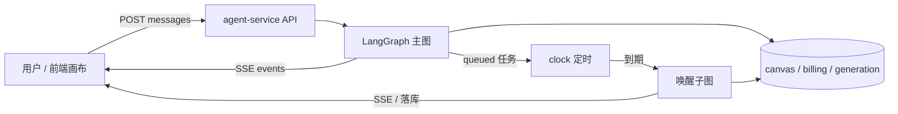
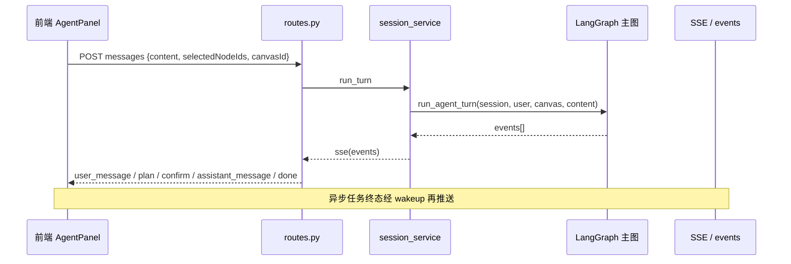
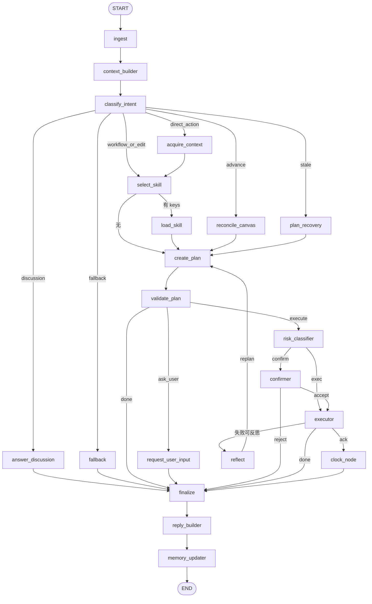
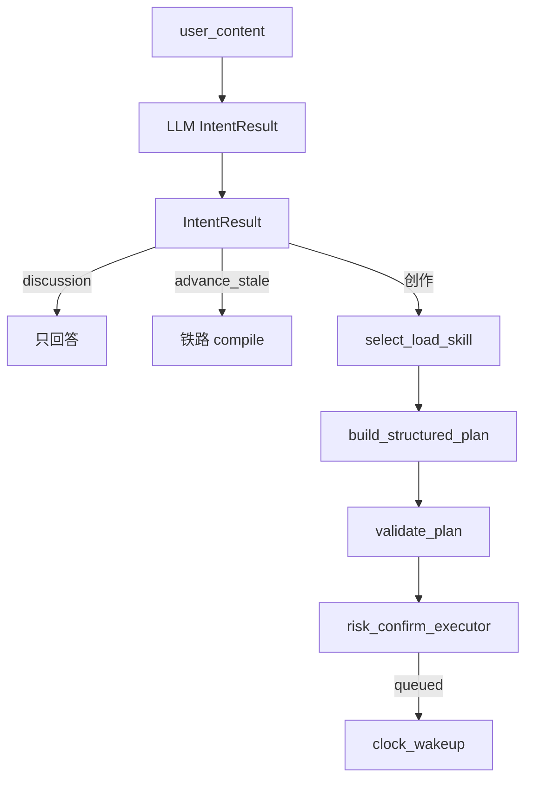
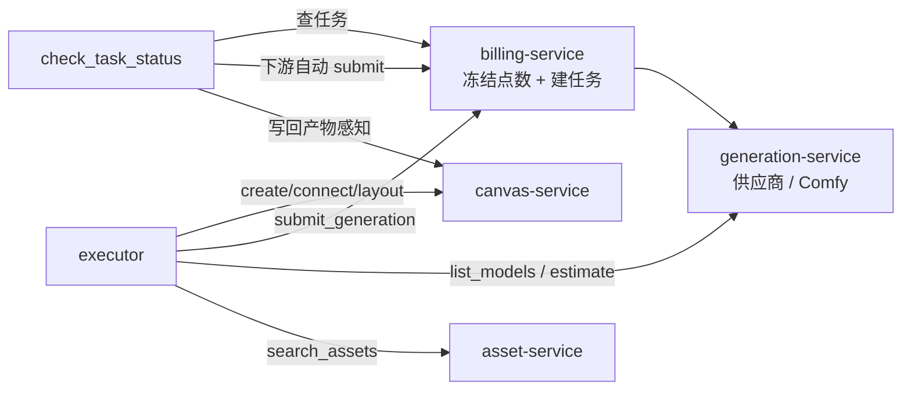
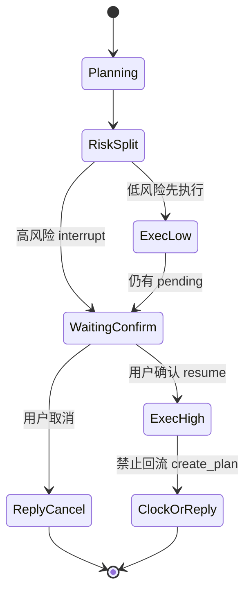
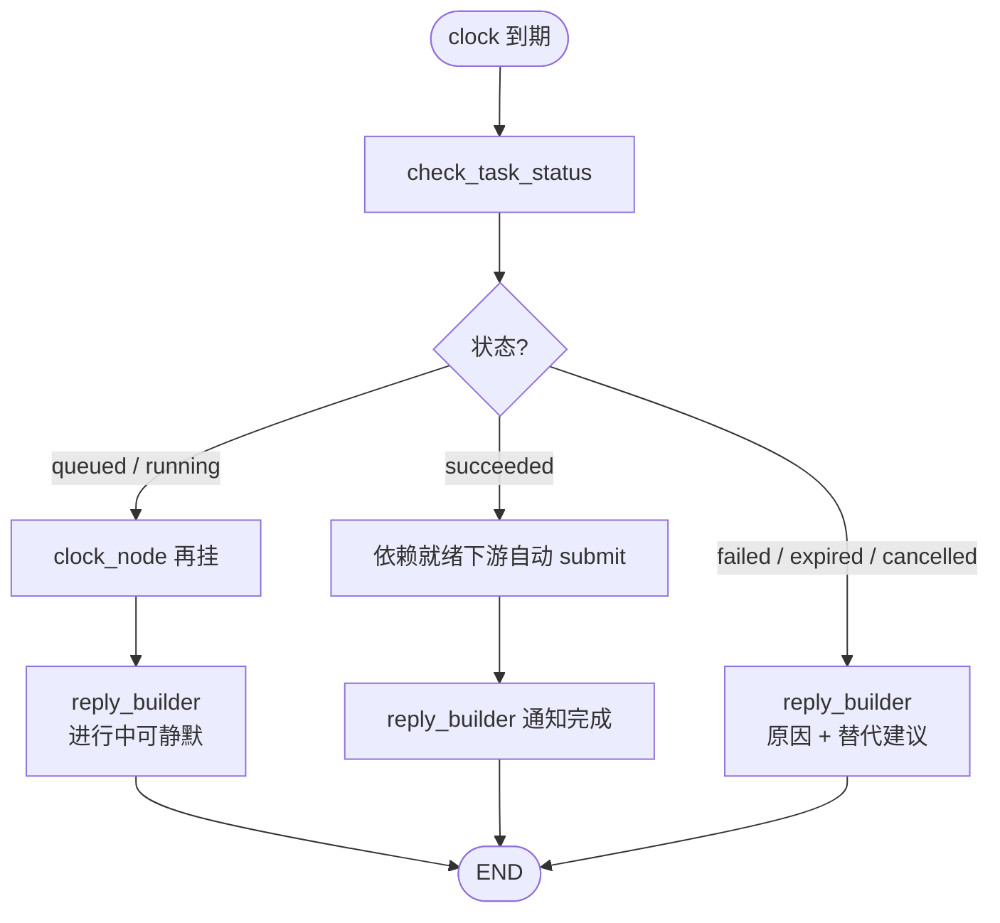
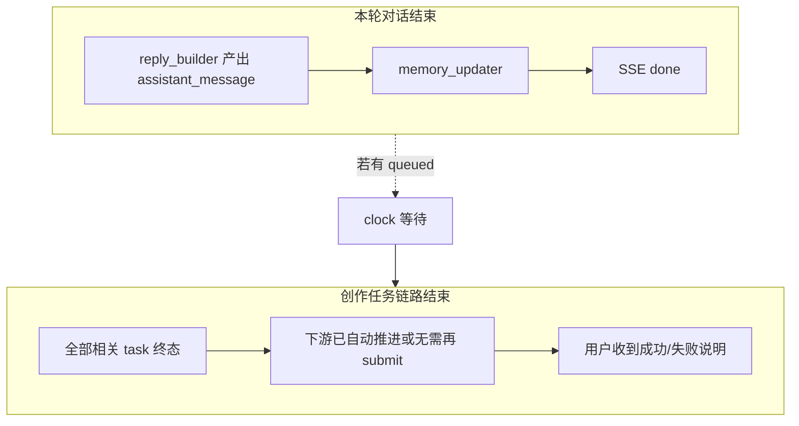

# VibePaper Agent 端到端运行流程

> 范围：`agent-service` 从接收用户指令到本轮（及异步唤醒）工作结束的完整链路。  
> 权威实现：`src/agent/graph/app.py` · `routing.py` · `domain/workflow_rails.py` · `agent/persona.py`  
> 分工原则：**工作流管轨道（能不能、走哪步、参数合不合法），模型管内容（文案 / prompt / 创意取舍）**。  
> **目标架构（P0）**：见 [`agent-control-plane-p0-spec.md`](./agent-control-plane-p0-spec.md)（LangGraph 控制平面 / Canvas 数据平面；本文描述现状）。

---

## 1. 一句话总览

用户在画布侧发消息 → Gateway 鉴权进 `agent-service` → LangGraph 主图跑完一轮（规划 / 确认 / 执行 / 回复 / 记忆）→ 若有生成任务则挂 `clock` → 到期后走唤醒子图查状态、自动推进下游 → SSE / 持久化消息推回前端。

---

## 2. 入口与会话

| 步骤 | 接口 / 组件 | 职责 |
|------|-------------|------|
| 开会话 | `POST /api/v1/agent/sessions` | 绑定 `user_id` + `canvas_id` |
| 发指令 | `POST /api/v1/agent/sessions/{id}/messages` | 写入用户消息，调用 `session_service.run_turn` → `run_agent_turn` |
| 确认高风险 | `POST .../confirmations/{action_id}` 或对话内「确认/取消」 | 恢复 interrupt，继续执行 |
| 订阅事件 | `GET .../events`（SSE） | 流式接收 `assistant_message` / `confirm_required` / `task_status` 等 |
| 唤醒 | Celery / Redis 到期回调 `run_agent_wakeup` | 独立 thread，不与主对话 checkpoint 争用 |

---

## 3. 主图节点流水线（单轮对话）

主路径：**意图分流 → 选 Skill → 创意规划 + 执行编译（`create_plan`）→ 校验 → 确认/执行 → clock 推进**。

编排纪律：

1. **Skill 先选后载**：`select_skill` → `load_skill`，规则注入后再规划。  
2. **双层规划**：Creative Planner 填内容；Execution Compiler 落工具步骤（`build_structured_plan`）。  
3. **铁路优先**：画布已有链路时的合成/推进走 `compile_execution_plan`，不灌空模板壳。  
4. **轨道参数**由 `workflow_rails` 回填。  
5. **queued ≠ 完成**；下游靠 clock 唤醒自动推进。  
6. **ack 不切断 ReAct 循环**（`route_after_exec`）：生成任务入队（ack）后，若模型仍想继续（`react_decision=act` 且未到步数上限），循环继续做同阶段独立工作；所有收尾路径（done / validate-finalize / ask_user / reject / reflect-reply）统一经 `clock_node` 注册唤醒，ack 的 clock 不会因收尾路径不同而丢失。  
7. **零动作禁止 finish**：执行意图下整轮没有任何执行/读取结果时，模型 `finish` 会被强制转为 `act` 先读画布（`react_agent_node` 守卫）。

当前视频偏好默认见 `workflow_rails.VIDEO_PREF_*`。

---

## 4. 意图与规划（创意规划 + 执行编译）

| 阶段 | 实现 |
|------|------|
| 意图 | `classify_intent_hybrid` → `IntentResult`，条件边分流 |
| Skill | `select_skill` / `load_skill`（按 LLM `requested_skill` 加载；未命中则只注入目录，由创意规划再选，**不默认竖屏短剧**） |
| 创意规划 | LLM 产出剧情/对白/镜头等内容字段 |
| 执行编译 | 规则把骨架 + 创意编译为 `StructuredPlan` / 工具步骤 |
| 校验 | `validate_plan` → planned_actions，桥接 risk / confirmer / executor |
| 失败 | `reflect` → 必要时回 `create_plan` 重规划 |

意图识别由 LLM 完成（`classify_intent_hybrid`）。`next_actions` 由模型按上下文生成，禁止固定词表硬编码。

**复杂度三级路由（`create_plan_node`）**：有 LLM Key 时按 `intent.name` 分流，任务粒度由规则定死、模型只填内容：

| 档位 | intent.name | 规划路径 | 交付形态 |
|------|-------------|----------|----------|
| 简单档 | `direct_canvas_action` | `build_structured_plan` → 单图 Skill 走 `_compile_simple_visual`，否则 `_compile_simple_generation` | 单节点 + 单提交（选中可生成媒体节点时直接提交该节点） |
| 编辑档 | `edit_existing` | `build_structured_plan` → `_compile_node_edit` | 读选中节点 + `update_node_config`，禁新建/提交 |
| 复杂档 | 其余（workflow_orchestration / advance_pipeline / regenerate_stale…） | `react_agent` 多拍 ReAct + Skill 拆链 + 阶段门禁 | 按 Skill 骨架拆多节点、依赖连线、分步提交 |

兜底：即使分类器误判把简单任务送进 ReAct，`_clamp_simple_intent` 会把动作裁剪回单节点/单编辑（`react_agent.py`），且 ReAct prompt 注入 `_COMPLEXITY_RULES` 硬约束。

Skill 出创作规则（可中途再载）；模型直接规划工具；Compiler 短剧脚手架已退出主路径。

---

## 5. 执行与外部服务

`submit_generation` 关键路径：

1. 解析节点 id（含 `$created[n]`）  
2. 收集上游 reference（图 / 文）  
3. 视频走 `build_video_task_params` → 偏好回填 + 兼容换模  
4. `resolve_submit_model` 得到具体模型名  
5. `POST billing /api/v1/tasks`（`Idempotency-Key`）→ 返回 `queued` ack  

---

## 6. 确认与中断

高风险（扣费提交、换模型、覆盖输出等）进入 `confirmer`；**写画布**（创建/连线/布局/改配置/删除）为低风险，免确认直接执行并回显。

LangGraph 已用 checkpointer + `interrupt` 做断点；对话回复「确认/取消」走 `Command(resume=…)`，**不得**把「确认」当新用户指令整图重规划。

要点：

- 确认后续跑只执行刚确认的动作；`confirmer` 将 `react_decision=finish`，`route_after_exec` 在 `confirm_accept` 时直接 `wait_for_result`/`done`。  
- 无挂起确认时再发「确认」，回复「当前没有待确认…」，不重跑主图。  
- 任务未完成时 `finalize` / `request_user_input` 落 `next_actions`，由前端可点击推进（人机交互）。  
- 确认令牌绑定 `user_id` + `canvas_id` + `canvas_version`；画布版本变化则令牌失效。

---

## 7. 异步唤醒子图（任务未结束不算「全流程结束」）

主图在出现 `ack + task_id` 时走 `clock_node` 登记提醒，然后仍会 `reply_builder` 告知「已提交」。  
真正产物就绪由唤醒子图推进：

要点：

- 唤醒使用独立 `thread_id`（`wakeup-{session}-{task}`），避免与主会话 checkpoint 死锁。  
- 上游成功后，按依赖图自动提交就绪下游（不编造成品）。  
- 纯轮询无终态时 `reply_builder` 可静默，避免刷屏。

---

## 8. 「工作结束」的两种含义

| 结束类型 | 标志 | 用户感知 |
|----------|------|----------|
| 本轮结束 | 主图到 `END`，SSE `done` | 看到动作结果 / 确认请求 / 下一步建议 |
| 任务链路结束 | 唤醒子图不再 `reclock`，产物写回画布 | 「生成完成」或失败原因 + 替代方案 |

---

## 9. 回复形态与人格约束（贯穿全流程）

Agent 名为 **DD**（创作搭档）：专业镜头语言、语气偏暖但不客套、默认不报名字。
结构由规则约束，措辞临场生成（见 `AGENT_PERSONA`）：

| 形态 | 何时用 |
|------|--------|
| 动作型 | 做完说结果（建节点、已提交） |
| 决策型 | 需用户拍板（主题 / 风格 / 选项） |
| 建议型 | 节奏 / 转场风险 + 可执行建议 |
| 反对型 | 讨论中指出问题与改法 |

`nextActions` 由 LLM 按上下文生成（规则路径空列表时有 Key 则补全），**禁止场景词表硬编码**；前端可点击，不重复写进 reply 正文。

---

## 10. 关键源码索引

| 主题 | 路径 |
|------|------|
| 主图 / 唤醒图 | `agent-service/src/agent/graph/app.py` |
| 路由 | `agent-service/src/agent/graph/routing.py` |
| 人格与 Skill | `agent-service/src/agent/agent/persona.py` |
| 规划 | `agent-service/src/agent/agent/planner.py` · `graph/nodes/planner_node.py` |
| 编排 / 契约 | `domain/workflow_orchestrator.py` · `creative_contract.py` · `methodology.py` |
| 参数轨道 | `domain/workflow_rails.py` · `domain/video_task.py` · `domain/precedence.py` |
| 工具执行 | `tools/registry.py` · `graph/nodes/executor.py` |
| 回复组装 | `graph/nodes/reply_builder.py` |
| HTTP 入口 | `api/routes.py` |

---

