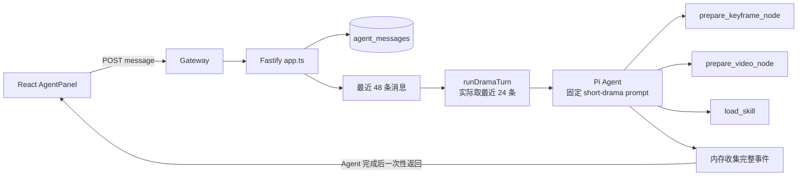

# VibePaper Pi Agent 二次开发模块全面审查报告

> 审查日期：2026-08-28  
> 审查基线：`codex/pi-agent-secondary-development`，提交 `fa87a64`  
> 主要实现：`pi-main/packages/vibepaper-agent-service`  
> 结论口径：以已提交源码为准；设计文档、未合并 worktree 和仅存在的数据表不计为已实现

## 1. 执行结论

当前 Pi Agent 模块已经完成“技术可行性骨架”，但尚未完成“可替换旧 Agent 的生产闭环”。更准确的阶段判断是：**M0 基础骨架完成、M1 只完成了一部分，M2-M4 的关键能力大多未落地**。

已经真实存在的能力包括：

- Pi `Agent` 单轮工具循环与模型接入；
- 服务端工具白名单和串行执行；
- 两个短剧领域准备工具，以及角色参考包、关键帧先行的部分硬约束；
- 会话、消息、Skill、长期记忆和会话片段的基础 CRUD；
- Skill 索引按需加载机制；
- React Agent 面板、执行记录、确认卡片、会话历史、Skill 和记忆界面；
- Fastify、PostgreSQL、Nacos 注册器及服务启动骨架。

但当前版本仍存在以下阻断性事实：

1. Agent 不读取画布摘要、选中节点、连线、素材或记忆，无法基于真实画布进行可靠编排。
2. 所有会话都被固定为“竖屏短剧 Agent”，没有通用画布、短剧、素材等 profile 路由，也没有可审计的意图识别。
3. 模型实际只有 `prepare_keyframe_node`、`prepare_video_node`、`load_skill` 三个工具；前两者只返回草稿，不创建画布节点，也不提交生成任务。
4. 审批仅有“消费接口”，没有 action/approval 创建路径；确认后也不会执行冻结动作或恢复 Agent。
5. 所谓 SSE 在 Agent 完成后一次性返回，前端“停止”只中止浏览器读取，不能取消服务端 Agent 或工具副作用。
6. 前端仍调用已不存在的 `/events` 和 `/skills/{id}/attach`，本机运行时实测均为 404。
7. generation-service 的终态回调不发送 `sessionId`，而新 Agent 回调接口强制要求 `sessionId`，因此异步恢复链路无法成立。
8. 旧 Python Agent 有 25 个测试文件、197 个测试用例；Pi 包只有 3 个测试文件、11 个用例，行为等价性远未建立。

因此，当前版本可以作为 Pi 适配和短剧领域模型的开发起点，**不能客观地标记为“全量迁移完成”“Agent 功能可用”或“具备生产安全的自动生成能力”**。

## 2. 审查范围与方法

### 2.1 覆盖范围

- Pi 运行时和模型调用：`application/agent-runtime.ts`、`pi/*`；
- 工具白名单、Tool Gateway、审批与计费入口；
- 短剧状态模型、PostgreSQL Store、渲染谱系；
- 会话、消息、Skill、记忆、片段、任务唤醒；
- Fastify API、错误合同、数据库初始化、Nacos、部署和 CI；
- React Agent 面板、SSE reducer、确认卡片、执行记录、模型选择、Skill 和历史界面；
- 旧 Python Agent 行为测试与 Pi 迁移设计的差距；
- Pi Core 能力的可复用边界。

### 2.2 证据方法

- CodeGraph 索引状态：1,623 个文件、27,582 个节点、114,325 条边，索引为最新；
- CodeGraph 用于定位 Pi Agent、会话、工具和前端事件链路；
- 使用 `rg` 对 API、调用点、配置引用和缺失路由做完整性回查；
- 完整阅读现行 Pi 包源码、测试、前端 Agent 相关源码和迁移设计；
- 执行 Pi 包 3 个测试文件，共 11 个测试，全部通过；
- 执行 Pi 包 TypeScript `--noEmit` 检查，通过；
- 执行前端 TypeScript project build 检查，通过；
- 对本机 8091 运行时探测 `/health`、`/events` 和 Skill attach 路径。

CodeGraph 是近似调用图，本报告中“未引用、未实现、只有单一调用点”等完整性结论均再次由文本检索确认。

### 2.3 快照边界

本机 8091 当前运行的是 `.worktrees/agent-security-hardening` 下的构建产物。该 worktree 与本报告基线同为提交 `fa87a64`，但包含大量未提交安全加固改动。本报告：

- 对“是否已经交付”的判断只采用当前分支已提交源码；
- 对 `/events`、Skill attach 404 等运行行为使用实际探测结果；
- 不把 worktree 中尚未合并的 migration、approval、ownership 和 streaming 修改计为完成；
- 已有安全计划 [2026-08-28-agent-security-and-availability.md](../superpowers/plans/2026-08-28-agent-security-and-availability.md) 视为进行中的修复计划。

## 3. 当前真实运行链路



这条链路中没有进入 Pi 上下文的画布摘要、节点详情、连线、素材、模型目录、用户记忆和任务状态，也没有 action、approval、outbox 或可恢复 run。`ToolGateway.submitGeneration()` 虽然存在，但没有任何调用者。

## 4. 能力成熟度矩阵

| 领域 | 当前状态 | 客观判断 |
|---|---|---|
| Pi Core 接入 | 部分完成 | 已复用 `Agent`、事件订阅、TypeBox 工具和白名单钩子 |
| Agent 编排 | 骨架 | 只有模型自由 ReAct；无 profile、确定性阶段路由、计划实体、预算或恢复 |
| 意图识别 | 未实现 | 所有输入进入同一个短剧 prompt；没有通用/短剧/素材 profile selection |
| 画布上下文 | 未实现 | 选中节点只写消息 meta，不进入模型；没有画布读取工具 |
| 工具调用 | Demo 级 | 仅 3 个工具；没有通用查询、画布编辑、模型查询、任务查询和生成提交 |
| 短剧领域合同 | 部分完成 | 角色参考包、2-5 秒、关键帧先行已实现；Canon、Scene、音频、字幕、合成和 revision 闭环未实现 |
| 审批与点数 | 不可用 | 表和确认消费接口存在，但不创建 approval，也不执行批准动作 |
| 异步任务 | 不可用 | 只接收 notice；回调字段不兼容，notice 不处理、不推送 |
| 会话管理 | 基础 CRUD | 可创建、列出、读取消息；无 run、并发控制、分页、归档、重命名、可靠恢复 |
| 记忆机制 | 数据 CRUD | 可手工增删长期记忆，但 Agent 完全不检索、不写入、不使用 |
| Skill | 部分完成 | 渐进加载实现；前端应用接口不匹配，快照不可复现，缺安全治理 |
| 前端展示 | UI 较完整、合同断裂 | 面板和卡片存在，但后端事件类型、流式语义和路由不匹配 |
| 测试 | 骨架覆盖 | 11 个 Pi 测试通过，但只覆盖配置默认值、会话列表、领域内存规则和 Skill 加载 |
| 可观测性 | 未达标 | 无 run_id/event_seq/action/task 全链路；请求 ID 在跨服务时被重建 |
| 部署与 CI | 部分完成 | 启动脚本指向 Node，但 CI 仍把旧 Python agent-service 当现行 Agent 测试 |

## 5. 主要问题清单

### 5.1 P0：上线阻断或安全/资金风险

| ID | 问题 | 证据 | 实际影响 |
|---|---|---|---|
| AGT-PI-P0-01 | 审批链路只有消费、没有签发和执行 | [app.ts](../../pi-main/packages/vibepaper-agent-service/src/api/app.ts) 216-244 行只查询/更新 `agent_approvals`；全包没有 `INSERT INTO agent_actions/agent_approvals` | 确认卡事件永远无法由现行 Agent 正常产生；即使预置记录，确认后也只改状态，不提交生成 |
| AGT-PI-P0-02 | 工具面不具备产品功能 | [drama-tools.ts](../../pi-main/packages/vibepaper-agent-service/src/tools/drama-tools.ts) 只注册两个 prepare 工具；[skill-tools.ts](../../pi-main/packages/vibepaper-agent-service/src/tools/skill-tools.ts) 只增加 `load_skill` | 不能读取画布、创建节点/连线、查询素材/模型/任务或提交生成 |
| AGT-PI-P0-03 | `submitGeneration()` 是死代码，且信任调用方估价 | [tool-gateway.ts](../../pi-main/packages/vibepaper-agent-service/src/infrastructure/tool-gateway.ts) 36-69 行；完整检索无调用者 | 点数和生成主链未接入；未来直接接入时，模型可控的 `estimatedCost` 也不能作为服务端权威估价 |
| AGT-PI-P0-04 | SSE 是完成后批量返回 | [app.ts](../../pi-main/packages/vibepaper-agent-service/src/api/app.ts) 167-175 行先 `await runDramaTurn`，876 行后才拼接全部事件；[agent-runtime.ts](../../pi-main/packages/vibepaper-agent-service/src/application/agent-runtime.ts) 113 行等待 `agent.prompt` 完成 | 首 token 延迟等于整轮执行时间；无法实时展示工具、确认和长任务进度 |
| AGT-PI-P0-05 | 前端“停止”不能取消后端 Agent | [AgentPanel.tsx](../../vibepaper-web/src/features/canvas/AgentPanel.tsx) 358-361 行只 abort fetch；服务端没有 run 注册或 `agent.abort()` API | 用户看到已停止，服务端仍可能继续调用模型或产生副作用 |
| AGT-PI-P0-06 | 关键前后端合同已经断裂 | 前端调用 `/agent/sessions/{id}/events` 和 `/skills/{id}/attach`；Pi API 无这两个路由。本机 8091 实测均返回 404 | 后台任务通知、主动消息和 Skill 应用不可用 |
| AGT-PI-P0-07 | generation 终态回调与新接口字段不兼容 | [task_service.py](../../generation-service/src/generation/services/task_service.py) 390-403 行不发送 `sessionId`；[app.ts](../../pi-main/packages/vibepaper-agent-service/src/api/app.ts) 630 行要求 `sessionId` | 所有正常终态回调都无法写入 Agent notice，异步恢复主路径断开 |
| AGT-PI-P0-08 | notice 只写不消费 | [app.ts](../../pi-main/packages/vibepaper-agent-service/src/api/app.ts) 623-650 行只有 insert；没有 events/notifications、consumer 或 processed 更新 | 即使回调成功，用户也收不到任务完成通知，Agent也不会推进下游 |
| AGT-PI-P0-09 | 内部回调在 secret 为空时默认放行 | [app.ts](../../pi-main/packages/vibepaper-agent-service/src/api/app.ts) 624 行仅在配置了 token 时校验；示例配置默认为空 | 非生产隔离失误或直接暴露 8091 时可伪造任务终态；生产也未 fail closed |
| AGT-PI-P0-10 | 短剧状态没有用户所有权 | drama route 虽读取 `X-User-Id`，但 Store 方法和表只按 series/shot/character ID 查询 | 知道 ID 的已认证用户可直接操作其他用户短剧记录；现有安全计划已确认此缺口 |
| AGT-PI-P0-11 | 会话可被请求体静默改绑到任意画布 | [app.ts](../../pi-main/packages/vibepaper-agent-service/src/api/app.ts) 148-154 行直接更新 `canvas_id`，不查询画布权限或版本 | 会话历史和后续动作可能跨画布污染；前端切换画布时也未清空当前 sessionId |
| AGT-PI-P0-12 | 确认消费不是原子状态转换 | 确认接口先 `SELECT`，再分别更新 approval/action，没有事务、行锁或 `UPDATE ... WHERE status='pending' RETURNING` | 并发确认可同时通过校验；一旦接入真实执行，存在重复提交/扣点风险 |
| AGT-PI-P0-13 | 数据库使用启动时动态 DDL，而非版本化迁移 | [server.ts](../../pi-main/packages/vibepaper-agent-service/src/server.ts) 12 行调用 `applySchema`；[schema.ts](../../pi-main/packages/vibepaper-agent-service/src/infrastructure/schema.ts) 105-108 行逐句执行 | 无版本、checksum、回滚和迁移顺序审计；部分成功会留下不可判定 schema |
| AGT-PI-P0-14 | 新 Pi 服务未进入 CI | [.github/workflows/ci.yml](../../.github/workflows/ci.yml) 47-55 行仍对 `agent-service` 运行 Python/pytest；没有 `@vibepaper/pi-agent-service` job | Pi 包可以在主分支完全损坏而 CI 仍显示 Agent 通过 |
| AGT-PI-P0-15 | Nacos 可静默不注册 | [nacos.ts](../../pi-main/packages/vibepaper-agent-service/src/infrastructure/nacos.ts) 17 行在用户名/密码为空时直接返回；网关使用 `lb://agent-service` | 进程健康不等于网关可达，故障表现为 503 且缺少明确启动错误 |

### 5.2 P1：功能完整性、可靠性和体验缺口

| ID | 问题 | 证据与影响 |
|---|---|---|
| AGT-PI-P1-01 | 没有 profile/意图路由 | `createDramaAgent()` 是唯一 factory，所有输入都使用竖屏短剧 SYSTEM；普通品牌文案、画布整理、素材查询会被短剧规则劫持 |
| AGT-PI-P1-02 | 选中节点没有进入 Agent 上下文 | 前端发送 `selectedNodeIds`，后端只写消息 meta；`runDramaTurn()` 仅收到文本 content |
| AGT-PI-P1-03 | 没有画布上下文构建器 | 没有 `get_canvas_summary/get_selected_nodes/get_node_detail` 工具，也未使用 `transformContext` 注入画布数据 |
| AGT-PI-P1-04 | 每轮重新创建 Agent，丢失工具 observation | [agent-runtime.ts](../../pi-main/packages/vibepaper-agent-service/src/application/agent-runtime.ts) 58-96 行只重建 user/assistant 文本，未持久化 Pi `toolResult`、tool call、run 状态或 pending action |
| AGT-PI-P1-05 | 固定截断 24 条消息，无摘要/压缩 | 数据库读 48 条，模型再 `slice(-24)`；长期项目会静默丢失关键决策，且待审批/任务终态没有保留规则 |
| AGT-PI-P1-06 | 同一会话没有并发控制 | message API 没有 session lease、active run、版本或幂等键；并发请求可读取相同历史并交错写入回复 |
| AGT-PI-P1-07 | Pi 事件映射与前端 reducer 不兼容 | 后端只发 `assistant_message`、`tool`、`usage`；前端主要处理 `plan_step/action_result/confirm_required/task_status/skill_loaded` |
| AGT-PI-P1-08 | 文本增量被当作完整前缀重复发送 | `message_update` 每次调用 `contentText(event.message)`，得到累计文本；`message_end` 又发送一次全文 | 网络放大、重复 UI 更新，且不符合目标 delta 合同 |
| AGT-PI-P1-09 | 模型错误可能以 200 空响应结束 | Pi provider 错误通常编码在 assistant stopReason/errorMessage；`captureEvent()` 没有处理 error/aborted stopReason |
| AGT-PI-P1-10 | token 用量被低估 | 多工具轮有多次 assistant `message_end`，当前 `setTotalTokens()` 每次覆盖而非累加；`points_used_total` 从未更新 |
| AGT-PI-P1-11 | 前端模型选择是装饰性状态 | `agentModel` 只保存偏好和渲染 ModelPicker，message 请求不发送模型；后端始终使用全局 `config.llmModel` |
| AGT-PI-P1-12 | 记忆不参与推理 | `/memories` 只提供手工 CRUD；没有检索、注入、异步更新、去重、embedding、scope 隔离或授权流程 |
| AGT-PI-P1-13 | Skill 会话快照不可复现 | session 只保存 Skill ID，运行时读取 Skill 最新正文；Skill 被修改后旧会话行为漂移，未记录 version/hash |
| AGT-PI-P1-14 | 用户 Skill 缺治理 | 上传 Markdown 会把全文直接作为 tool result 注入模型；缺少正文规范、能力声明、版本锁、风险扫描和最大上下文预算 |
| AGT-PI-P1-15 | 错误码被统一改写 | [app.ts](../../pi-main/packages/vibepaper-agent-service/src/api/app.ts) 76-84 行仅保留 Domain/Runtime 错误码，普通 `ApiError` 被返回为 `INVALID_INPUT` | `PERMISSION_DENIED/NOT_FOUND/CONFIRMATION_REQUIRED` 等稳定错误码丢失 |
| AGT-PI-P1-16 | 请求链路 ID 断裂 | Tool Gateway 每次生成新 `X-Request-Id`，Fastify 错误体使用本地 `req-1` 类 request id；无法串联 gateway、Agent、画布、计费和生成日志 |
| AGT-PI-P1-17 | 画布 queued 回写失败被吞掉 | [tool-gateway.ts](../../pi-main/packages/vibepaper-agent-service/src/infrastructure/tool-gateway.ts) 61-66 行忽略 PUT 失败 | 计费已冻结/任务已创建，但画布仍显示旧状态且没有补偿记录 |
| AGT-PI-P1-18 | drama/review 路由未进入网关 | gateway 只匹配 agent/skills/memories；`/api/v1/drama/**` 和 `/api/v1/render-reviews/**` 不可从产品入口访问 |
| AGT-PI-P1-19 | API 没有 OpenAPI/TypeBox 请求合同 | Fastify route 全部手工解析 `Record<string, unknown>`；前端类型不是 OpenAPI 生成，迁移时已经发生接口漂移 |
| AGT-PI-P1-20 | 数据完整性约束不足 | messages/actions/approvals/notices 与 session/action 缺少外键和必要唯一/check 约束；审批 action_id 也无唯一约束 |
| AGT-PI-P1-21 | Snowflake 生成器不满足多实例安全 | [ids.ts](../../pi-main/packages/vibepaper-agent-service/src/infrastructure/ids.ts) 用 `pid & 0x3ff` 作为节点号，单毫秒第 4097 个 ID 回绕；跨主机 PID 可碰撞 |
| AGT-PI-P1-22 | 部署配置来源不一致 | README 指导在 Pi 包创建 `.env`，但 [start-all.ps1](../../deploy/start-all.ps1) 45 行读取旧 `agent-service/.env`；当前 Pi 包 `.env` 实际不存在 |
| AGT-PI-P1-23 | 节点参考只完成“选择和传 ID”，没有形成消息与上下文闭环 | [AgentComposerBar.tsx](../../vibepaper-web/src/features/canvas/AgentComposerBar.tsx) 已能展示选中节点参考，[AgentPanel.tsx](../../vibepaper-web/src/features/canvas/AgentPanel.tsx) 也会发送 `selectedNodeIds`；但乐观用户消息不保存引用快照、消息气泡不渲染引用卡片，服务端 `readHistory()` 丢弃消息 `meta`，`runDramaTurn()` 最终只接收纯文本 `content`。结果是截图所示“节点卡片 + 用户指令”不能在当前消息或历史会话稳定回显，Pi 也没有获得节点正文、媒体 URL、状态或提示词 |

> **AGT-PI-P1-23 本分支整改状态（2026-08-28）：已实现，视觉手工验收待运行。** Agent 服务现在使用用户身份通过画布公开详情接口读取并校验最多 8 个节点，生成受限快照写入 `agent_messages.meta.nodeReferences`；当前轮和历史用户消息均以“不可信参考数据”注入 Pi。前端已增加文本/图片/视频节点引用卡片、不可变历史回显、选择跃迁检测和按轮消费，发送失败保留引用。自动化证据：Pi 包 5 个测试文件共 20 个测试通过，Pi TypeScript 检查通过；前端 2 个测试文件共 4 个测试通过，TypeScript 检查通过，oxlint 0 error（仅保留仓库既有 warning）。已执行变异检查，移除 Pi 引用注入会使回归测试失败。由于本轮未启动完整微服务栈进行浏览器操作，截图级视觉效果仍需手工验收。

### 5.3 P2：扩展性和产品质量缺口

- 没有 `agent_runs`、`agent_event_outbox`、`event_seq`、断线游标和事件重放。
- 没有计划实体、计划版本、行动摘要查询和局部重跑审计。
- 没有 Canvas 依赖图 Ready Set、stale 传播编译器和下游局部调度。
- 短剧领域只覆盖 Series、Character、ReferencePack、Shot、Keyframe、Lineage 的小切片；WorldBible、Episode、Scene、ContinuityFact、Foreshadow、Audio、Subtitle、Composite 尚未实现。
- 没有独立只读审校 Agent，`render_reviews` 只是任意客户端可写的记录表。
- 没有模型能力目录、服务端估价、供应商降级、重试预算和批准成本上限。
- 没有企业 scope 的记忆隔离、保留/删除/导出和可见性策略。
- 会话列表固定最多 100 条，无分页、归档、删除、显式重命名和搜索。
- 前端没有事件断线重连游标；异常被大量 `.catch(() => undefined)` 静默吞掉。
- 没有 Agent 效果评测集、trace 对比、模型/Skill 版本 A/B、人工修订和点数收益归因。

## 6. 各专项审查结论

### 6.1 Agent 编排与意图识别

Pi 已经提供模型—工具—观察—再决策循环，但 VibePaper 不能把全部编排责任交给模型。当前唯一短剧 Agent 既是意图识别器、规划器，又是执行器；安全边界虽然受工具数组限制，但功能边界和产品行为不可审计。

推荐采用两层路由：

1. **服务端 profile selection**：结合页面入口、画布领域标记、待审批状态和轻量分类，确定 `canvas-general`、`vertical-short-drama`、`asset-assistant`、`audit-readonly`。profile 决定 SYSTEM 和工具集合，LLM 无权扩大工具面。
2. **profile 内意图与计划**：Pi 在限定工具面内完成讨论、查询、编辑、生成、审校等意图；复杂写操作先形成结构化 plan/action，再由确定性 compiler 验证。

不要重新建立一套庞大正则意图树，也不要让 LLM 自由选择 profile。明确指令、当前确认、用户偏好、Skill、模型默认的优先级必须由代码合并，而非只写在 SYSTEM 中。

### 6.2 工具调用与 Tool Gateway

当前 `beforeToolCall` 只检查工具名是否在已经传入的工具数组中。这能阻止未知工具，但不能替代：

- 用户和企业权限；
- 画布 ID/版本校验；
- 参数和模型能力校验；
- 费用估算和确认阈值；
- action 持久化和幂等；
- 跨服务超时后的状态查询与恢复。

应建立单一 `ToolManifest`，至少包含 `name/profile/schema/risk/version/maxBatch/costPolicy/approvalPolicy/auditFields`。Pi Tool、应用层校验、前端标签和契约测试都从同一 manifest 生成或校验，避免当前前端列出几十个工具而后端实际只有三个的漂移。

### 6.3 会话、运行和恢复

业务会话不能等同于 Pi 内存 transcript。建议分离：

- `agent_sessions`：用户可见会话；
- `agent_runs`：一次输入对应一次有状态运行；
- `agent_messages`：用户和最终 assistant 消息；
- `agent_run_events/outbox`：可重放的模型、工具、确认、任务事件；
- `agent_actions/approvals`：外部副作用事实；
- Canvas/Task/Points：分别由各业务服务作为真相源。

每个会话同一时刻只允许一个 active run，第二条输入使用 Pi `steer()`、`followUp()` 或进入持久队列，而不是并发启动另一个无关联 Agent。

### 6.4 记忆机制

现有 `user_memories` 表字段比实际功能丰富，但表结构不等于记忆机制。推荐最小治理：

| scope | 保存内容 | 写入条件 | 默认寿命 |
|---|---|---|---|
| session | 当前目标、临时偏好、待确认动作摘要 | 当前轮需要 | 会话或 24 小时 |
| project/canvas | Canon 摘要、已确认创作决策、项目风格 | 可追溯到画布事件或用户确认 | 项目生命周期 |
| long_term user | 稳定且可复用的个人偏好 | 用户明确授权或可撤销确认 | 长期，可删除/导出 |
| enterprise | 经授权的公共规范 | 管理员发布 | 企业策略控制 |

每条记忆必须有 source、scope、tenant/user/canvas、confidence、TTL、visibility、version 和 deleted 状态。Agent 只读取与当前 profile 和输入相关的受限 top-k 摘要；秘密、原始工具输出、完整媒体和未经授权的企业数据不得写入。

### 6.5 前端展示

前端组件本身已经具备较好的产品骨架：对话浮窗、执行时间线、确认卡、任务 badge、Skill、历史、记忆和用量均有界面。主要问题不是“缺 UI”，而是**UI 建立在旧事件合同上**。

后续应统一事件信封：

```json
{
  "eventId": "snowflake",
  "runId": "snowflake",
  "sessionId": "snowflake",
  "eventSeq": 17,
  "type": "assistant_delta | tool_started | tool_completed | confirmation_required | task_status | run_completed | run_failed",
  "runtime": "pi",
  "runtimeVersion": "0.84.3",
  "data": {}
}
```

前端只追加 `assistant_delta`，最终消息以 `run_completed` 校准；工具结果必须是创作者可理解的摘要，原始异常和内部 ID 不直接展示。断线后通过 `Last-Event-ID` 或 `afterSeq` 回放。

#### 6.5.1 节点参考消息闭环

当前前端已经具备参考栏雏形：画布节点被选中后会进入 `composerRefs`，发送请求也包含 `selectedNodeIds`。缺失的是从“临时选择状态”到“可追溯会话事实”的完整转换：

1. 发送前应把本轮参考节点固化为只读快照；文本节点展示类型、标题和状态，图片/视频节点优先展示缩略图、标题和状态。
2. 服务端必须按当前 `user_id + canvas_id` 读取权威节点数据并校验所有节点归属，不能把前端上传的节点正文或媒体地址当作可信数据。
3. 快照应写入 `agent_messages.meta.nodeReferences`，供乐观消息、会话历史和重新加载后使用；节点后续修改或删除不应改变已经发送的历史消息。
4. Pi 当前轮及历史用户消息需要把受限节点内容序列化为明确标记的“不可信参考数据”，包含必要的文本、提示词、媒体 URL 和状态；节点正文不得被解释为系统指令或扩大工具权限。
5. 节点参考按轮次消费：发送成功后移除本轮引用，失败则保留；画布节点保持选中不应导致后续每一轮被静默重复引用，只有重新选择或显式加入参考栏才再次发送。
6. 应限制数量和上下文预算（当前前端上限为 8 个），截断过长文本，不传媒体二进制，不记录密钥类参数。

该能力可以复用 Pi 的 `AgentMessage` 文本上下文、现有 `agent_messages.meta`、画布详情 API 和前端参考栏；权威节点读取、引用快照、上下文序列化、消息卡片、按轮消费和权限校验必须由 VibePaper 自行实现。

### 6.6 短剧功能实现

当前短剧状态层最有价值的部分是：角色 3-5 条 identity anchors、唯一批准 ReferencePack、人物关键帧自动挂参考、视频必须引用 accepted keyframe、角色变化使 lineage stale。这些确定性规则应保留并扩展。

尚未实现的生产链为：

`StoryBible → Episode → Scene → ShotSpec → Keyframe → Video → TTS/Subtitle → Composite → AuditReport`

其中 Canon revision、Character Look revision、Prompt revision、Canvas version 和 RenderLineage 必须共同进入输入哈希。上游变化只生成 impact set 和重跑建议，不能默认自动扣点重跑。

## 7. Pi 可复用与必须自研的边界

### 7.1 可直接复用 Pi Core

| Pi 能力 | 使用方式 | 当前使用情况 |
|---|---|---|
| `Agent` 工具循环 | 模型—工具—观察—再决策 | 已使用 |
| `AgentTool` + TypeBox | 模型可见参数 schema 和执行接口 | 已使用，但工具太少 |
| `subscribe()` 事件 | 实时转换为 VibePaper event envelope | 已使用为内存收集，需改为实时 sink |
| `beforeToolCall/afterToolCall` | 本地预检、action/approval 终止提示、结果脱敏 | 只使用白名单预检 |
| `transformContext` | 裁剪 transcript、注入受限画布/记忆摘要 | 未使用 |
| `shouldStopAfterTurn` | 上下文阈值、审批等待、任务 ACK 后优雅结束 | 未使用 |
| `abort()/waitForIdle()` | 服务端取消和安全收尾 | 未使用 |
| `steer()/followUp()` | 同会话运行中的新输入和后续工作 | 未使用 |
| `@earendil-works/pi-ai` | 模型 provider、流和多模型抽象 | 已使用 Agnes 兼容路径 |
| Pi compaction 辅助函数 | 估算 token、生成/应用会话摘要 | 可选择性复用，必须保护业务事实 |
| 自定义 AgentMessage | 注入 UI-only observation/status 并用 `convertToLlm` 过滤 | 可复用，当前未使用 |

### 7.2 只能选择性复用，不能作为业务账本

- Pi Harness/Session/JSONL/SQLite 可参考其单写 lease、队列、恢复、compaction 和事件模型；
- VibePaper 设计已经确定 PostgreSQL 是生产会话、action 和 approval 的事实源，不应把 Pi SQLite session 变成第二套生产账本；
- 可以复用算法、状态机思想和测试方法，不能让本地 session 文件裁决点数、画布版本或任务是否已提交。

### 7.3 不应复用到产品服务

- Pi Coding Agent 的 bash、文件、编辑、浏览器和任意网络工具；
- CLI/TUI 的工作目录、扩展和本地凭据模型；
- 让用户 Skill 动态注册新工具或供应商；
- 让模型直接调用数据库、MQ、billing 或 generation SDK。

### 7.4 必须由 VibePaper 自研

1. profile/意图路由、结构化计划和领域 compiler；
2. 画布摘要、选中节点、一跳依赖和素材上下文构建；
3. 单一 ToolManifest、权限、参数、模型能力、风险与费用策略；
4. AgentAction、Approval、确认哈希、版本失效、幂等执行和审计；
5. PostgreSQL run/message/event/outbox、单会话并发和断线重放；
6. 计费冻结/结算、Task 状态机和 generation 终态对账；
7. 记忆的 scope、授权、检索、写入、TTL、删除和企业隔离；
8. 短剧 Canon/Scene/Shot/Lineage/Batch/审校领域模型；
9. 前端事件 reducer、确认交互、任务时间线和可恢复体验；
10. OpenAPI、稳定错误码、trace、指标、审计和灰度发布。

## 8. 推荐优化架构

```text
server/api
  -> application/session-run-service
      -> profile-selector
      -> context-builder
      -> pi/runtime-adapter
      -> action-approval-service
      -> event-outbox
  -> domain
      -> tool-manifest / risk-policy / precedence
      -> canvas-plan / dependency-compiler
      -> short-drama canon / shot / lineage / audit
  -> tools
      -> read adapters
      -> low-risk canvas command adapters
      -> proposed high-risk action adapters
  -> infrastructure
      -> postgres repositories / migrations
      -> redis SSE fanout
      -> RocketMQ terminal-event consumer
      -> canvas/asset/billing/generation REST clients
```

一次高风险生成的推荐流程：

1. 创建 `agent_run`，读取 session lease、画布版本和受限上下文；
2. profile selector 确定工具 manifest；
3. Pi 产生 `submit_generation` 意图；
4. Tool Gateway 查询模型能力和服务端估价，生成 canonical params；
5. 同一事务写 `AgentAction + Approval + event_outbox`；
6. `afterToolCall` 返回 `terminate=true`，本轮以 `waiting_confirmation` 结束；
7. 用户通过确认卡提交 token；
8. 原子消费 approval，重新读取画布版本和可用点数；
9. 使用 `agt:{actionId}:{attemptNo}` 调 billing `/api/v1/tasks`；
10. 写回 task_id 和 action 状态，推送 queued 事件；
11. generation 终态事件按 task_id 定位 action/session，幂等写 observation/outbox；
12. 必要时创建新 Pi run 解释结果或推进已批准范围内的下一步。

## 9. 分阶段实施建议

### 阶段 A：P0 安全与可用性收口

优先合并并验证现有安全计划中的内容：Nacos fail-closed、版本化迁移、安全 ID、drama ownership、ApprovalService、真实 SSE、gateway 路由和 Pi CI。补充该计划未覆盖的三个 P0：

- 修复 generation callback 的 session/action 定位合同；推荐按 `task_id` 查 action，而不是要求 generation 记住 sessionId；
- 恢复 `/events`、Skill attach 或同步修改前端到新合同；
- 实现服务端 run cancel，禁止用 fetch abort 伪装成 Agent 已停止。

退出标准：所有公网和内部路由可达；无跨用户 drama 访问；确认只消费一次；1 点生成也不能绕过确认；Pi job 进入 CI。

### 阶段 B：P0 最小可用 Agent 闭环

- 实现 `canvas-general` 和 `vertical-short-drama` 两个 profile；
- 实现 `get_canvas_summary/get_selected_nodes/get_node_detail/list_models/search_assets`；
- 实现 `create_nodes/connect_nodes/update_node_config` 低风险命令；
- 实现 `submit_generation` proposed action，而非直接副作用；
- 建立 `agent_runs`、event outbox、统一事件信封和断线回放；
- 修复前端 reducer，使 delta、工具、确认和任务事件一一对应。

退出标准：用户能基于真实画布完成“梳理、文案、三个方向、创建节点、确认生成”，且没有一次未经确认的点数冻结。

### 阶段 C：P1 会话、记忆和异步恢复

- session lease、steer/follow-up、服务端 abort；
- 会话摘要和业务事实保护型 compaction；
- session/project/long-term/enterprise 四级记忆治理；
- generation 终态 consumer、notice outbox、任务时间线和重连；
- 会话分页、重命名、归档、删除、搜索和跨画布显式复制。

退出标准：服务在模型流、工具执行、确认等待、任务运行期间被杀死后，不重复写画布、不重复扣点，且用户可恢复可解释状态。

### 阶段 D：P1 短剧生产链

- Canon revision、WorldBible、Episode、Scene 和完整 ShotSpec；
- CharacterLook/ReferencePack revision 和 Canvas 投影；
- Keyframe-first RenderBatch/RenderJob、成本上限和局部重跑；
- TTS、字幕、Composite；
- 独立只读 audit profile 和确定性 continuity rules。

退出标准：3 个镜头的角色档案→ShotSpec→关键帧→审校→确认视频纵切可运行，修改第 2 镜只使第 2 镜 lineage stale。

### 阶段 E：P2 质量和规模化

- 模型/Skill/workflow 版本评测；
- 角色一致性、时长、音画同步和审片通过率指标；
- 成本、失败、重跑和人工修订归因；
- 企业知识治理、批量审批和生产配额；
- 灰度、影子运行、回滚和 7 天门槛。

## 10. 测试与验收补齐

旧 Agent 的 197 个用例不应机械逐行翻译，但必须作为黑盒行为清单迁移。建议优先级：

1. `test_control_plane.py`：审批绑定、一次性消费、版本变化、终态幂等；
2. `test_methodology_e2e.py`、`test_workflow_rails.py`：关键帧先行、模型参数和短剧方法论；
3. `test_dependency_and_prompts.py`、`test_selection_*.py`：选中节点、依赖 Ready Set、提示词来源；
4. `test_precedence.py`：用户指令、确认覆盖、偏好、Skill、默认值优先级；
5. `test_media_process_derive.py`、`test_compose_reuse.py`：加工与合成复用；
6. `test_react_loop.py`、`test_events_reducer_delta.py`：循环上限、失败观察、增量事件；
7. 新增 API/SSE、迁移、跨租户、并发确认、服务中断、断线回放和前端 Playwright E2E。
8. 新增节点参考闭环测试：未授权/不存在节点拒绝、最多 8 个引用、服务端快照持久化、历史回显、Pi 上下文注入、发送成功消费与发送失败保留。

最低门禁：

- 资金/审批核心分支覆盖率 ≥90%；
- 所有写接口拥有明确幂等策略；
- 100% 高风险工具产生 action/approval；
- 0 次跨用户/跨画布未授权访问；
- 0 次服务重启导致重复画布写入或重复点数冻结；
- REST/OpenAPI/SSE 契约测试覆盖前端实际调用路径；
- Pi package 的 lint、typecheck、test、migration test 和安全测试全部进入 CI。

## 11. 建议立即执行的任务顺序

1. 先完成并合并当前安全 worktree，但在合并前增加 callback、route contract 和 server-side abort 三项回归。
2. 将 Pi package 加入根 CI，同时停止把旧 Python agent-service 的 pytest 结果当成 Pi Agent 门禁。
3. 生成现有前端调用与 Fastify route 的契约清单，修复 `/events`、Skill attach、plans/notifications 的取舍。
4. 建立 ToolManifest 和两个 profile，再增加任何新工具；避免继续堆 UI 或数据库空表。
5. 打通只读画布上下文，再做低风险写，再做 proposed generation；不要反向顺序。
6. 迁移审批、幂等和终态回调用例后，才允许 Pi 触发真实点数路径。
7. 完成 run/outbox/reconnect 后，再开放长任务自动推进和批量渲染。
8. 最后迁移短剧完整 Canon 和审校链，不以“一句话生成整集”替代生产状态模型。

## 12. 最终判断

Pi 的选型本身是合理的：它适合承接工具循环、模型流、事件、上下文变换和中途控制；当前短剧 ReferencePack/Keyframe 领域规则也值得保留。现阶段的主要问题不是 Pi 能力不足，而是 VibePaper 控制面迁移只完成了表、路由和少量工具的外形，尚未完成权限、审批、点数、会话恢复、真实画布上下文和前端事件合同。

最优方向不是重新造一个 Agent loop，也不是直接搬用 Pi Coding Agent，而是：**稳定复用 Pi Core，把 VibePaper 的 profile、领域 compiler、Tool Gateway、Action/Approval、PostgreSQL run/outbox、记忆治理和前端事件层做成确定性控制面。**

在阶段 A、B 完成前，应关闭 Agent 自动提交生成能力；在阶段 C 完成前，不应宣称支持可恢复的长任务和主动通知；在阶段 D 完成前，当前实现应称为“短剧一致性领域切片”，而不是完整短剧生产 Agent。
