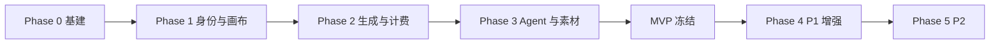

# VibePaper 执行计划

> **编制日期**：2026-07-30  
> **对齐**：PRD V2.1 §4.3 / §15 · 技术概要 · `docs/specs/V1.0-engineering-spec.md` · `AGENTS.md`  
> **原则**：先基础设施与计费闭环，再创作主路径，再 Agent，最后 P1/P2；每阶段有可演示增量与验收门槛。

---

## 0. 总览

| 阶段 | 目标 | 预估工期* | 退出标准 |
|------|------|-----------|----------|
| Phase 0 | 可运行本地骨架 | 1–1.5 周 | Compose 起全套中间件 + 空服务健康检查 + CI 骨架 |
| Phase 1 | 登录与画布 CRUD | 2 周 | AC-01~08 部分通过；导入导出 schema 校验 |
| Phase 2 | 生成 + 点数闭环 | 2.5–3 周 | AC-09~13、AC-12b；无重复扣费集成测试绿 |
| Phase 3 | Agent + 素材 + 历史 | 2 周 | AC-14~16、AC-18~21；MVP Demo 可走通 |
| **MVP 冻结** | P0 全部 | — | PRD P0 清单勾完 + 压测报告 |
| Phase 4 | P1 | 4–6 周 | 企业/广场/后台可运营 |
| Phase 5 | P2 | 1–2 周 | 记忆 + 会员后台 |

\*工期按 1 全栈小队（FE 2 + Java 2 + Python 1 + QA 1）粗估，需用执行计划 xlsx 再校准人天。

---

## Phase 0 — 工程基建（Week 0–1）

### 目标

任何功能开发前，先有可复现环境与仓库结构。

### 任务

| ID | 任务 | 产出 | 负责人建议 |
|----|------|------|------------|
| E-01 | 仓库结构：`vibepaper-web` · `vibepaper-services/*` · `generation-service` · `agent-service` · `deploy/compose` | 目录与 README | Tech Lead |
| E-02 | Docker Compose：PG×N / Redis / Nacos / RocketMQ / MinIO | `docker compose up` 文档 | DevOps/Backend |
| E-03 | Java parent POM + `vibepaper-common`（错误体、Snowflake、安全上下文） | 可启动 gateway 空路由 | Java |
| E-04 | Python `uv` 工程模板 + FastAPI health + Alembic | `/health` | Python |
| E-05 | 前端 Vite + React + Tailwind + Router 壳 + 功能目录 | 空白布局页 | FE |
| E-06 | CI：lint + 空测 + OpenAPI 占位 | GitHub Actions / 等价 | 全员 |
| E-07 | 约定落地：确认 `AGENTS.md` / Spec 评审 | 签字记录 | PM+Tech |

### 验收

- [ ] 新人按 README 30 分钟内起本地依赖
- [ ] Gateway `/actuator/health`、各服务 health 200
- [ ] 前端 `pnpm dev` 可打开管理空间壳

---

## Phase 1 — 身份 · 画布 · 连线（P0 基础）

### 目标

用户能注册登录，创建并编辑画布结构（尚可不调用真实模型）。

### 后端

| ID | 任务 | 服务 | 对照 |
|----|------|------|------|
| B1-01 | 注册/登录/刷新/注销、BCrypt、会话黑名单 | identity | B-18 |
| B1-02 | 网关 JWT 校验 + Header 透传 | gateway | — |
| B1-03 | 画布 CRUD、version 乐观锁、缩略图占位 | canvas | B-01、F-01 |
| B1-04 | 节点/连线 API、兼容性校验 | canvas | B-02~B-04、F-03~F-04 |
| B1-05 | 导入/导出 JSON + `schema_version` | canvas | §5.5 |

### 前端

| ID | 任务 | 对照 |
|----|------|------|
| F1-01 | 登录注册页、Token 存储与刷新 | F-25 相关 |
| F1-02 | 管理空间画布列表/新建/删/重命名 | F-01 |
| F1-03 | React Flow 画布：平移缩放、选择/抓手、适应视图 | F-02 |
| F1-04 | 节点增删改移、框选复制；一键整理（ELK） | F-02~F-03 |
| F1-05 | 连线拖拽、状态可视化（色+文案） | F-04 |
| F1-06 | 自动保存 + version 冲突 Toast | PRD EX-09 |

### 验收门槛

- [ ] AC-01~AC-08
- [ ] 多标签页冲突：后写方收到 `VERSION_CONFLICT`
- [ ] 导入不兼容 schema 被拒绝并提示版本

---

## Phase 2 — 生成 · 存储 · 计费闭环（P0 核心）

### 目标

「估价 → 冻结 → 执行 → 结算/解冻」资金安全闭环可演示；至少接通一类文/图生成（可用 Mock Provider）。

### 后端

| ID | 任务 | 服务 | 对照 |
|----|------|------|------|
| B2-01 | MinIO 预签名上传、素材元数据、引用表 | asset | B-16~B-17 |
| B2-02 | 点数账户、流水、冻结/结算/超时解冻（XXL-JOB） | billing | B-13~B-15、BILL-* |
| B2-03 | Outbox + RocketMQ 事务消息对接 generation | billing | 技术概要 §9 |
| B2-04 | 任务状态机、ModelProvider（先 Mock + 可选 ComfyUI） | generation | B-11~B-12 |
| B2-05 | SSE 任务进度；失败重试≤2 | generation | F-34、EX-01 |
| B2-06 | 模型目录与定价只读配置 | generation/admin 种子 | B-11 |
| B2-07 | 幂等键与并发扣费集成测试 | billing | AC-10~12b |

### 前端

| ID | 任务 | 对照 |
|----|------|------|
| F2-01 | 文本/图片节点参数表单、消耗预览 | F-07~F-08 |
| F2-02 | 音频/视频节点最小生成 UI | F-09-01、F-10 |
| F2-03 | 任务状态机 UI、错误码文案、重试/取消 | F-34 |
| F2-04 | 订阅菜单：余额、买点（Mock 支付） | F-19 |
| F2-05 | 结果预览/下载/设为当前输出 | AC-13 |

### 验收门槛

- [ ] AC-09~AC-13、AC-12b
- [ ] 双飞 `Idempotency-Key` 只扣一次
- [ ] queued >5min → expired + 点数退回
- [ ] 模型失败 → 全额解冻 + 埋点 `task_generate_fail`

### 风险缓冲

ComfyUI/GPU 环境未就绪时：**强制保留 MockProvider**，不阻塞计费与前端联调。

---

## Phase 3 — Agent · 素材库 · 历史 · MVP 收口

### 目标

Agent 可安全改画布并触发计费；个人素材与任务历史完整；P0 清单关闭。

### 后端

| ID | 任务 | 服务 | 对照 |
|----|------|------|------|
| B3-01 | Agent 会话/消息 SSE、上下文组装 | agent | B-26 |
| B3-02 | Tool Registry + 确认令牌 + 审计 | agent | B-27、§5.2.1 |
| B3-03 | Agent → canvas/asset REST；生成走 MQ | agent | 技术概要 §5 |
| B3-04 | 素材库完整 API（删前引用检查） | asset | F-13 |
| B3-05 | 任务历史查询 API | generation/billing 聚合或 B-25 方案 | F-23、B-25 |
| B3-06 | 偏好设置持久化 | identity | F-15 |

### 前端

| ID | 任务 | 对照 |
|----|------|------|
| F3-01 | Agent 面板、流式步骤、确认弹窗 | F-14~F-15 |
| F3-02 | 素材库侧栏、拖入画布 | F-13 |
| F3-03 | 历史记录页筛选/跳转 | F-23 |
| F3-04 | 个人中心点数概览图表 | F-25 |
| F3-05 | 埋点接入核心事件 | PRD §11 |

### MVP 退出检查（全部勾选才冻结）

- [ ] PRD 附录 A 全部 **P0** F/B 项 Done
- [ ] AC-14~16、AC-18~21
- [ ] 计费核心单测覆盖 ≥90%
- [ ] Playwright Smoke：注册→画布→生成成功→生成失败解冻→Agent 删除确认
- [ ] k6：关键读 API P95 ≤1s（约定环境）
- [ ] 画布 500 节点基准：平移可用、保存成功
- [ ] 安全：无密钥进日志；权限抽测通过

---

## Phase 4 — P1 增强（按依赖排序）

建议波次（可并行，但标注依赖）：

### Wave A — 创作增强（弱依赖企业）

| 项 | 编号 | 依赖 |
|----|------|------|
| 编组 / 堆叠 | F-05/F-06 | Phase 1 画布 |
| 图片加工、视频剪辑/提帧/超分 | B-06-02、B-07-02、F-09 | Phase 2 |
| Seedance 认证 | 同上 | 供应商接口确认（PRD §14） |
| 合成 / 导演台 | F-11/F-12、B-09/B-10 | 视频节点 |

### Wave B — 增长与分发

| 项 | 编号 | 依赖 |
|----|------|------|
| Skill + 会话历史 | F-16/F-17、B-28/B-29 | Phase 3 Agent |
| 画布分享 | F-20、B-23 | Phase 1 |
| 创意广场 + 先审后发 | F-24、B-24 | 分享 + admin 审核 |
| 签到 / 邀请 / 公告 | F-21/F-22/F-33 | billing 发奖规则表待运营 |

### Wave C — 企业与后台

| 项 | 编号 | 依赖 |
|----|------|------|
| 企业邀请/成员/分配/素材/统计 | F-26~F-32、B-31~B-37 | billing + asset |
| 运营后台（用户/模型/定价/交易/审计/公告） | B-38、B-40~B-47 | 全服务管理 API |

### Phase 4 验收

- [ ] AC-17、AC-23~AC-27
- [ ] 企业分配并发不超卖；不可回收 frozen
- [ ] 公开作品未经审核不可被 guest 浏览

---

## Phase 5 — P2

| 项 | 编号 | 说明 |
|----|------|------|
| 记忆系统短+长 | F-18、B-30 | Redis 短期 + PG/pgvector 长期；可删 |
| 会员体系后台 | B-39 | 等级/权益/定价；与订阅菜单打通 |

验收：AC-22；会员变更仅影响新权益发放。

---

## 跨阶段并行轨（全程）

| 轨 | 内容 |
|----|------|
| 设计 | 关键页视觉与交互规范；与官网对照表 |
| QA | 每 Phase 补用例；计费与权限为永久回归集 |
| 合规 | 隐私政策、用户协议、支付与内容审核上线门禁 |
| 运维 | 监控看板：任务成功率、队列深度、解冻异常、Gateway 429 |
| 文档 | OpenAPI 随 PR 更新；破坏性变更走评审 |

---

## 里程碑与决策点

| 里程碑 | 决策 |
|--------|------|
| M0 Spec 评审 | 冻结 P0 范围；ID=Snowflake；支付 Mock 策略 |
| M1 画布可编辑 | 是否投入 ComfyUI 实机（否则继续 Mock） |
| M2 计费闭环 | 是否引入 Seata（默认否，MQ 事务消息足够则不引入） |
| M3 MVP | 是否对外开放内测；P1 Wave 优先级裁剪 |
| M4 运营就绪 | 真实支付与内容审核合规签字 |

---

## 人员与协作建议

| 角色 | 主责阶段 |
|------|----------|
| FE | Phase 1–3 画布/节点；Phase 4 企业与广场 |
| Java | identity/canvas/asset/billing/gateway；P1 enterprise/gallery/admin |
| Python | generation → agent；媒体 Worker |
| QA | Phase 2 起驻场计费；E2E 维护 |
| PM | 范围裁决、§14 待确认清零、xlsx 人天校准 |

---

## 即时下一步（本周可执行）

1. 评审并签字：`AGENTS.md` + 本计划 + `V1.0-engineering-spec.md`
2. 用 xlsx 任务清单回填本计划人天与负责人
3. 启动 **Phase 0**：Compose + 三端脚手架 + CI
4. 清零 PRD §14 中阻塞 P0 的项（模型清单、支付 Mock、存储配额）

---

## 修订记录

| 版本 | 日期 | 说明 |
|------|------|------|
| 0.1 | 2026-07-30 | 初版分阶段执行计划 |
