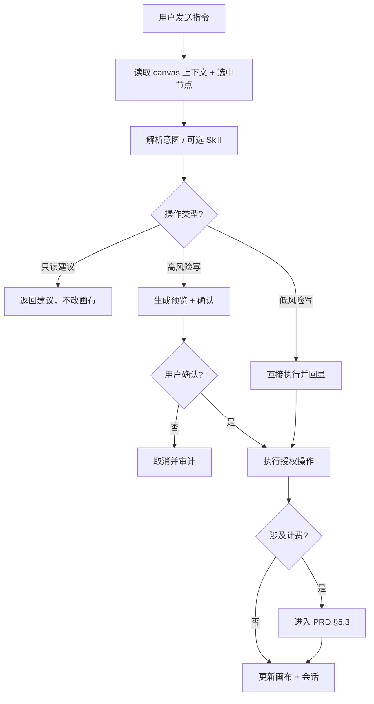
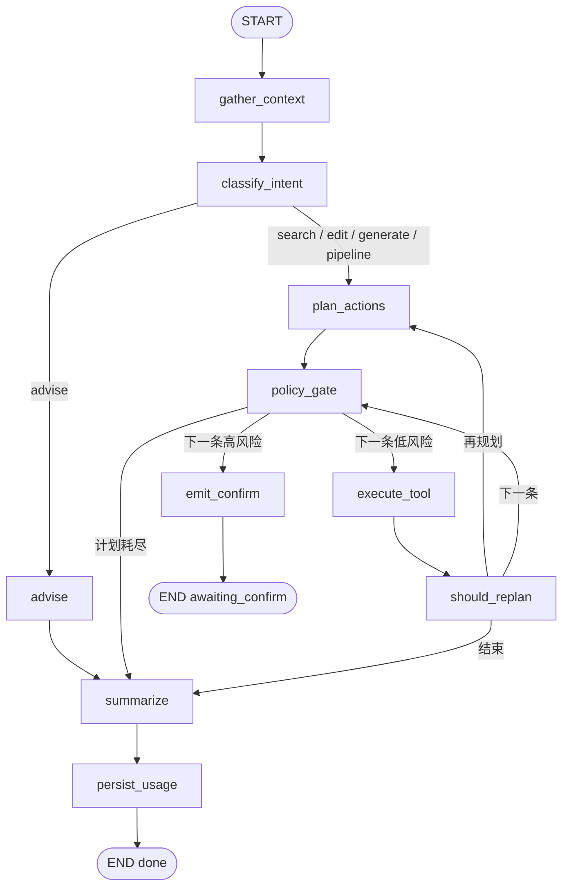

# VibePaper Agent 编排设计（LangGraph，已被替代）

> **状态**：已被 pi-agent-full-replacement-design.md 替代；仅保留产品契约和历史迁移参考。
> **编制日期**：2026-08-02  
> **依据**：PRD §5.2 / §6.5 · 技术概要 §5.2–5.4 · `AGENTS.md` §6 · 产品介绍与使用说明（飞书）  
> **范围**：历史 LangGraph 方案；新的 Node/TypeScript Pi Agent 方案见 pi-agent-full-replacement-design.md。
> **冲突裁决**：确认阈值 / 点数 / 状态机以 PRD 为准；服务边界与通信以技术概要为准；本文件细化 **如何编排**。

---

## 1. 设计目标与范式

### 1.1 产品诉求（官网 / 飞书指南）

- 自然语言驱动画布创作，全流程参与（灵感 → 结构 → 生成 → 优化）。
- 实时理解画布上下文（节点、连线、选中、操作意图），而非孤立问答。
- 对外表述「多智能体协作」（剧本拆解 → 资产生成 → 分镜输出）；支持随时人工精修。
- 短/长期记忆沉淀习惯（工程上长期记忆为 **P2**）。

### 1.2 工程范式（强制）

| 层级 | 范式 | 说明 |
|------|------|------|
| 编排 | **LangGraph Plan-and-Execute**（可含短观察–再规划环） | 库内嵌于 `agent-service`，无独立 Agent 服务 |
| 工具 | **Tool Registry + Function Calling** | 仅白名单；禁止 SQL / 直连 Repository / 直接改画布 JSON |
| 安全 | **Policy-as-Code（LLM 之后）** | PRD §5.2.1 阈值确定性执行；高风险确认令牌 |
| 「多智能体」 | **Supervisor + Specialist Subgraphs**（P1） | 角色化子图共享同一工具与策略，非多微服务 |
| 记忆 | 短期会话（P0 可用）+ 长期检索（P2） | 上下文按优先级裁剪，控制 Token |

**一句话**：对外是懂画布的创作编排器；对内是带策略门控的 Plan–Execute Agent。

### 1.3 非目标（本设计明确不做）

- Agent 跨服务直连对方数据库。
- 开放式无限 ReAct、模型自由发明工具。
- V1.0 多人实时协作画布（WebSocket）。
- P0 实现完整长期记忆与 Supervisor 全链路（仅留扩展点）。

---

## 2. 与现有契约的对齐

### 2.1 决策流程（PRD §5.2）



### 2.2 工具白名单（技术概要 §5.3 / Spec §7.2）

| 风险等级 | 工具 | 默认行为 |
|----------|------|----------|
| 只读 | `get_canvas_summary` · `get_selected_nodes` · `list_models` · `search_assets` | 可观察，不改画布 |
| 低风险 | `create_nodes` · `connect_nodes` · `layout_nodes` · `update_node_config` | 直接执行；`create_nodes` 单次 >20 → 升为高风险 |
| 高风险 | `delete_nodes` · `change_model` · `replace_output` · `submit_generation` | 确认令牌通过后才执行 |

每个工具：Pydantic 入参、权限范围、是否计费、是否需确认、审计字段。

### 2.3 确认令牌

绑定：`user_id` + `canvas_id` + `canvas_version` + 操作摘要哈希 + 过期时间。  
确认期间画布 `version` 变化 → 令牌失效，要求重新规划（PRD 异常表）。

### 2.4 跨服务通信

| 方向 | 方式 |
|------|------|
| Agent → canvas / asset | REST（读上下文、写节点/连线） |
| Agent → 生成 / 计费 | 经既有任务提交链路（MQ / billing API，带 `Idempotency-Key`） |
| 前端 ← Agent | SSE 流式步骤 |

---

## 3. 代码布局（目标）

```text
agent-service/src/agent/
  agent/
    planner.py                 # 规则回退 + LLM 结构化规划（保留）
    graph/
      state.py                 # AgentState
      schemas.py               # Intent / PlannedAction / Policy 相关模型
      nodes.py                 # 图节点实现
      edges.py                 # 条件边
      builder.py               # compile graph + checkpointer
  services/
    session_service.py         # 会话 CRUD；调 graph；确认续跑
  tools/
    registry.py                # 工具注册、风险分级、确认令牌（契约不变）
```

原则：**图只编排；副作用只走 Registry；策略门控不进 LLM。**

---

## 4. AgentState

```python
class AgentState(TypedDict, total=False):
    # --- 入参（每轮固定）---
    session_id: int
    user_id: int
    canvas_id: int | None
    user_message: str
    selected_node_ids: list[int]
    skill_id: int | None
    preferences: dict              # 默认模型 / 分辨率等

    # --- 上下文 ---
    canvas_summary: dict           # version / nodes / edges 摘要
    canvas_version: int
    selected_nodes: list[dict]
    short_term: dict               # Redis 会话上下文
    # long_term: list[dict]        # P2

    # --- 意图与计划 ---
    intent: dict                   # IntentSchema
    plan: list[dict]               # [{tool, params, summary, _risk?}]
    plan_cursor: int
    observations: list[dict]       # 工具返回，供再规划

    # --- 策略 / 确认 ---
    pending_actions: list[dict]
    await_confirm: bool
    confirm_action_id: int | None

    # --- 执行结果 ---
    executed: list[dict]
    errors: list[dict]
    assistant_reply: str
    usage: dict                    # tokens / points

    # --- 控制 ---
    events: list[dict]             # SSE 事件缓冲（P0）
    status: str                    # running | awaiting_confirm | done | failed | timeout
    loop_count: int
    max_loops: int                 # 默认 3
    started_at: float              # 规划超时 30s（PRD）
    thread_id: str                 # checkpointer 键，确认续跑用
```

### 4.1 IntentSchema

```python
class IntentSchema(BaseModel):
    kind: Literal["advise", "edit_canvas", "generate", "search", "pipeline"]
    modalities: list[Literal["text", "image", "video", "audio"]] = []
    needs_billing: bool = False
    target_node_ids: list[int] = []
    notes: str = ""
```

| `kind` | 含义 | 主路径 |
|--------|------|--------|
| `advise` | 只聊方案 / 解释，不改画布 | `advise` → `summarize` |
| `edit_canvas` | 创建 / 连线 / 布局 / 改参 | `plan_actions` → … |
| `generate` | 需要提交生成（计费） | 同上，计划含 `submit_generation` |
| `search` | 搜素材 / 列模型 | 以只读工具为主 |
| `pipeline` | 全流程（剧本→资产→分镜） | P0 可降级为 `generate`+`edit`；P1 进 Supervisor |

### 4.2 上下文组装优先级（降 Token）

1. 用户当前请求  
2. 当前选中节点  
3. 相关上下游节点  
4. 画布摘要（非全量 JSON）  
5. 当前 Skill（P1）  
6. 用户偏好  
7. 最近 N 轮对话  
8. 相关长期记忆（P2）

---

## 5. 图拓扑（P0）



### 5.1 节点职责

| 节点 | 职责 | 复用现状 |
|------|------|----------|
| `gather_context` | REST 拉画布；选中节点；短期记忆；追加 `context` 事件 | `SessionService.run_turn` 前半 |
| `classify_intent` | 产出 `IntentSchema`；失败回退规则 | 扩展 `planner.INTENT_RULES` |
| `advise` | 只读工具 + 文本建议，不写画布 | 新 |
| `plan_actions` | LLM 结构化 JSON 计划，失败回退 `plan()`；工具名必须 ∈ 白名单 | `planner.plan` / `llm_plan` |
| `policy_gate` | `classify_risk`；落 `AgentAction`；写入 `plan[i]._risk` | `tools.registry` |
| `execute_tool` | 调 `TOOLS[name].fn`；推进 `plan_cursor`；记 `observations` | `execute_tool` |
| `emit_confirm` | `create_confirm_token`；`await_confirm=True`；`confirm_required` 事件；**图中断** | 现确认逻辑 |
| `should_replan` | 据 observation / 占位 ID / `loop_count` 决定边 | 新 |
| `summarize` | `build_reply`；写 assistant 消息 | `build_reply` |
| `persist_usage` | 累计 token/points；`usage` + `done` | `run_turn` 尾部 |

### 5.2 条件边

```python
def after_intent(state: AgentState) -> str:
    if state["intent"]["kind"] == "advise":
        return "advise"
    return "plan_actions"

def after_policy(state: AgentState) -> str:
    plan = state.get("plan") or []
    i = state.get("plan_cursor", 0)
    if state.get("await_confirm"):
        return "emit_confirm"
    if i >= len(plan):
        return "summarize"
    if plan[i].get("_risk") == "high":
        return "emit_confirm"
    return "execute_tool"

def after_execute(state: AgentState) -> str:
    if time.time() - state["started_at"] > 30 and not state.get("executed"):
        state["status"] = "timeout"  # 节点内设置；边函数只读更佳
        return "summarize"
    last = (state.get("observations") or [None])[-1]
    if last and last.get("needs_replan") and state.get("loop_count", 0) < state.get("max_loops", 3):
        return "plan_actions"
    plan = state.get("plan") or []
    i = state.get("plan_cursor", 0)
    if i < len(plan):
        return "policy_gate"
    return "summarize"
```

### 5.3 `needs_replan` 触发（P0 最小集）

- `create_nodes` 成功，但后续 `connect_nodes` / `submit_generation` 仍使用占位 `node_id=0`。
- 工具返回可恢复错误（如节点不存在）。
- `pipeline` 某一子阶段完成，需要下一阶段计划（P1 完善）。

### 5.4 确认续跑

```text
POST .../confirmations/{action_id}  accept=true
  → 校验令牌与 canvas_version
  → checkpointer 加载 thread_id
  → 从 execute_tool（或专用 resume 入口）继续
  → policy_gate → … → summarize → persist_usage

accept=false
  → AgentAction.status = cancelled
  → 审计 agent_confirm_reject
  → summarize / done（不改画布）

version 不匹配
  → 拒绝续跑；提示重新发送指令
```

生产 checkpointer 建议 Redis；开发可用 `MemorySaver`。`thread_id` 建议：`s:{session_id}:{turn_id}`，并写入待确认的 `AgentAction` / Redis，供 confirm API 查找。

---

## 6. 意图识别分层

| 层 | 名称 | 输出 | 实现建议 |
|----|------|------|----------|
| L1 | 路由意图 | `IntentSchema.kind` | 小模型分类或规则；失败回退 `INTENT_RULES` |
| L2 | 槽位填充 | 模态、目标节点、是否计费、规模 | 结合选中节点 + 画布摘要 + 偏好 |
| L3 | 计划合成 | `plan[]` 工具序列 | LLM JSON Schema；校验白名单；失败 → `plan()` |

**禁止**：把 LLM 自由文本当作可执行指令；执行前必须解析为工具名 + 合法 params。

---

## 7. 工具调用契约

1. Planner **只**输出白名单工具名。  
2. Params 经 Pydantic / registry schema 校验，非法拒绝。  
3. `classify_risk` 二次判定（§5.2.1）：批量创建 >20、参数变化 ≥30%、删除、换模型、覆盖输出、`estimated_cost ≥ 1` 等。  
4. 高风险生成确认令牌后方可执行。  
5. 读 canvas/asset → REST；生成 → 计费/任务链路 + 幂等键；全程审计与埋点（`agent_confirm_*` · `agent_action_success|fail`）。

单轮规划超时：**>30s 无完整计划 → 终止且不改画布**（PRD）。  
生成任务提交后由 generation 状态机推进，Agent 不阻塞 GPU。

---

## 8. SSE 事件（保持前端兼容）

| 时机 | `type` | 说明 |
|------|--------|------|
| 上下文就绪 | `context` | 画布摘要计数等 |
| 计划步骤 | `plan_step` | tool + summary |
| 需确认 | `confirm_required` | actionId · token · confirmReason |
| 执行结果 | `action_result` | ok + data |
| 助手回复 | `assistant_message` | 文本 |
| 用量 | `usage` | token / points |
| 结束 | `done` | — |

**P0 推送模式**：节点向 `state["events"]` 追加，`run_turn` 结束后 `sse(events)`（与现状一致）。  
后续可升级为 Queue 边执行边 yield，不改事件名。

---

## 9. builder 骨架

```python
from langgraph.graph import StateGraph, END

def build_agent_graph():
    g = StateGraph(AgentState)
    for name, fn in [
        ("gather_context", gather_context),
        ("classify_intent", classify_intent),
        ("advise", advise),
        ("plan_actions", plan_actions),
        ("policy_gate", policy_gate),
        ("execute_tool", execute_tool),
        ("emit_confirm", emit_confirm),
        ("summarize", summarize),
        ("persist_usage", persist_usage),
    ]:
        g.add_node(name, fn)

    g.set_entry_point("gather_context")
    g.add_edge("gather_context", "classify_intent")
    g.add_conditional_edges("classify_intent", after_intent, {
        "advise": "advise",
        "plan_actions": "plan_actions",
    })
    g.add_edge("advise", "summarize")
    g.add_edge("plan_actions", "policy_gate")
    g.add_conditional_edges("policy_gate", after_policy, {
        "execute_tool": "execute_tool",
        "emit_confirm": "emit_confirm",
        "summarize": "summarize",
    })
    g.add_conditional_edges("execute_tool", after_execute, {
        "plan_actions": "plan_actions",
        "policy_gate": "policy_gate",
        "summarize": "summarize",
    })
    g.add_edge("emit_confirm", END)
    g.add_edge("summarize", "persist_usage")
    g.add_edge("persist_usage", END)
    return g.compile(checkpointer=...)  # 开发 MemorySaver；生产 Redis
```

`session_service.run_turn` 目标形态：

```python
state = {
    "session_id": session.id,
    "user_id": user_id,
    "canvas_id": session.canvas_id,
    "user_message": content,
    "selected_node_ids": selected_nodes or [],
    "events": [],
    "plan_cursor": 0,
    "loop_count": 0,
    "max_loops": 3,
    "started_at": time.time(),
    "status": "running",
    "thread_id": f"s:{session.id}:{turn_id}",
}
final = agent_graph.invoke(state, {"configurable": {"thread_id": state["thread_id"]}})
return final["events"]
```

---

## 10. 「多智能体」落地（P1）

官网多智能体 ≠ 多个可写库的独立服务。推荐：

```text
Supervisor（编排 + 统一 policy_gate）
  ├─ Script Specialist    → 文本 / 大纲节点
  ├─ Asset Specialist     → 图/音节点 + submit_generation
  ├─ Shot Specialist      → 分镜 / 视频节点
  └─ Layout Specialist    → layout_nodes / connect_nodes
```

约束：

- 共享同一 `TOOLS` 与 §5.2.1；角色 = 不同 system prompt + **允许工具子集**。  
- `intent.kind == pipeline` 时进入 Supervisor；否则单 Planner 即可。  
- Skill（P1）在 `gather_context` 注入指令，不扩大工具权限。

---

## 11. 分阶段范围

| 阶段 | 交付 | 验收锚点 |
|------|------|----------|
| **P0** | 单 Planner 图：context → intent → plan → policy → confirm? → execute → summarize；规则回退；SSE 兼容 | AC-19、AC-20、AC-20b |
| **P1** | Skill 注入；会话历史/片段；`pipeline` Supervisor 子图 | F-16 / F-17 |
| **P2** | 长期记忆检索进入 `gather_context` | F-18、AC-22 |

---

## 12. 从 `run_turn` 迁移计划

| 里程碑 | 改动 | 验收 |
|--------|------|------|
| **M1** | 抽出 `graph/state.py`、`schemas.py`；`run_turn` 仅组装 State，逻辑仍内联 | 行为零差异 |
| **M2** | 实现 gather / plan / policy / execute / summarize；`run_turn` → `graph.invoke`；暂无再规划、无 advise 分支 | 创建连接 + 确认门控 |
| **M3** | `classify_intent` + `advise`；checkpointer + `emit_confirm`；confirm API resume | 令牌失效 / 拒绝 / 接受 |
| **M4** | `should_replan`、占位 ID 修复进 observation、30s 超时、可选严格 JSON LLM plan | create → 真实 node_id → submit |

迁移期间保留 `planner.plan()` 作为 `plan_actions` 的 fallback；`llm_plan` 改为严格 JSON Schema，解析失败再回退。

---

## 13. 可观测与审计（最小集）

日志 / 埋点字段：`request_id` · `session_id` · `user_id` · `canvas_id` · `canvas_version` · `tool_name` · `risk_level` · `error_code` · 费用相关字段。  

事件：`agent_confirm_show|accept|reject` · `agent_action_success|fail`（口径见 PRD §11）。  

禁止：API Key、完整画布大 JSON、用户隐私明文无必要落盘。

---

## 14. 开放问题

| # | 问题 | 建议默认 |
|---|------|----------|
| 1 | Checkpointer 生产选型 | Redis（与现有 `agent_confirm:*` 同集群，独立 key 前缀） |
| 2 | 高风险是否「遇第一个即中断」还是「批量预览一次确认」 | P0：遇第一个高风险即中断；P1 可做批量预览 |
| 3 | `pipeline` P0 是否暴露 | P0 映射为 edit+generate 计划；产品文案可保留「全流程」 |
| 4 | LLM 不可用时 | 全量规则引擎 `plan()`，功能降级但门控不降级 |

---

## 15. 参考路径

| 文档 | 用途 |
|------|------|
| `docs/VibePaper产品需求文档新版.md` §5.2 / §6.5 | 流程、确认阈值、FR-AGENT |
| `docs/技术概要设计方案.md` §5.2–5.4 | LangGraph、工具、记忆 |
| `docs/specs/V1.0-engineering-spec.md` §7 | ModelProvider / 工具表 |
| `docs/plans/execution-plan.md` Phase 3 | B3-01~03、F3-01 |
| `AGENTS.md` §6 | Agent 安全硬约束 |
| `agent-service/src/agent/services/session_service.py` | 现状编排入口 |
| `agent-service/src/agent/tools/registry.py` | 工具与确认令牌实现 |
| `agent-service/src/agent/agent/planner.py` | 规则 / LLM 规划回退 |
