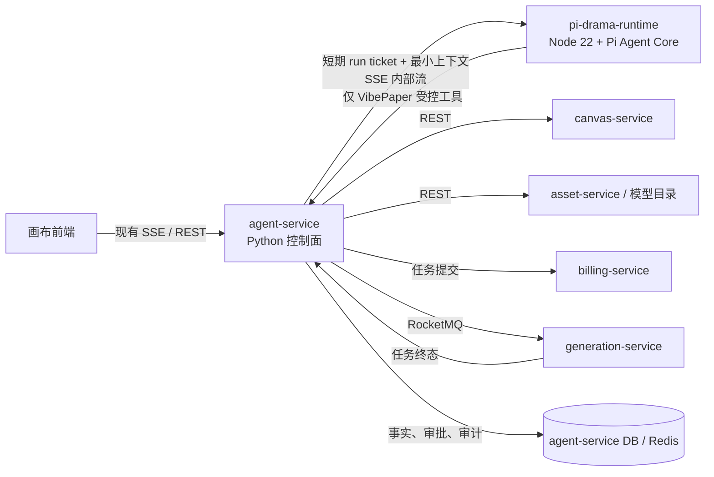
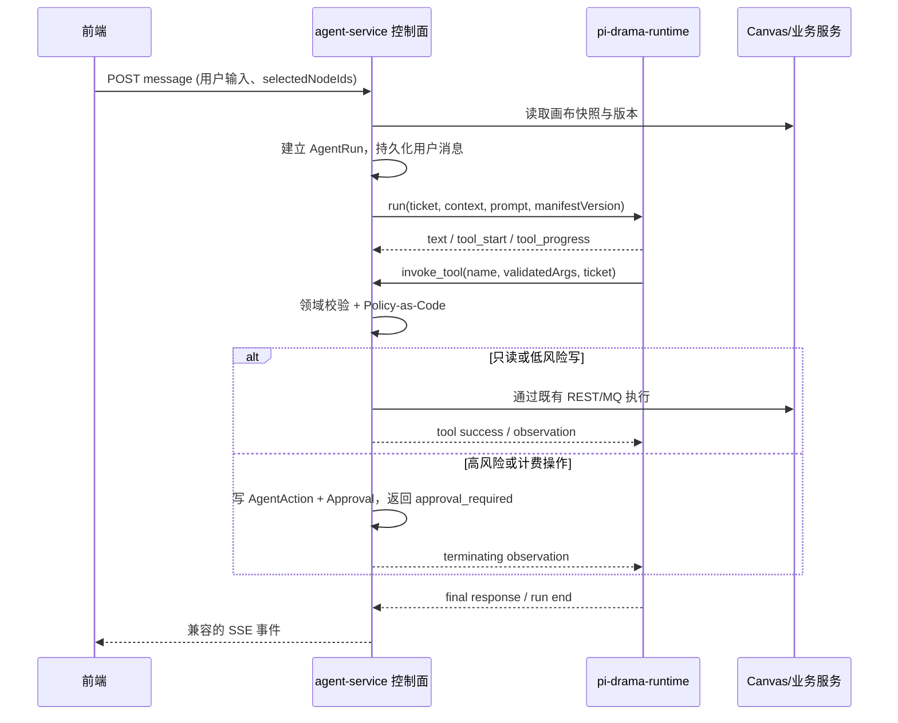

# VibePaper 短剧 Agent 基于 Pi 的重构设计（已被替代）

> - **状态**：已被 pi-agent-full-replacement-design.md 替代；仅保留短剧领域迁移背景
> - **编制日期**：2026-08-28
> - **适用范围**：原为 vertical-short-drama（短剧）编排链路；不再作为实施基线。
> - **依据**：PRD §5.2 / §6.5 / §5.3、技术概要 §5.2–5.4、根目录 `AGENTS.md` §5–7、现有短剧实现与测试、[Pi Agent Core](https://github.com/earendil-works/pi/tree/v0.84.3/packages/agent)。
> **上游基线**：`@earendil-works/pi-agent-core` **v0.84.3**（Node.js `>=22.19.0`，MIT）；升级必须显式评审 [release notes](https://github.com/earendil-works/pi/releases/tag/v0.84.3) 与工具/事件契约。

---

## 1. 结论

采用 **Pi Agent Core 运行时 + VibePaper 控制面** 的组合，而不是将 Pi Coding Agent CLI 嵌入产品，也不是把 Pi 的内置文件、Shell、浏览器工具开放给模型。

具体决策如下：

| 决策 | 结论 | 原因 |
|---|---|---|
| 采用范围 | 只采用 `@earendil-works/pi-agent-core` 与 `@earendil-works/pi-ai` | Core 提供有状态工具循环、流事件、工具调用前后钩子；CLI/TUI 与短剧产品无关且权限面过大。 |
| 运行形态 | 新增 Node 22 的 **`pi-drama-runtime` 内部运行时**，与 Python `agent-service` 同一部署单元（sidecar） | 不改变现有 FastAPI 公网 API、会话、审批、计费和 MQ 边界；Pi 只接收最小上下文和受控工具。 |
| 二次开发位置 | 在 `pi-main/packages/vibepaper-drama-agent` 开发适配包；发布镜像只携带该包及 Pi 的已审计依赖 | 复用 Pi 的单体测试与类型系统，避免修改上游 `packages/agent`。 |
| 系统记录 | `agent-service` 的 PostgreSQL 仍是会话、计划、审批、动作、计费审计的唯一业务事实源 | Pi 的内存状态和事件不是资金/画布事务事实；重启可由控制面重建。 |
| 安全门 | 所有写工具均回调 `agent-service` 控制面；Pi 不持有服务数据库凭据，不能直接访问 canvas、billing、generation | Pi 上游明确不提供内建文件、进程、网络或凭据权限限制；产品安全规则不能委托给提示词。 |
| 前端兼容 | 维持现有 `/api/v1/agent/**` 及 SSE 名称；在事件中补充 `runtime: "pi"` 和版本 | 可以灰度，不要求画布页面与历史记录一次性迁移。 |

本设计替代 [agent-langgraph-design.md](agent-langgraph-design.md) 中**短剧运行时编排**的部分；其中工具白名单、确认令牌、点数、画布乐观锁和跨服务边界继续有效。通用 Agent 仍可使用既有 LangGraph，直至有单独的替换决策。

## 2. 背景、问题与目标

当前短剧 Agent 位于 `agent-service` 的 LangGraph/ReAct 图中，并通过规则回退和 `workflow_orchestrator` 生成脚本、角色、分镜、关键帧、视频、音频和成片链路。现有测试已经固化了关键产品行为：不以用户原句充当节点提示词、关键帧未就绪不能提交视频、生成需要确认、任务终态可幂等回写。

问题不在于短剧领域约束缺失，而在于领域编译、LLM JSON 解析、ReAct 循环、事件转换和恢复逻辑相互交织，导致模型调用失败时要靠多处兜底，难以稳定扩展工具循环、上下文压缩和中途改指令。

Pi Core 已经提供以下与本项目匹配的基础能力：

- 多轮工具调用循环与流式 `agent_*`、`message_*`、`tool_execution_*` 事件；
- TypeBox 参数校验、并行/串行工具调用配置，以及 `beforeToolCall`、`afterToolCall` 门控；
- 中断、steering/follow-up 队列、上下文转换与压缩扩展点；
- 统一的多供应商 LLM 抽象。

目标是让 Pi 负责“模型—工具—观察—再决策”的运行循环，让 VibePaper 继续确定性地负责领域合同、权限、审批、计费、持久化和外部副作用。

### 2.1 成功标准

1. 短剧创建与推进不再依赖 LangGraph `react_agent_node` 或规则型 ReAct 回退。
2. 所有现有短剧领域约束继续由确定性代码执行，模型不能跳过 `script → shot → keyframe → clip → composite` 的合法依赖。
3. 现有确认令牌、`Idempotency-Key`、冻结/结算链路和画布版本校验保持不变。
4. 前端能够继续通过 SSE 显示思考、工具进度、确认卡片、最终回复和异步任务通知。
5. `runtime=pi` 可按用户、画布或环境灰度，出现错误可无损回退到 `runtime=langgraph`。

### 2.2 非目标

- 不把 Pi Coding Agent 变成面向用户的桌面/终端产品。
- 不启用 Pi 自带的 `bash`、PowerShell、文件读写、浏览器或任意网络工具。
- 不把 Pi 内置会话存储作为业务账本，也不迁移历史消息表。
- 不在本期改短剧产品合同、节点类型、任务状态机或点数规则。
- 不实现多 Agent 自主协商；可在 Pi 上做受控 specialist prompt，但仍共享同一控制面和白名单。

## 3. 目标架构



### 3.1 责任边界

| 组件 | 必须负责 | 明确不负责 |
|---|---|---|
| `pi-drama-runtime` | Pi 实例生命周期、系统提示词/Skill 装配、上下文裁剪、模型流、工具调用循环、Pi 事件标准化 | 用户鉴权、审批决定、点数判断、直接调用业务服务、业务数据持久化 |
| `agent-service` | JWT 上下文校验、会话/消息/动作持久化、领域计划验证、工具网关、审批令牌、幂等、SSE 转发、任务终态恢复 | 模型循环与 Pi 供应商适配实现 |
| `canvas-service` 等领域服务 | 各自资源的权限、版本、事务和状态机 | 信任 Pi 传入的用户/成本/画布版本 |

`pi-drama-runtime` 仅监听私有地址；生产环境使用 workload identity 或 mTLS，并要求每次 run 带一次性、短时有效的签名 `run_ticket`。ticket 至少绑定 `run_id`、`user_id`、`session_id`、`canvas_id`、`canvas_version`、`tool_manifest_version` 和过期时间。运行时不得接受浏览器 JWT，也不得保存跨请求的服务凭据。

### 3.2 代码布局与供应链

```text
pi-main/                              # 上游 Pi 的独立、可审计镜像/子模块
  packages/
    vibepaper-drama-agent/             # 新增：只放 VibePaper 适配层
      src/runtime.ts                   # Agent 构造、run 生命周期
      src/tools.ts                     # TypeBox 工具定义；没有通用系统工具
      src/policy-client.ts             # 调 agent-service 内部控制面
      src/context.ts                   # 最小上下文、压缩、红action
      src/events.ts                    # Pi event -> VibePaper 内部事件
      src/prompts/vertical-short-drama.ts
      test/
agent-service/
  src/agent/services/pi_runtime_service.py
  src/agent/services/pi_control_plane.py
  src/agent/domain/drama_*             # 继续保留为确定性领域合同
  src/agent/tools/registry.py          # 逐步收敛为控制面执行器
```

`pi-main` 不能以无 Git 元数据的源码副本长期存在。实施 M0 必须把它改为锁定到上游 `v0.84.3` commit `4e58f324fae8ebfa98a3d45181fb248072a2afac` 的 Git submodule 或可复现 vendor snapshot，并记录 SHA-256/许可证声明。依赖均精确锁定，禁止直接修改上游 `packages/agent`；确需修复时，以 `vibepaper-*` 包扩展或向上游提交 PR。

## 4. 单轮运行与确认恢复

### 4.1 正常路径



每轮新建 Pi `Agent`，由控制面提供经过裁剪的历史消息和已持久化的 tool observation。这样进程崩溃、扩容和重试都不依赖 Node 内存。`session_id` 仅用于供应商缓存/追踪；业务恢复由 `AgentRun`、`AgentAction`、`AgentMessage` 和 Redis 事件完成。

Pi 的默认并行工具执行不能直接用于会写画布、冻结点数或存在先后依赖的工具。默认设置为 `sequential`；只读工具若声明 `read_only=true` 且不依赖同批结果，才允许独立并行。`create_nodes → connect_nodes`、`submit_generation`、`compose_final` 固定串行。

### 4.2 确认不是 Pi 的权限功能

Pi 的 `beforeToolCall` 只用于本地格式/清单预检，最终安全裁决在控制面。高风险工具调用将得到 `approval_required` observation，Pi 通过 `afterToolCall` 标记本轮终止；控制面随后写出 `confirm_required` SSE。不得让 Pi 自行“等待用户确认”。

确认通过后，不恢复一个不可信的内存循环，也不要求模型重新生成动作：

1. `POST confirmations/{action_id}` 继续校验 token、`user_id`、`canvas_id`、`canvas_version`、动作哈希、有效期和一次性消费；
2. 控制面执行已经冻结的 `AgentAction`，使用既有 `agt:{action_id}:{attempt_no}` 幂等键；
3. 将 `action_executed` 或失败 observation 持久化为新的会话事实；
4. 若需要后续说明或规划，启动一轮新的 Pi run，注入该事实，而不是执行旧模型输出。

画布版本变更、审批过期、参数变更超过 30%、模型切换或点数不足均使旧动作失效并回到重新读取快照/重新规划。生成任务提交后立即结束 Agent 轮次；任务状态仍由 generation/billing 状态机和既有 clock/resume 机制推进。

## 5. 工具与领域合同

### 5.1 工具清单（P0）

| 工具 | 风险 | 控制面执行规则 |
|---|---|---|
| `get_canvas_summary`、`get_selected_nodes`、`get_task_status`、`list_models`、`search_assets` | 只读 | 使用 ticket 中的用户与画布范围查询；结果大小、素材 URL、敏感字段均裁剪。 |
| `load_skill`、`suggest_next_stage` | 只读 | 只返回已启用的 Skill 和确定性短剧阶段建议。 |
| `create_nodes`、`connect_nodes`、`layout_nodes`、`update_node_config` | 低风险（批量 >20 升高风险） | 校验 Canvas 版本、节点归属及 `creative_contract`；执行后返回标准化节点 ID。 |
| `delete_nodes`、`change_model`、`replace_output` | 高风险 | 先生成 `AgentAction` 和确认令牌。 |
| `submit_generation`、`compose_final`、`extract_frames`、`trim_clip`、`upscale`、`outpaint` | 高风险/计费 | 必须先确认；通过 billing/generation 正常入口，禁止 Pi 直发 MQ。 |

工具参数存在两层验证：Pi 的 TypeBox 负责让模型只能看到合法形状；Python Pydantic/领域合同负责权威业务验证。两层 schema 由版本化 `tool-manifest.json` 生成或校验，运行 ticket 固定 `manifest_version`，拒绝工具名、版本或参数摘要不匹配的调用。不得维护两套手工漂移的字段定义。

### 5.2 短剧领域不变量

这些规则不写进 prompt 的“建议”，而是保留/收敛在 `agent-service` 的确定性 domain 层：

- 创作类型只使用 `script`、`character`、`shot`、`keyframe`、`clip`、`audio`、`composite`；
- `input` 依赖必须符合 `creative_contract.ALLOWED_INPUTS`，脚本不能直接生图/生视频；
- 视频提交需要已满足的关键帧/分镜/角色上游，未 ready 的关键帧不能推进视频层；
- 角色、分镜、关键帧、片段、合成节点的提示词须为角色化产物，不得原样复制用户整句；
- 每个副作用动作必须带 `run_id`、`action_id`、`canvas_version`、`idempotency_key`，并写审计字段；
- 计费继续遵循冻结后排队、5 分钟未运行自动解冻、成功结算/失败全额解冻的现有契约。

### 5.3 提示词与上下文

`vertical-short-drama` prompt 包只描述角色、输出格式、可用工具以及何时提问；它不能授予权限。每次调用按以下优先级装配上下文，超过预算从底部裁剪并记录 `context_compacted`：

1. 用户当前指令、已选节点、未消费的审批/任务终态；
2. 当前画布版本与短剧工作流摘要（阶段、每类节点计数、失败/运行任务）；
3. 与所选节点一跳相关的节点、连线、素材摘要；
4. 已附加 Skill 的简明指令与用户偏好；
5. 最近对话、已有摘要和非关键历史 observation。

永不发送服务令牌、完整账务、未授权画布内容或原始数据库对象给模型。长内容、图片和素材只提供受时限保护的引用或受控缩略信息。

## 6. API、事件和数据变更

### 6.1 外部 API

现有外部 API 保持路径和主要字段不变。请求消息可选接受 `runtimeHint`（只在灰度/测试环境生效），响应和 SSE 增加兼容字段：

```json
{
  "type": "tool_progress",
  "runId": "...",
  "runtime": "pi",
  "runtimeVersion": "pi-agent-core@0.84.3+vibepaper.1",
  "actionId": "...",
  "content": "正在创建第 2 个关键帧节点"
}
```

事件映射如下，旧前端不认识的字段必须可忽略：

| Pi 事件 | VibePaper SSE | 持久化 |
|---|---|---|
| `agent_start` / `turn_start` | `agent_run_started` / `thinking` | `agent_runs` 开始记录 |
| assistant text `message_update` | `assistant_delta`（兼容既有 `assistant_message` 分片） | 最终完整助手消息 |
| `tool_execution_start` | `tool_started` | 动作意图/运行事件 |
| `tool_execution_update` | `tool_progress` | 仅关键进度事件 |
| `tool_execution_end` | `tool_result` / `confirm_required` | observation、`AgentAction` 终态 |
| `agent_end` | `assistant_message` / `agent_run_finished` | run 状态、用量、错误码 |

SSE 只由 `agent-service` 对浏览器输出。Pi 内部事件采用 SSE 或 NDJSON，必须能用 `run_id + event_seq` 去重；浏览器断线不取消后台 Agent，重连继续读取控制面事件。

### 6.2 新增内部合同

| 接口 | 调用方 | 关键约束 |
|---|---|---|
| `POST /internal/pi/runs`（流） | 控制面 → Pi | 仅 sidecar 身份；一次性 ticket；请求含上下文快照 hash。 |
| `POST /internal/pi/tools/{tool}` | Pi → 控制面 | ticket、工具名、manifest 版本、call ID、已验证参数；控制面重新验证。 |
| `POST /internal/pi/runs/{run_id}/cancel` | 控制面 → Pi | 触发 `AbortSignal`；不会撤销已持久化动作。 |
| `GET /internal/pi/tool-manifest/{version}` | Pi → 控制面 | 只返回当前 profile 的最小白名单。 |

内部错误统一映射为 `{ code, message, details, request_id, retryable }`，沿用 `INVALID_INPUT`、`PERMISSION_DENIED`、`VERSION_CONFLICT`、`INSUFFICIENT_POINTS`、`MODEL_TIMEOUT`、`MODEL_UNAVAILABLE`、`CONTENT_BLOCKED`、`FREEZE_EXPIRED`。Pi 进程错误新增 `AGENT_RUNTIME_UNAVAILABLE`，可重试且不产生业务动作。

### 6.3 数据迁移

新增而非改写历史记录：

| 表/实体 | 关键字段 | 用途 |
|---|---|---|
| `agent_runs` | `id`、`session_id`、`runtime`、`runtime_version`、`status`、`canvas_version`、`context_hash`、`event_seq`、`error_code`、`started_at/ended_at` | 为一次 Pi 调用建立可恢复、可审计边界。 |
| `agent_actions`（扩展） | `run_id`、`tool_name`、`tool_manifest_version`、`params_hash`、`observation_hash` | 关联 Pi 工具意图与现有审批/幂等动作。 |
| `agent_messages`（扩展） | `runtime`、`run_id`、`event_seq` | 保留对话兼容性与去重依据。 |
| `agent_runtime_rollouts` | profile、目标比例、allowlist、fallback、启停时间 | 不将灰度开关散落在环境变量。 |

所有迁移使用 Alembic，并补充回滚说明。旧历史默认标记为 `runtime=langgraph`；不回填或重放旧模型消息。

## 7. 安全、资金与可观测性

### 7.1 必须阻断的风险

1. **提示词注入**：画布文本、Skill、素材元数据都是不可信内容；仅作为 data，不能改变系统提示词、工具列表或 policy。
2. **越权工具**：Pi 每次工具调用都由 ticket 范围和控制面二次鉴权，禁止根据模型参数选择 URL、服务名或用户 ID。
3. **重复副作用**：Pi 重试、SSE 重连、sidecar 重启均只能重放读 observation；写操作通过 action 的唯一幂等键执行一次。
4. **审批绕过**：`beforeToolCall` 的允许结果不等于授权；成本、模型改变、参数变化和覆盖风险由控制面重算。
5. **供应链漂移**：Pi 升级需锁定 release/commit、执行其核心包测试和本项目契约测试，禁止浮动 `latest`。

### 7.2 指标与审计

每个 run 和工具动作均记录/透传 `request_id`、`run_id`、`session_id`、`user_id`、`canvas_id`、`canvas_version`、`tool_name`、`action_id`、`task_id`、`model`、token 用量、估算/实际点数、延迟、结果/错误码。最小告警包括：

- Pi runtime 不可用、流中断率、超时率、工具参数拒绝率；
- `approval_required → approved → executed` 的漏斗和过期率；
- 同一 action 多次执行尝试、版本冲突、冻结超时；
- 短剧每阶段成功率（脚本、关键帧、视频、合成）和非法依赖拦截率。

## 8. 实施与迁移计划

| 阶段 | 交付物 | 退出条件 |
|---|---|---|
| M0：基线与 ADR | 固定 Pi `v0.84.3` 源码、许可证 NOTICE、Node 22.19 镜像、`pi-drama-runtime` 空服务、架构例外审批 | 不使用浮动上游源码；镜像 SBOM/漏洞扫描通过。 |
| M1：只读垂切 | run ticket、Pi 事件桥、`get_canvas_summary`/`get_selected_nodes`/`list_models`/`search_assets`、SSE 映射 | 只读短剧问答与历史回放稳定；不改画布、不扣点。 |
| M2：低风险写 | manifest、`create_nodes`/`connect_nodes`/`update_node_config` 控制面、短剧 prompt 与领域校验 | 30 秒 3 镜短剧能生成合法节点图；现有短剧方法论测试迁为 Pi 契约测试。 |
| M3：确认与生成 | `AgentRun`、审批终止/新轮恢复、生成/合成工具、幂等与任务终态 observation | 确认、拒绝、过期、版本冲突、冻结超时全链路通过。 |
| M4：灰度与切换 | rollout 表、影子评估、按 user/canvas 灰度、开关与回退仪表盘 | 目标指标连续 7 天达标；默认短剧 runtime 切到 Pi。 |
| M5：清理 | 删除短剧专用 LangGraph 节点和重复回退，仅保留通用 Agent 图 | 历史 run 不再依赖旧代码；回退窗口结束后完成删除。 |

灰度策略：M1/M2 先镜像执行只读计划，不产生副作用并比较“合法工具序列、领域校验结果、回复质量”；M3 开始仅 allowlist 用户可见。发生 `AGENT_RUNTIME_UNAVAILABLE`、协议不兼容或错误预算超标时，在**下一轮**切回 LangGraph，不重放正在等待确认/已提交的动作。

## 9. 测试与验收

### 9.1 自动化测试矩阵

| 层级 | 必测用例 |
|---|---|
| Pi 包单测 | TypeBox schema、事件映射、上下文裁剪、顺序工具执行、取消、未知工具阻断、无系统工具暴露。 |
| 控制面单测 | ticket 绑定/过期/重放、manifest 版本不匹配、参数二次校验、审批哈希、幂等动作、领域合同。 |
| 契约测试 | Pi 发出的每个工具调用均与 Python manifest、OpenAPI 错误体和 SSE schema 相符。 |
| E2E | “30 秒、3 镜、雨夜城门橘猫”创建合法 script/character/shot/keyframe/clip/composite 链；关键帧未 ready 时不得提交视频；确认生成后才冻结/排队；失败全额解冻。 |
| 韧性测试 | 在文本流、工具执行、审批等待、generation 终态回调四个位置杀掉 Pi sidecar；验证没有重复写、没有重复扣点、下一轮可恢复。 |
| 安全测试 | 提示词注入、伪造 ticket、跨画布 ID、篡改 `user_id`/成本/模型、批量 >20、重复 confirmation。 |

### 9.2 上线验收门槛

- 所有既有 `agent-service/tests/test_methodology_e2e.py`、`test_workflow_rails.py`、`test_control_plane.py` 的同等 Pi 路径用例通过；
- 资金安全核心分支覆盖率不低于现行要求（≥90%）；
- 不存在 Pi 到任意业务数据库、MQ 或公网业务服务的直连网络路径；
- 100% 高风险工具在控制面生成 `AgentAction`，0 次未确认计费提交；
- 灰度期间短剧主路径成功率、P95 延迟和用户拒绝率不低于旧运行时基线，且不存在 P0 数据/资金事故。

## 10. 需在 M0 明确的事项

1. 允许在“Agent 模块 Python”硬约束下引入 Node sidecar，还是把该技术例外回写到技术概要；本设计的推荐是 **允许受限 sidecar，但公网 Agent 服务仍为 Python**。
2. Pi 上游采用 submodule 还是 vendor snapshot；推荐 submodule + 精确 gitlink，便于安全更新与差异审计。
3. 首发支持的模型供应商和 API key 所有权；推荐由控制面托管短期 provider ticket，Pi 不落盘密钥。
4. 低风险节点创建是否可免确认；沿用当前 PRD，单批超过 20 个节点升级为确认。

在上述事项完成架构签字前，不应删除 LangGraph 短剧路径，也不应把 `pi-main` 的未锁定源码直接进入生产镜像。

## 11. 参考与源码索引

- [Pi 仓库](https://github.com/earendil-works/pi) 与 [Pi Agent Core v0.84.3](https://github.com/earendil-works/pi/tree/v0.84.3/packages/agent)：工具循环、事件、`beforeToolCall`/`afterToolCall`、上下文与 TypeBox 契约。
- [Pi v0.84.3 release](https://github.com/earendil-works/pi/releases/tag/v0.84.3)：锁定上游版本及升级评审入口。
- [现有 LangGraph 设计](agent-langgraph-design.md)：通用 Agent 编排、工具白名单、确认令牌与 SSE 合同。
- `agent-service/src/agent/domain/creative_contract.py`：短剧节点依赖与生成合法性。
- `agent-service/src/agent/domain/workflow_orchestrator.py`：短剧工作流编译基线。
- `agent-service/src/agent/tools/registry.py`：现有跨服务工具执行入口，后续收敛为控制面执行器。
- `agent-service/tests/test_methodology_e2e.py`、`test_workflow_rails.py`、`test_control_plane.py`：需保留的行为、资金和审批回归基线。
