# 技术概要设计方案

> **目标**：完全复刻 VibePaper 网站（vibepaper-ai.com）的全部功能与交互体验  
> **编制日期**：2026-07-30    

> **架构决议（2026-08-28，优先于本文下方历史描述）**：agent-service 完整迁移为 Node.js 22.19+、TypeScript、Fastify、Pi Agent Core 服务；Python 仅保留 generation-service。所有下文中 agent-service 为 Python/FastAPI/LangGraph 或 LangGraph 为 Agent 框架的内容均为迁移前基线，实施以 docs/specs/pi-agent-full-replacement-design.md 为准。PRD 的工具白名单、确认令牌、计费与跨服务边界不变。

---

## 目录

1. [总体架构决策](#1-总体架构决策)
2. [前端技术栈](#2-前端技术栈)
3. [后端技术栈](#3-后端技术栈)
4. [数据库与存储](#4-数据库与存储)
5. [AI 生成与 Agent](#5-ai-生成与-agent)
6. [媒体处理](#6-媒体处理)
7. [实时通信](#7-实时通信)
8. [中间件与基础设施](#8-中间件与基础设施)
9. [并发控制与容错](#9-并发控制与容错)
10. [开发工具与基础设施](#10-开发工具与基础设施)
11. [完整技术栈总览](#11-完整技术栈总览)

---

## 1. 总体架构决策

### 1.1 架构形态：微服务架构

**技术栈分工原则**：
- **Agent 相关模块**（agent、generation）采用 **Python** 技术栈——AI/LLM 生态原生支持，LangGraph、ComfyUI 等核心依赖均为 Python 生态
- **其他业务模块**（identity、canvas、asset、billing、enterprise、gallery、admin）采用 **Java** 技术栈——Spring Boot 生态成熟，事务管理、企业级特性、团队人才储备更有优势

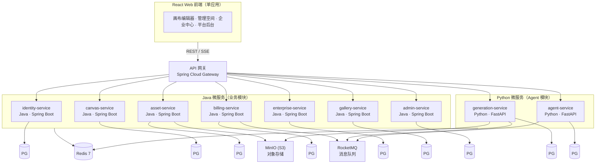

### 1.2 微服务进程拆分

#### 1.2.1 Java 微服务（Spring Boot 3.x + Java 21）

| 服务 | 职责 | 运行时 | 数据库 |
|------|------|--------|--------|
| `identity-service` | 注册、登录、JWT、会话、偏好 | Java 21 + Spring Boot 3.x | `vibepaper_identity` |
| `canvas-service` | 画布 CRUD、节点/连线、DSL 导入导出 | Java 21 + Spring Boot 3.x | `vibepaper_canvas` |
| `asset-service` | 素材元数据、上传签名、引用管理、媒体处理 | Java 21 + Spring Boot 3.x | `vibepaper_asset` |
| `billing-service` | 账户、冻结、结算、充值、分配、流水 | Java 21 + Spring Boot 3.x | `vibepaper_billing` |
| `enterprise-service` | 企业、成员、邀请、点数分配、权限 | Java 21 + Spring Boot 3.x | `vibepaper_enterprise` |
| `gallery-service` | 发布、审核、搜索、克隆 | Java 21 + Spring Boot 3.x | `vibepaper_gallery` |
| `admin-service` | 用户管理、模型配置、价格、审核、审计 | Java 21 + Spring Boot 3.x | `vibepaper_admin` |

#### 1.2.2 Python 微服务（Agent 相关 · FastAPI + Python 3.12）

| 服务 | 职责 | 运行时 | 数据库 |
|------|------|--------|--------|
| `generation-service` | 模型目录、参数校验、任务状态机、供应商路由、图像/视频生成 | Python 3.12 + FastAPI + Celery | `vibepaper_generation` |
| `agent-service` | Agent 会话、消息、Skill、规划、工具执行、记忆系统 | Python 3.12 + FastAPI + Celery | `vibepaper_agent` |

**Celery Worker 拆分**（Python 服务内部）：

```
generation-worker-image    # 图片生成
generation-worker-video    # 视频生成
generation-worker-audio    # 音频生成
agent-worker               # Agent 执行
media-worker               # FFmpeg/媒体处理（可归属 asset-service 调用）
```

#### 1.2.3 基础设施服务

| 服务 | 职责 | 运行时 |
|------|------|--------|
| `vibepaper-gateway` | API 网关、路由转发、限流、鉴权 | Java 21 + Spring Cloud Gateway |
| `vibepaper-web` | React 前端（Vite 开发服务器） | Node.js 20 LTS |
| Nacos Server | 服务注册发现、配置中心 | 独立部署 |
| RocketMQ | 异步消息、分布式事务 | 独立部署 |

**核心原则**：
- Java 微服务处理同步业务请求（CRUD、权限、计费事务），通过 **RocketMQ** 与 Python Agent 服务异步协作
- Python 微服务专注 AI 能力——模型生成、Agent 编排、LLM 调用，通过 Celery 执行长耗时 GPU 任务
- 各服务独立数据库，通过 API 调用 + 消息队列实现最终一致性；关键强一致场景（计费）使用分布式事务（Seata）
- API 网关统一入口，Nacos 管理服务注册发现与配置

---

### 1.3 服务间调用关系

#### 1.3.1 同步调用依赖矩阵

各服务通过 REST API 相互调用（行依赖列）：

```
                  identity canvas asset billing generation agent enterprise gallery admin
identity            -       -      -       -        -       -         -        -      -
canvas              ●       -      ●       -        -       -         -        -      -
asset               ●       -      -       -        -       -         -        -      -
generation          ●       -      ●       ●        -       -         -        -      -
billing             ●       -      -       -        -       -         -        -      -
agent               ●       ●      ●       ●        ●       -         -        -      -
enterprise          ●       -      -       -        ●       -         -        -      -
gallery             ●       ●      -       -        -       -         -        -      -
admin               ●       ●      ●       ●        ●       ●         ●        ●      -
```

**依赖规则**：
- `identity-service` 是所有服务的认证入口——每个请求到达网关后需向 identity-service 校验 JWT
- `admin-service` 作为管理后台可访问所有服务的 API
- 服务间禁止直接访问对方数据库——必须通过 API 或消息队列
- 循环依赖绝对禁止——若出现，说明需要提取第三服务或合并两个服务

#### 1.3.2 异步消息流（RocketMQ）

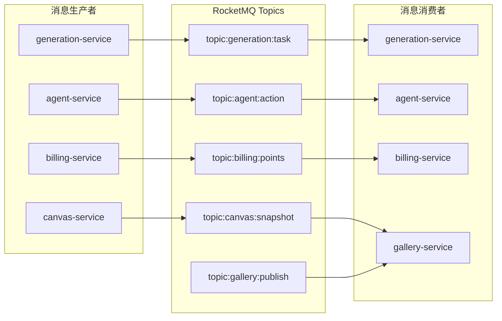

#### 1.3.3 关键调用路径说明

| 调用路径 | 通信方式 | 说明 |
|----------|----------|------|
| identity ← (所有服务) | REST（网关统一校验） | JWT 在网关层校验，服务间内部调用携带认证上下文 |
| billing → generation | REST / MQ | 生成任务扣费：billing 冻结后发 MQ → generation 消费创建任务 |
| agent → canvas → asset → generation → billing | REST 同步 + MQ 异步 | Agent 读画布/搜素材（REST）→ 触发生成（MQ）→ 回调计费（MQ） |
| gallery → canvas | REST | 发布时获取画布数据生成快照 |
| admin → (所有服务) | REST | 后台管理跨服务操作 |
| generation → billing（回调） | MQ | 任务完成后通过 MQ 通知 billing 结算/解冻 |

**同步 REST 调用 vs 异步 MQ 调用的选择原则**：
- **REST**：读操作（查询画布、获取素材）、需要立即返回结果的写操作（创建画布、更新节点）
- **RocketMQ**：跨服务的长耗时操作（提交生成任务、Agent 触发）、回调通知（任务完成、冻结解冻）、数据同步（画布快照发布）

---

### 1.4 关键业务流程时序图

#### 1.4.1 用户注册与登录（跨服务）

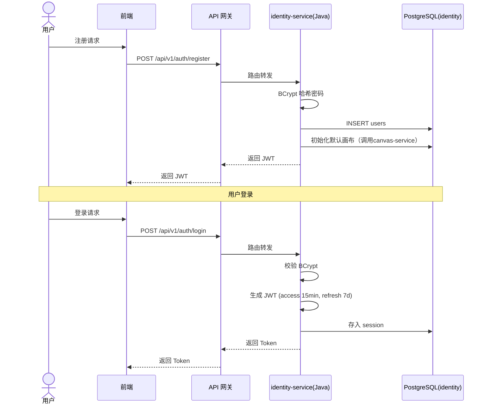

#### 1.4.2 点数充值-消费全链路（分布式事务）

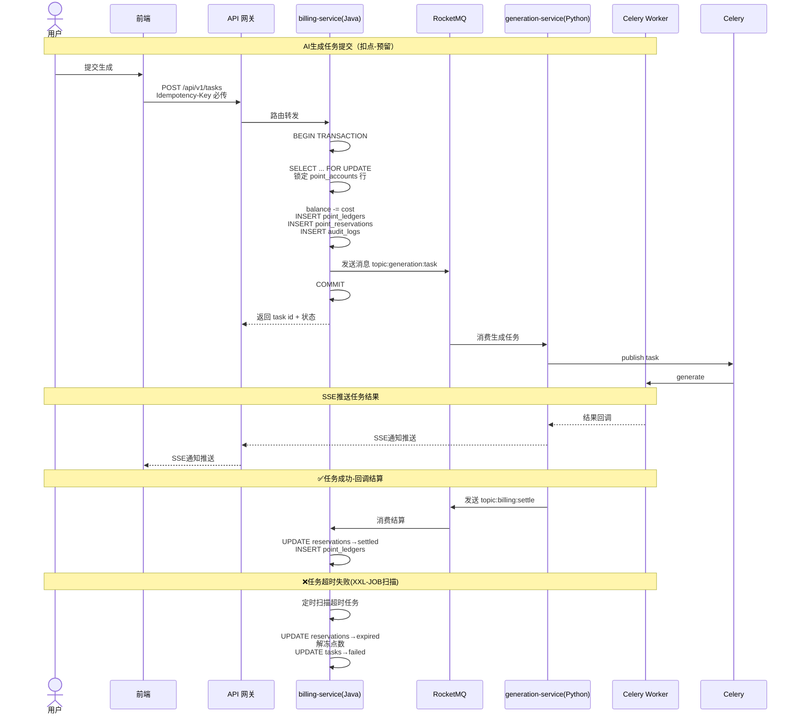

**关键设计要点**：
1. `Idempotency-Key` 防止重复扣费——同一 Key 第二次请求返回第一次的结果
2. `SELECT ... FOR UPDATE` 锁定账户行，防止并发扣费超支
3. 本地事务 + RocketMQ 消息确保原子性（事务提交后才发送 MQ）
4. 冻结点数在任务成功时由 generation-service 回调 MQ 触发结算、失败时由 XXL-JOB 定时解冻

#### 1.4.3 画布发布到创意广场（跨服务 REST）

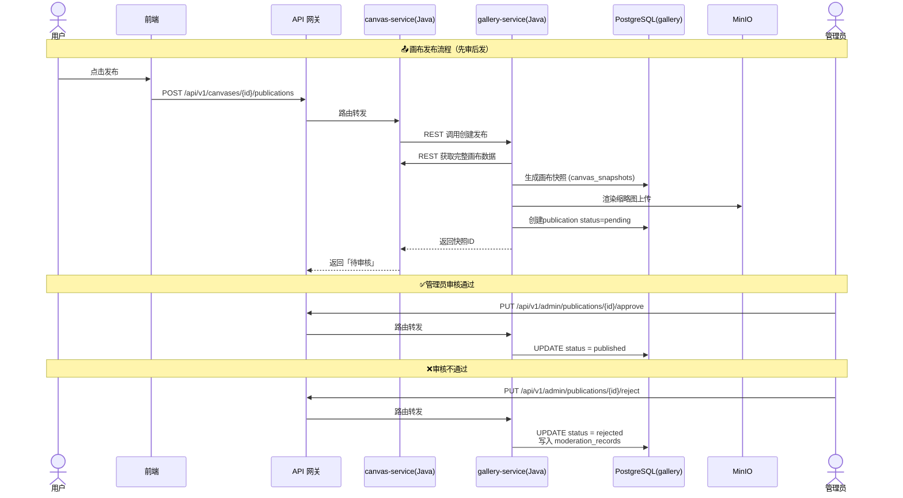

**设计要点**：
- 发布时创建的是画布快照（snapshot），而非引用——即使原画布后续修改，已发布内容不受影响
- "先审后发"：内容发布后默认 `pending`，经人工/自动审核后才可见

#### 1.4.4 企业成员邀请流程

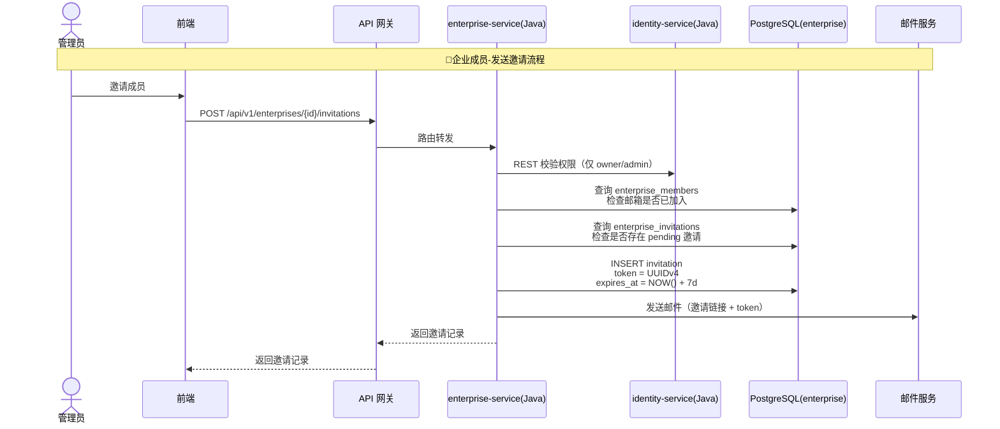

**被邀请人接受流程**：

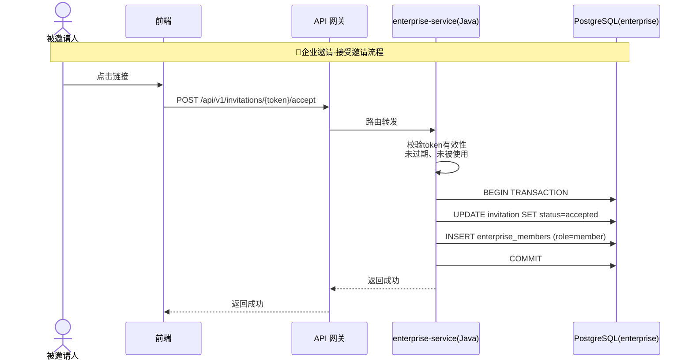

#### 1.4.5 Agent 执行全链路（跨语言同步+异步）

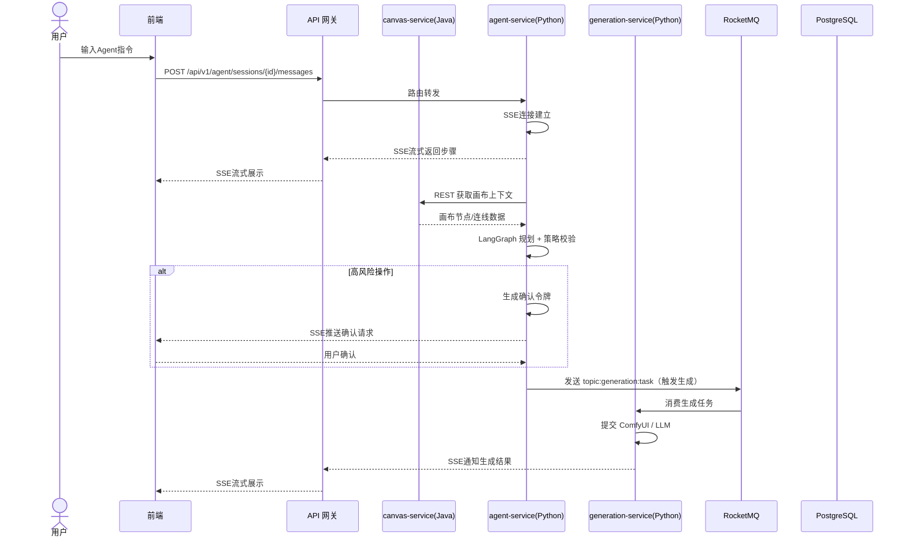

---

---

### 1.5 外部服务依赖清单

| 服务 | 类型 | 用途 | 强/弱依赖 | 降级策略 |
|------|------|------|-----------|----------|
| PostgreSQL | 数据库 | 全部持久化存储（每个微服务独立DB） | **强依赖** | 不可降级——PG 挂则对应服务不可用 |
| Redis | 缓存/锁 | 会话、限流、分布式锁、Celery Broker | **强依赖** | Celery 任务丢失；会话校验降级为每次查 PG；限流降级为放过 |
| Nacos | 注册发现/配置中心 | 服务注册发现、动态配置管理 | **强依赖** | 首次获取配置后本地缓存；发现失败使用上次可用列表 |
| RocketMQ | 消息队列 | 服务间异步通信、分布式事务 | **强依赖** | 消息暂存本地 Outbox 表延迟投递 |
| Spring Cloud Gateway | API 网关 | 路由转发、限流、鉴权 | **强依赖** | 无降级——网关是唯一入口；可配置高可用多实例 |
| Seata | 分布式事务 | 跨服务强一致事务（计费场景） | **弱依赖** | 降级为 MQ 最终一致性 + 定时对账补偿 |
| MinIO | 对象存储 | 素材/输出文件/缩略图 | **强依赖** | 上传功能不可用；已上传文件不受影响 |
| ComfyUI | AI 引擎 | 图像/视频生成 | **弱依赖** | 生成任务排队等待；模型状态页显示不可用 |
| LangGraph | Agent 框架 | Agent 编排 | 内嵌依赖 | 作为 Python 库内嵌在 agent-service Worker 中，无独立服务 |
| OpenAI API | 外部 LLM | LLM 调用（如使用云端模型） | **弱依赖** | 切换备用模型供应商；返回友好错误信息 |
| 邮件服务 | 通知 | 邀请/验证/告警 | **弱依赖** | 邮件暂不发送，记录到 Outbox 延迟投递 |
| 支付网关 | 外部 API | 充值回调 | **弱依赖** | 充值订单标记为 `pending`，定时轮询支付状态 |

---

## 2. 前端技术栈

### 2.1 核心框架

| 能力 | 选型 | 版本 | 理由 |
|------|------|------|------|
| 框架 | **React** + TypeScript | React 18/19 + TS 5.x | 官网实测为 React + @xyflow/react + Tailwind；完整复刻必须同技术栈才能保证交互一致 |
| 构建 | **Vite** | 5/6 | React 生态标配，HMR 极快，开发体验优秀 |
| 路由 | **React Router** | 6.x | `/workspace`、`/canvas/{id}`、`/admin` 等路由对齐官网 IA |
| 包管理 | **pnpm** | 9.x | 磁盘空间友好，lockfile 清晰，monorepo 支持好 |

### 2.2 画布引擎（最关键选型）

| 能力 | 选型 | 理由 |
|------|------|------|
| 画布核心 | **@xyflow/react**（React Flow） | 官网同款引擎；节点/连线/缩放/框选/小地图/自定义节点能力完整；支持 500+ 节点流畅交互 |
| 自动布局 | **ELK.js** | 一键整理、分层布局、编组排列，计算放入 Web Worker 不阻塞主线程 |
| 2D 导演台 | **react-konva** | 场景编辑、角色摆放、相机预览，Canvas 2D 渲染比 DOM 方案更适合 |

### 2.3 状态管理

| 状态类型 | 工具 | 存储内容 | 理由 |
|----------|------|----------|------|
| 画布高频本地状态 | **Zustand** | 节点坐标、选中项、视口、拖拽模式 | 细粒度选择器避免全画布重渲染；只更新拖拽结束后的最终位置 |
| 服务端状态 | **TanStack Query** | 画布列表、任务、素材、账户、企业 | 自动缓存/失效/重取，与 REST API 天然匹配 |
| 表单状态 | **React Hook Form + Zod** | 模型参数、登录、企业设置 | 高性能非受控表单 + Zod 类型校验 |
| 本地草稿 | **IndexedDB**（idb 库） | 未同步画布操作、上传恢复信息 | 页面刷新/崩溃不丢失编辑中的内容 |
| URL 状态 | **React Router** | 当前画布 ID、筛选项、分页 | 链接可分享、浏览器前进后退可用 |

### 2.4 UI 与交互

| 能力 | 选型 | 理由 |
|------|------|------|
| 样式方案 | **Tailwind CSS** | 官网同款样式方案，完整复刻必须使用；utility-first 开发效率高 |
| 无障碍组件 | **Radix UI** | 弹窗、菜单、Popover、Tabs、Select 等交互基元；行为完整、可定制样式 |
| 图标 | **Lucide React** | 与官网风格一致的图标库 |
| 富文本 | **TipTap**（基于 ProseMirror） | 节点文本编辑、Markdown 渲染，插件生态丰富 |
| 文本编辑器 | **CodeMirror 6** | 文本节点的 Prompt 编辑、语法高亮 |
| 图片裁剪 | **react-easy-crop** | 图片节点的裁剪和预览 |
| 音频波形 | **WaveSurfer.js** | 音频节点的波形展示和播放 |
| 拖拽排序 | **dnd-kit** | 视频拼接顺序、素材列表拖拽、画布外拖入 |
| 图表 | **Apache ECharts** | 点数用量统计、企业数据分析 |
| 测试 | **Vitest + Testing Library + Playwright** | 单元/组件/E2E 全覆盖 |

### 2.5 画布性能策略

1. 节点组件使用稳定 `id`、`React.memo` 和 Zustand 细粒度选择器，避免全画布重渲染
2. 缩放到较小时切换简化节点外观，暂停视频和复杂预览
3. 大画布按视口只渲染可见重型内容；节点结构仍由 React Flow 管理
4. 连续移动以 300-500ms 防抖生成增量补丁，最终操作（松开鼠标/确认编辑）立即落盘
5. 自动布局计算放入 Web Worker；完成后一次性应用结果
6. 图片使用缩略图，视频不自动加载原文件
7. 用 100、500、1000 节点基准场景监控 FPS、内存和保存耗时

### 2.6 前端项目结构

```
src/
├── app/              # 应用壳：路由、布局、认证
├── features/
│   ├── canvas/       # 画布编辑器
│   │   ├── components/  # React Flow 节点、连线、小地图
│   │   ├── stores/      # Zustand store
│   │   └── hooks/       # 画布操作 hooks
│   ├── nodes/        # 各类型节点组件（文本/图片/视频/音频/合成/导演台）
│   ├── agent/        # Agent 面板、SSE 流式、对话界面
│   ├── assets/       # 素材库
│   ├── generation/   # 生成任务状态和参数
│   ├── billing/      # 点数、订阅
│   ├── enterprise/   # 企业中心
│   ├── gallery/      # 创意广场
│   └── admin/        # 平台后台
├── api/
│   └── generated/    # OpenAPI 自动生成的 TS 类型和 Client
├── components/       # 共享 UI 组件
├── hooks/            # 共享 hooks
├── lib/              # 工具函数
└── routes/           # 路由配置
```

---

## 3. 后端技术栈

### 3.1 技术栈分派总览

```
┌─────────────────────────────────────────────────────┐
│                   Java 技术栈                        │
│  identity · canvas · asset · billing · enterprise   │
│  gallery · admin · gateway                          │
│                                                     │
│  Spring Boot 3.x + Spring Cloud + MyBatis-Plus      │
│  PostgreSQL · Redis · Nacos · RocketMQ · Seata      │
├─────────────────────────────────────────────────────┤
│                  Python 技术栈                       │
│  generation · agent                                 │
│                                                     │
│  FastAPI + Celery + LangGraph + SQLAlchemy           │
│  PostgreSQL · Redis · ComfyUI                       │
└─────────────────────────────────────────────────────┘
```

### 3.2 Java 微服务技术栈（业务模块）

#### 3.2.1 核心框架

| 能力 | 选型 | 版本 | 理由 |
|------|------|------|------|
| 语言 | **Java** | 21 LTS | 虚拟线程、模式匹配、Record 类型；Spring Boot 3.x 最低要求 Java 17 |
| 框架 | **Spring Boot** | 3.x | 企业级 Java 开发事实标准；自动配置、起步依赖、Actuator 运维端点完善 |
| 微服务治理 | **Spring Cloud** | 2024.x | 与 Spring Boot 深度集成；服务发现、配置中心、网关、负载均衡一站配齐 |
| Web 层 | **Spring WebFlux**（推荐） | 3.x | 异步非阻塞 I/O，支持 SSE 流式响应；也可降级使用 Spring MVC |
| 参数校验 | **Jakarta Validation** + **Hibernate Validator** | 3.x | 注解式声明校验，与 Spring 自动集成 |

#### 3.2.2 数据访问

| 能力 | 选型 | 理由 |
|------|------|------|
| ORM | **MyBatis-Plus** | 零侵入、内置分页/乐观锁/逻辑删除；复杂 SQL 用 XML 自由编写；比 JPA 更适合中国团队习惯 |
| 迁移 | **Flyway** | Spring Boot 内置支持；SQL 脚本版本管理；比 Liquibase 更轻量 |
| 数据库驱动 | **PostgreSQL JDBC Driver** | PostgreSQL 官方 JDBC 实现 |
| 数据库版本 | **PostgreSQL 18** | 各微服务独立数据库，详见第 4 节 |
| 连接池 | **HikariCP** | Spring Boot 默认连接池，性能最优 |

#### 3.2.3 微服务基础设施

| 能力 | 选型 | 理由 |
|------|------|------|
| API 网关 | **Spring Cloud Gateway** | 基于 WebFlux 的响应式网关；路由/限流/鉴权/跨域一站式配置 |
| 服务注册发现 | **Nacos** | 阿里开源，同时支持服务发现和配置中心；Spring Cloud Alibaba 深度集成 |
| 配置中心 | **Nacos Config** | 动态配置刷新，支持灰度发布；Java 生态首选 |
| 远程调用 | **Spring Cloud OpenFeign** + **Spring Cloud LoadBalancer** | 声明式 HTTP 客户端，像本地方法调用远程 API |
| 负载均衡 | **Spring Cloud LoadBalancer** | 替代 Ribbon（已停止维护）的官方负载均衡器 |
| 服务熔断 | **Resilience4j** | 轻量级熔断/限流/重试；替代 Hystrix（已停止维护） |
| 异步消息 | **Apache RocketMQ** | 阿里开源，万亿级消息容量；支持事务消息、顺序消息、延迟消息；Spring Cloud Stream 适配 |
| 分布式事务 | **Seata** | AT/TCC/Saga 多种模式；对业务无侵入的 AT 模式满足 90% 场景 |
| 定时任务 | **XXL-JOB** | 分布式任务调度平台；可视化管理、失败重试、分片广播；比 Celery Beat 更适合 Java 生态 |
| 分布式锁 | **Redisson** | Redis 分布式锁的 Java 企业级实现；自动续期、可重入、读写锁、RedLock |

#### 3.2.4 服务间调用策略

| 调用场景 | 方式 | 工具 | 说明 |
|----------|------|------|------|
| 同步查询 | REST（HTTP） | OpenFeign | 如 gallery-service 查 canvas-service 获取画布数据 |
| 异步命令 | 消息队列 | RocketMQ | 如 billing-service 冻结点数后通知 generation-service 创建生成任务 |
| 事件通知 | 消息队列 | RocketMQ | 如 generation-service 任务完成后通知 billing-service 结算 |
| SSE 推送 | WebFlux SSE | Spring WebFlux | 任务状态、Agent 步骤实时推送前端 |

#### 3.2.5 Java 服务代码分层

```
controller → service → repository（MyBatis-Plus Mapper）
```

| 层 | 职责 | 约束 |
|----|------|------|
| `controller` | HTTP 协议、请求解析、响应码、参数校验 | 不写业务规则，不直接操作 Mapper |
| `service` | 用例编排、事务边界（`@Transactional`）、权限校验、跨服务调用 | 业务逻辑核心，对外暴露 DTO 不暴露 Entity |
| `repository`（Mapper） | 数据库 CRUD、复杂查询 | 继承 MyBatis-Plus `BaseMapper`，不写业务逻辑 |
| `domain`（Entity） | 数据实体定义 | 与数据库表一一映射，不与 DTO/VO 混淆 |
| `feign` | 远程服务调用接口 | 声明式接口 + @FeignClient |
| `config` | Spring 配置、Nacos 配置属性 | 仅配置，不写业务 |

**严格约束**：
- Controller 层接收 DTO、返回 VO，禁止直接暴露 Entity
- Service 层之间不得循环依赖；跨服务调用通过 Feign 接口
- Mapper 只做数据访问，不得包含业务逻辑
- 事务注解 `@Transactional` 仅在 Service 层使用，不得在 Controller 使用
- 跨服务写操作优先使用 RocketMQ 异步解耦，避免长链路 REST 调用

#### 3.2.6 Java 微服务项目结构

```
vibepaper-services/
├── vibepaper-common/              # 公共模块（DTO、异常、工具类）
│   ├── common-core/
│   ├── common-security/
│   └── common-feign/
├── vibepaper-gateway/             # API 网关
│   └── src/main/java/com/vibepaper/gateway/
├── identity-service/              # 认证授权服务
│   ├── src/main/java/com/vibepaper/identity/
│   │   ├── controller/            # REST Controller
│   │   ├── service/               # Service 层
│   │   ├── mapper/                # MyBatis-Plus Mapper
│   │   ├── entity/                # 实体类
│   │   ├── dto/                   # 数据传输对象
│   │   ├── vo/                    # 视图对象
│   │   ├── config/                # 配置类
│   │   └── feign/                 # Feign 远程调用接口
│   └── src/main/resources/
│       ├── application.yml        # 应用配置
│       └── db/migration/          # Flyway SQL 迁移脚本
├── canvas-service/
├── asset-service/
├── billing-service/
├── enterprise-service/
├── gallery-service/
└── admin-service/
```

### 3.3 Python 微服务技术栈（Agent 模块）

#### 3.3.1 核心选型

| 能力 | 选型 | 版本 | 理由 |
|------|------|------|------|
| 语言 | **Python** | 3.12.x | ComfyUI、LangGraph、PyTorch 等 AI 库均以 Python 为第一语言 |
| Web 框架 | **FastAPI** | 0.115+ | 异步 I/O 原生支持；SSE 一等公民；Pydantic v2 深度集成；与 AI 生态无缝适配 |
| ASGI 服务器 | **Uvicorn** | 最新稳定 | FastAPI 官方推荐，支持多 worker |
| 参数校验 | **Pydantic** | v2 | 请求/响应/配置/DSL Schema 统一校验；判别联合类型适配多模态节点 |

#### 3.3.2 数据访问

| 能力 | 选型 | 理由 |
|------|------|------|
| ORM | **SQLAlchemy 2.0** | 显式事务控制、原生 JSON/JSONB 支持、复杂查询能力强，AI 生态适配最佳 |
| 迁移 | **Alembic** | 与 SQLAlchemy 官方组合，自动生成迁移脚本 |
| 异步驱动 | **asyncpg** | PostgreSQL 异步驱动，性能最优 |

#### 3.3.3 异步任务

| 能力 | 选型 | 理由 |
|------|------|------|
| 任务队列 | **Celery** + Redis Broker | Python 生态最成熟的异步任务框架；支持重试、定时任务、多队列隔离 |
| 结果后端 | **Redis** | 任务结果临时存储 |
| 消息对接 | **rocketmq-client-python** | 收发 RocketMQ 消息，与 Java 服务通信 |

**Celery 队列划分**：

```
generation_image     # 图片生成
generation_video     # 视频生成
generation_audio     # 音频生成
agent_exec           # Agent 执行
media_processing     # FFmpeg/媒体处理
```

#### 3.3.4 Python 服务代码分层

```
router → application service → domain → repository / provider
```

| 层 | 职责 | 约束 |
|----|------|------|
| `router` | HTTP 协议、请求解析、响应码 | 不写业务规则 |
| `application` | 用例编排、事务边界、权限调用 | 不直接依赖供应商 SDK |
| `domain` | 状态机、生成规则、实体不变量、领域错误 | 不依赖 FastAPI/SQLAlchemy/Celery |
| `infrastructure` | SQLAlchemy Repository、Redis、S3、模型供应商适配器 | 实现接口，切换时不影响上层 |

**严格约束**：
- Pydantic API Schema 与 SQLAlchemy ORM Model 分离，禁止直接返回 ORM 对象
- 模块只能通过公开 Service 调用，不得跨模块直接访问对方 Repository
- API 层只处理协议，Service 层负责业务规则，Worker 只执行已创建的任务

#### 3.3.5 跨语言服务调用

Python 服务需要调用 Java 服务（如 agent 读画布、查素材），通过两种方式：

| 调用方向 | 通信方式 | 工具 | 说明 |
|----------|----------|------|------|
| Python → Java（同步查询） | REST（HTTP） | `httpx` / `aiohttp` | 如 agent-service 查 canvas-service 获取画布 |
| Python → Java（异步通知） | RocketMQ | `rocketmq-client-python` | 如 generation-service 通知 billing-service 结算 |
| Java → Python（异步命令） | RocketMQ | RocketMQ | 如 billing-service 冻结后通知 generation-service 创建任务 |

#### 3.3.6 Python 服务项目结构

```
generation-service/
├── pyproject.toml
├── alembic.ini
├── migrations/
├── src/generation/
│   ├── main.py              # FastAPI 应用入口
│   ├── core/                 # config, db, redis, security
│   ├── modules/
│   │   ├── tasks/            # 任务管理（router/service/domain/repository）
│   │   ├── models/           # 模型目录
│   │   └── webhooks/         # 回调接口
│   ├── integrations/         # comfyui, openai, model_provider
│   ├── messaging/            # RocketMQ consumer/producer
│   └── workers/              # Celery task 定义
└── tests/

agent-service/
├── pyproject.toml
├── alembic.ini
├── migrations/
├── src/agent/
│   ├── main.py
│   ├── core/
│   ├── modules/
│   │   ├── sessions/         # 会话管理
│   │   ├── tools/            # 工具注册与执行
│   │   ├── skills/           # 技能注册
│   │   └── memory/           # 记忆系统
│   ├── integrations/         # langgraph, model_provider
│   ├── messaging/            # RocketMQ consumer/producer
│   └── workers/              # Celery task 定义
└── tests/
```

### 3.4 服务职责详情

| 服务 | 技术栈 | 主要职责 | 关键约束 |
|------|--------|----------|----------|
| `identity-service` | Java | 注册、登录、JWT、会话、偏好 | 密码 BCrypt；Token 可撤销 |
| `canvas-service` | Java | 画布 CRUD、节点/连线、DSL 导入导出 | `version` 乐观锁；DSL 版本化迁移 |
| `asset-service` | Java | 素材元数据、上传签名、引用管理、媒体处理 | 文件预签名直传；删除前检查引用 |
| `generation-service` | **Python** | 模型目录、参数校验、任务状态机、供应商路由、图像/视频/音频生成 | 异步执行；Provider 协议隔离 |
| `billing-service` | Java | 账户、冻结、结算、充值、分配、流水 | 事务强一致；流水只追加 |
| `agent-service` | **Python** | 会话、消息、Skill、规划、工具执行、记忆系统 | 工具白名单；确认令牌 |
| `enterprise-service` | Java | 企业、成员、邀请、点数分配、权限 | owner/admin/member 三级分级 |
| `gallery-service` | Java | 发布、审核、搜索、克隆 | 先审后发；发布快照不可变 |
| `admin-service` | Java | 用户管理、模型配置、价格、审核、审计 | 高风险操作二次确认 |
| `gateway` | Java | API 路由、统一鉴权、限流、CORS | 不写业务逻辑 |

---

## 4. 数据库与存储

### 4.1 主数据库：PostgreSQL 18

#### 4.1.1 数据库实例规划

每个微服务拥有独立的数据库实例（或独立 Schema），实现数据隔离：

| 微服务 | 数据库名 | 技术栈 | 说明 |
|--------|----------|--------|------|
| identity-service | `vibepaper_identity` | Java | 用户、会话、偏好 |
| canvas-service | `vibepaper_canvas` | Java | 画布、节点、连线、分组、修订 |
| asset-service | `vibepaper_asset` | Java | 素材元数据、存储对象、版本、引用 |
| generation-service | `vibepaper_generation` | Python | 生成任务、模型配置、价格规则 |
| billing-service | `vibepaper_billing` | Java | 点数账户、流水、冻结、充值 |
| agent-service | `vibepaper_agent` | Python | 会话、消息、动作、技能、记忆 |
| enterprise-service | `vibepaper_enterprise` | Java | 企业、成员、邀请 |
| gallery-service | `vibepaper_gallery` | Java | 发布、快照、审核 |
| admin-service | `vibepaper_admin` | Java | 审计日志、管理操作记录、分析事件 |

**数据库隔离原则**：
- 每个服务只能访问自己的数据库，其他服务的数据必须通过 API 或 MQ 获取
- 跨服务写操作通过 RocketMQ 实现最终一致性
- 全局唯一 ID 使用 Snowflake 算法，避免跨库 ID 冲突
- 共享的 Redis 实例通过 key 前缀做逻辑隔离

#### 4.1.2 为什么仍然是 PostgreSQL？

| 维度 | PostgreSQL | MySQL | 结论 |
|------|-----------|-------|------|
| JSON 支持 | JSONB 原生，支持索引和查询 | JSON 列功能有限 | **PG 胜**：画布 DSL 和节点参数大量使用 JSONB |
| 全文检索 | 内置 `tsvector`，支持多语言 | 有限 | **PG 胜**：创意广场搜索不需要额外上 Elasticsearch |
| 向量扩展 | pgvector 插件成熟 | 不支持 | **PG 胜**：Agent 长期记忆/语义检索未来可直接扩展 |
| 事务隔离 | SI/SSI 级别，适合计费场景 | 默认 RR | **PG 胜**：点数冻结需要严格事务 |
| 行锁 | `SELECT ... FOR UPDATE` 精准 | 有限 | **PG 胜**：账户余额并发控制 |
| 迁移工具 | Alembic 一流支持 | Alembic 也可用 | 平手 |

PostgreSQL 的 JSONB、pgvector、全文检索和事务能力使其成为 VibePaper "一个数据库覆盖所有查询场景"的最佳选择。

**其他存储中间件的取舍**：

| 中间件 | 是否选用 | 理由 |
|--------|----------|------|
| Elasticsearch | ❌ 不选 | PG 内置 `tsvector` 全文检索足以满足创意广场搜索；V1.0 数据量在 PG 单表千万级内完全可承载。未来搜索复杂度提升（如多语言分词、同义词）再引入 |
| MongoDB | ❌ 不选 | 画布 DSL / 快照虽然 JSON 体量大，但需要事务一致性（画布节点+连线+计费在同一事务中），PG 的 JSONB 已覆盖文档存储需求，避免维护两套存储 |
| ClickHouse | ❌ 不选 | `analytics_events` 在 V1.0 阶段数据量小，PG 聚合查询足够。后续分析需求增长（日活报表、漏斗分析）时可引入 ClickHouse 作为列式分析引擎 |

### 4.2 核心数据表（按服务划分）

| 服务（数据库） | 核心表 |
|---------------|--------|
| identity-service | `users`, `auth_sessions`, `user_preferences` |
| canvas-service | `canvases`, `canvas_nodes`, `canvas_edges`, `canvas_groups`, `canvas_stacks`, `canvas_revisions` |
| generation-service | `generation_tasks`, `task_attempts`, `task_outputs`, `model_configs`, `pricing_rules` |
| asset-service | `assets`, `storage_objects`, `asset_versions`, `asset_references` |
| billing-service | `point_accounts`, `point_ledgers`, `point_reservations`, `recharge_orders` |
| agent-service | `agent_sessions`, `agent_messages`, `agent_actions`, `skills`, `user_memories` |
| enterprise-service | `enterprises`, `enterprise_members`, `enterprise_invitations` |
| gallery-service | `publications`, `canvas_snapshots`, `moderation_records` |
| admin-service | `audit_logs`, `admin_operation_logs`, `outbox_events`, `analytics_events` |

**跨服务数据关联**：不通过外键（跨库无法使用 FK），而是通过关联 ID 字段 + API 查询。例如：
- `canvas_nodes.cavas_id` 关联 `canvas-service.canvases`
- `generation_tasks.user_id` 关联 `identity-service.users`
- `point_ledgers.user_id` 关联 `identity-service.users`

**关键约束**：
- `point_ledgers` 只追加（INSERT），不更新不删除
- `UNIQUE(task_id, ledger_type)` 防止重复冻结或结算
- 任务保存提交时的 `pricing_version`，历史数据不受新价格影响
- 所有归属数据显式保存 `owner_id` 或 `enterprise_id`
- 高频筛选列建立组合索引；JSONB 只用于非关系查询主体

### 4.3 缓存：Redis 7

| 键前缀 | 用途 | TTL | 原则 |
|--------|------|-----|------|
| `session:` | JWT 黑名单、登录会话 | 7d（与 refresh token 一致） | 注销时主动加入黑名单 |
| `agent_ctx:` | Agent 短期上下文 | 30min | 可丢失，可由 DB 重建 |
| `rate:` | 用户/IP 限流计数器 | 按窗口自动过期 | 原子计数器 |
| `model_health:` | 模型健康与熔断状态 | 30s | 短 TTL |
| `sse:` | SSE 事件补流 | 5min | 有界 Stream（最多保留 200 条） |
| `lock:` | 分布式锁 | 30s（自动释放） | 使用 `SET NX PX` 实现，详见 §8.2 |
| `celery:` | Broker 与任务结果 | Celery 自动管理 | 与业务缓存隔离 |

**核心原则**：Redis 不是权威数据源——任何 Redis 中的数据都必须能从 PostgreSQL 重建。

### 4.4 对象存储：MinIO（S3 协议）

**存储路径规范**：

```
users/{user_id}/uploads/{asset_id}/original
users/{user_id}/assets/{asset_id}/{variant}
tasks/{task_id}/outputs/{output_id}
canvases/{canvas_id}/thumbnails/{version}.webp
skills/{skill_id}/{version}.md
```

**上传流程**：客户端请求上传会话 → API 返回预签名 URL → 客户端直传 MinIO → 上传完成后 API 校验 MIME/扩展名/大小/哈希 → 创建素材记录 → 异步生成缩略图


## 5. AI 生成与 Agent

### 5.1 图像与视频生成：ComfyUI

| 项 | 说明 |
|----|------|
| 定位 | 工作流驱动的图像/视频生成引擎，独立进程运行 |
| 所属服务 | **generation-service**（Python 微服务） |
| 集成方式 | generation-service → `ComfyUiClient` → HTTP 提交 workflow → 轮询结果 |
| 覆盖能力 | 文生图、图生图、文生视频、图生视频、视频风格化、图像超分、视频超分 |
| 工作流管理 | agent-service 数据库中维护 workflow 注册表，业务代码不硬编码 ComfyUI JSON |
| 环境隔离 | ComfyUI 独立 venv（PyTorch/GPU 依赖与 Web 依赖分离） |

**供应商适配协议**：

```python
class ModelProvider(Protocol):
    async def estimate(self, request: GenerationRequest) -> CostEstimate: ...
    async def submit(self, request: GenerationRequest) -> ProviderJob: ...
    async def poll(self, job: ProviderJob) -> ProviderResult: ...
    async def cancel(self, job: ProviderJob) -> CancelResult: ...
    async def healthcheck(self) -> ProviderHealth: ...
```

所有模型供应商（ComfyUI、OpenAI、BlockRun 等）通过此协议接入，业务代码不依赖供应商专用字段。

### 5.2 Agent 框架：LangGraph + Tool Registry

| 项 | 说明 |
|----|------|
| 所属服务 | **agent-service**（Python 微服务） |
| 框架 | **LangGraph** 作为 Python 库内嵌在 Worker 中 |
| 跨服务上下文 | Agent 读取画布数据通过 REST 调用 **canvas-service**（Java），搜索素材通过 REST 调用 **asset-service**（Java） |
| 触发生成 | Agent 通过 RocketMQ 发送消息给 **generation-service**（Python），异步执行 |

**Agent 执行链路**：

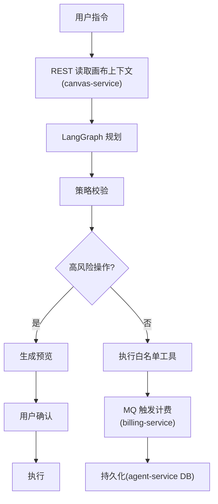

### 5.3 Agent 工具白名单

Agent 不得生成 SQL、直接调用 Repository 或修改画布 JSON，只能调用注册工具：

| 风险等级 | 工具 |
|----------|------|
| 只读 | `get_canvas_summary`、`get_selected_nodes`、`list_models`、`search_assets` |
| 低风险 | `create_nodes`、`connect_nodes`、`layout_nodes`、`update_node_config` |
| 高风险（需确认） | `delete_nodes`、`change_model`、`replace_output`、`submit_generation` |

每个工具定义：Pydantic 输入、权限范围、最大操作数量、是否计费、是否需确认、审计字段。

**确认令牌（Confirmation Token）**：高风险操作必须生成确认令牌，绑定 `user_id` + `canvas_id` + `canvas_version` + 操作摘要哈希 + 过期时间。若确认期间画布版本变化，令牌自动失效。

### 5.4 记忆系统

| 类型 | 存储 | 内容 |
|------|------|------|
| 短期记忆 | Redis（当前会话）+ PostgreSQL（持久） | 最近对话消息、当前画布摘要、最近创建节点 |
| 长期记忆 | PostgreSQL + pgvector（可选扩展） | 文案风格偏好、常用主题、图片风格、分辨率偏好 |

**上下文构建策略**（降低 Token 消耗）：
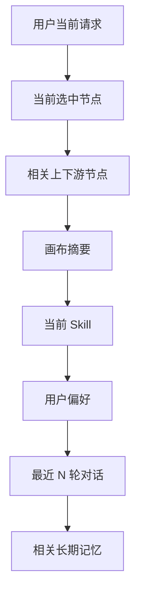

---

## 6. 媒体处理

| 能力 | 工具 | 说明 |
|------|------|------|
| 视频转码/剪辑 | **FFmpeg** CLI | 行业标准，裁剪/转码/拼接/抽帧均通过 `asyncio.create_subprocess_exec` 异步调用 |
| 视频元数据 | **ffprobe** | 读取分辨率、码率、时长、编码格式 |
| 图片处理 | **Pillow** + **OpenCV** | 缩略图生成、格式转换、图片超分前处理 |
| 视频合成 | **FFmpeg concat** | 多视频按时间线拼接 |
| 视频抽帧 | **FFmpeg** | 用户拖动时间轴，提交时间点，Worker 抽帧生成图片节点 |

---

## 7. 实时通信

| 场景 | 协议 | 理由 |
|------|------|------|
| CRUD 查询、任务提交 | **REST** | 标准 HTTP，配合 TanStack Query 缓存 |
| Agent 文本与步骤流 | **SSE** | FastAPI `StreamingResponse` 原生支持，单向推送足够，比 WebSocket 轻量 |
| 单向任务状态更新 | **SSE** | 断线后用 `Last-Event-ID` 补流；无法补流时返回当前任务快照 |
| 文件上传下载 | **S3 预签名 URL** | 客户端直传，不经过 API |

**V1.0 暂不启用**：WebSocket 双向实时协作（多人编辑同一画布）。

### API 规范

- 路径前缀：`/api/v1`
- 资源使用复数名词：`/canvases/{canvas_id}/tasks`
- 写接口支持 `Idempotency-Key`（任务提交、充值回调、点数操作强制要求）
- 错误统一格式：`{code, message, details, request_id, retryable}`
- 时间：ISO 8601 UTC；点数：整数；ID：Snowflake 全局唯一 ID
- 前后端类型契约：
  - Java 服务：SpringDoc 生成 `openapi.json` → `openapi-typescript` → TypeScript 类型
  - Python 服务：FastAPI 内置生成 `openapi.json` → `openapi-typescript` → TypeScript 类型
- 网关统一聚合所有服务的 OpenAPI 文档

---

## 8. 中间件与基础设施

### 8.1 API 网关：Spring Cloud Gateway

#### 8.1.1 选型理由

| 维度 | Spring Cloud Gateway | Nginx | Kong | Traefik |
|------|---------------------|-------|------|---------|
| 微服务适配 | ✅ 原生集成 Nacos 服务发现 | ⚠️ 需 Nginx+Lua/OpenResty | ✅ 插件丰富 | ✅ 自动发现 |
| 动态路由 | ✅ 配置中心推送即生效 | ❌ 需 reload | ✅ Admin API | ✅ 标签驱动 |
| 编程能力 | ✅ Java 生态，自定义 Filter/Predicate | ⚠️ Lua 脚本 | ✅ 多语言插件 | ⚠️ 中间件 |
| 团队统一 | ✅ 与 Java 微服务同一技术栈 | ❌ 额外技术栈 | ❌ 额外技术栈 | ❌ 额外技术栈 |
| 运维复杂度 | 中等（JVM 应用） | 低 | 高 | 中等 |

**结论**：选择 Spring Cloud Gateway——与 Java 微服务技术栈统一，开发团队无需维护额外的网关中间件。

#### 8.1.2 网关职责

```
                 ┌─── 路由转发 ───► identity-service
                 ├─── 路由转发 ───► canvas-service
                 ├─── 路由转发 ───► asset-service
                 ├─── 路由转发 ───► generation-service (Python)
客户端 ──► Gateway ──┼─── 路由转发 ───► agent-service (Python)
                 ├─── 路由转发 ───► billing-service
                 ├─── 路由转发 ───► enterprise-service
                 ├─── 路由转发 ───► gallery-service
                 ├─── 路由转发 ───► admin-service
                 ├─── 统一鉴权（JWT 校验 + 身份透传）
                 ├─── 全局限流（基于 Redis）
                 └─── CORS、日志、OpenAPI 文档聚合
```

**鉴权流程**：
1. 客户端请求携带 JWT → Gateway 校验签名和有效期
2. 校验通过后从 identity-service 获取用户角色权限（缓存 Redis，5min）
3. 以 HTTP Header 形式透传 `X-User-Id`、`X-User-Role`、`X-Enterprise-Id` 给下游服务
4. 下游服务信任 Header 中的身份信息（内部网络隔离）

#### 8.1.3 网关限流

| 限流维度 | 实现方式 | 说明 |
|----------|----------|------|
| 全局 IP 限流 | `RequestRateLimiter` + Redis | 每 IP 100 req/s |
| 用户级限流 | `KeyResolver` + Redis | 基于 `X-User-Id` Header |
| 接口级限流 | 路由级 `filters` 配置 | 登录/注册/生成等敏感接口独立限流 |
| 熔断 | Resilience4j 集成 | 下游服务不可用时快速失败 |

### 8.2 服务注册与发现：Nacos

#### 8.2.1 选型理由

| 维度 | Nacos | Eureka | Consul | Zookeeper |
|------|-------|--------|--------|-----------|
| 服务发现 | ✅ HTTP/DNS/gRPC | ✅ | ✅ | ✅ |
| 配置中心 | ✅ 内置一体化 | ❌ 需额外组件 | ⚠️ KV 存储 | ❌ 需额外组件 |
| 健康检查 | ✅ TCP/HTTP/MySQL | ✅ HTTP | ✅ 多协议 | ⚠️ TCP |
| 动态配置 | ✅ 实时推送、灰度 | ❌ | ⚠️ 需 Consul Template | ❌ |
| Spring Cloud 集成 | ✅ Spring Cloud Alibaba | ✅ Spring Cloud Netflix | ⚠️ 社区支持 | ⚠️ 社区支持 |
| CAP | AP + CP 可切换 | AP | CP | CP |
| 运维复杂度 | 中等（Java 应用） | 中等 | 中等 | 较高 |

**结论**：选择 Nacos——服务发现 + 配置中心合一，Spring Cloud Alibaba 深度集成，阿里大规模验证。

#### 8.2.2 配置管理策略

| 配置类型 | 存储位置 | 刷新方式 |
|----------|----------|----------|
| 数据库连接、Redis 地址 | Nacos 配置中心 | 启动时加载 |
| 限流阈值、熔断参数 | Nacos 配置中心 | 动态刷新（`@RefreshScope`） |
| 业务开关（功能灰度） | Nacos 配置中心 | 动态刷新 |
| 敏感信息（密码、密钥） | 环境变量 / K8s Secret | 不可配置中心存储 |

#### 8.2.3 部署架构

```
Nacos Cluster (3 节点)
    ├── nacos-node-1
    ├── nacos-node-2
    └── nacos-node-3

各微服务启动时注册到 Nacos → Gateway 从 Nacos 拉取实例列表 → 动态路由
```

### 8.3 消息队列：RocketMQ

#### 8.3.1 选型理由

| 维度 | RocketMQ | RabbitMQ | Kafka | Redis Pub/Sub |
|------|----------|----------|-------|---------------|
| 事务消息 | ✅ 原生支持 | ❌ 需自行实现 | ❌ 不原生 | ❌ 不支持 |
| 延迟消息 | ✅ 18 级延迟 | ⚠️ 死信队列变通 | ❌ | ❌ |
| 顺序消息 | ✅ 分区有序 | ⚠️ | ✅ 分区有序 | ❌ |
| 吞吐量 | 十万级 TPS | 万级 TPS | 百万级 TPS | 万级 |
| 运维复杂度 | 中等（Java 应用） | 低 | 较高 | 极低 |
| Java 集成 | ✅ RocketMQ Spring | ✅ spring-amqp | ✅ spring-kafka | ✅ Spring Data Redis |

**结论**：选择 RocketMQ——事务消息是分布式事务的关键依赖，原生支持延迟消息用于超时结算场景，Java 生态集成最优。

#### 8.3.2 Topic 规划

| Topic | 生产者 | 消费者 | 消息类型 | 说明 |
|-------|--------|--------|----------|------|
| `generation-task-created` | billing-service | generation-service | 事务消息 | 冻结成功后通知创建生成任务 |
| `generation-task-completed` | generation-service | billing-service | 普通消息 | 任务完成通知结算 |
| `generation-task-failed` | generation-service | billing-service | 延迟消息 | 任务失败通知解冻 |
| `agent-action-triggered` | agent-service | generation-service | 普通消息 | Agent 触发生成任务 |
| `canvas-snapshot-published` | canvas-service | gallery-service | 普通消息 | 画布发布快照 |
| `billing-points-changed` | billing-service | enterprise-service | 普通消息 | 点数变更通知企业 |
| `outbox-dlq` | Outbox Publisher | admin-service | 普通消息 | 死信队列，人工处理 |

### 8.4 分布式锁方案

#### 8.4.1 使用场景

| 场景 | 锁粒度 | 实现 | 风险 |
|------|--------|------|------|
| 同一画布同时触发多个生成任务 | `lock:canvas:{id}:generate` | Redisson / Redis `SET NX PX` | 节点状态冲突、计费重复 |
| XXL-JOB 多实例去重 | `lock:job:{task_name}:{time_bucket}` | Redisson | 同一定时任务被多次执行 |
| 素材删除检查 | `lock:asset:{id}:delete` | Redisson | 删除期间新引用创建 |
| 点数账户并发扣费 | `lock:billing:account:{user_id}` | Redisson | 作为 PG 行锁的快速失败层 |

#### 8.4.2 双语言实现

| 语言 | 实现方式 | 工具 |
|------|----------|------|
| **Java 服务** | Redisson `RLock` | Redisson 提供可重入锁、自动续期（Watchdog）、公平锁、RedLock |
| **Python 服务** | Redis `SET NX PX` + 自旋重试 | `redis-py` 原生命令，轻量化实现 |

#### 8.4.3 锁粒度与 TTL 规范

| 锁 Key | 最大 TTL | 说明 |
|--------|----------|------|
| `lock:canvas:{id}:generate` | 30s | 任务创建足够，实际生成工作不持锁 |
| `lock:beat:{task_name}:{bucket}` | 120s | 时间分桶（如按分钟）确保幂等 |
| `lock:asset:{id}:delete` | 10s | 删除操作很快 |
| `lock:billing:account:{user_id}` | 5s | 作为 PG 行锁的快速失败层 |

**安全原则**：
- 锁只保护"决策时刻"（如判断是否可以创建任务），不保护"执行过程"（如实际模型推理）
- 所有锁操作必须有超时，避免死锁
- Worker 崩溃时 Redis 自动 TTL 过期释放锁

---

## 9. 并发控制与容错

### 9.1 并发控制方案总览

| 场景 | 方案 | 工具 | 级别 |
|------|------|------|------|
| 点数账户扣费（本地事务） | 悲观锁 `SELECT ... FOR UPDATE` | PostgreSQL | 行级 |
| 画布编辑冲突 | 乐观锁 `version` 字段 | PostgreSQL（MyBatis-Plus `@Version`） | 行级 |
| 同一画布并发生成 | 分布式锁 `lock:canvas:{id}:generate` | Redis（Redisson） | 业务级 |
| 任务状态流转 | 状态机 + `WHERE status = ?` 条件 UPDATE | PostgreSQL | 行级 |
| 定时任务去重 | 分布式锁 `lock:job:*` | Redis（Redisson）/ XXL-JOB 原生路由策略 | 进程级 |
| Agent 高风险操作确认 | 确认令牌（Confirmation Token） | Redis + canvas_version | 业务级 |
| **跨服务分布式事务（计费+生成）** | **Seata AT 模式** / MQ 最终一致性 | Seata / RocketMQ 事务消息 | 跨服务级 |

### 9.2 分布式事务方案

#### 9.2.1 问题场景

在微服务架构下，用户提交生成任务的流程跨多个服务：

```
billing-service → 冻结点数（本地事务）
generation-service → 创建任务（本地事务）
```

如果 billing 冻结成功但 generation 创建失败，需要解冻——这是典型的分布式事务场景。

#### 9.2.2 方案选择矩阵

| 场景 | 方案 | 选型 | 说明 |
|------|------|------|------|
| 计费冻结 → 生成创建 | **RocketMQ 事务消息** | ✅ 首选 | billing 半消息 → 本地事务 → 提交/回滚 MQ；generation 消费创建 |
| 生成完成 → 计费结算 | **RocketMQ 普通消息 + 本地事务** | ✅ 首选 | generation 本地更新状态 → 发送 MQ → billing 消费结算 |
| 充值回调 | **Seata AT 模式** | 备选 | 充值涉及 billing + 第三方网关回调，需要强一致 |
| 点数分配（企业） | **Seata AT 模式** | 备选 | enterprise 分配点数需要同时更新 enterprise + billing 两个服务的数据 |

#### 9.2.3 RocketMQ 事务消息流程（计费冻结 → 生成创建）

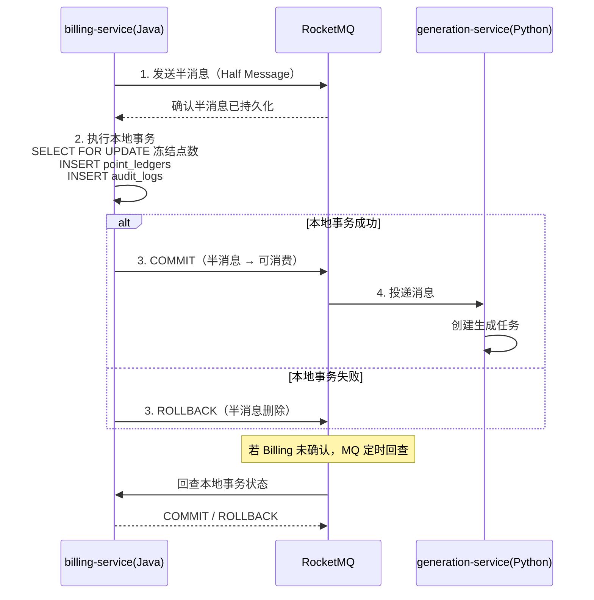

**回查机制**：如果 billing-service 本地事务完成后、发送 COMMIT 前崩溃，RocketMQ 会定时回调 billing-service 的 `checkLocalTransaction` 接口查询事务状态，确保最终一致性。

#### 9.2.4 Seata AT 模式（备选兜底）

对于需要强一致且涉及 3 个以上服务的场景（如季度结算、批量退款），使用 Seata AT 模式：

```
Java 服务集成：seata-spring-boot-starter
Python 服务集成：seata-python（社区适配，或降级为 TCC 模式）
```

**V1.0 策略**：优先使用 RocketMQ 事务消息覆盖 90% 场景，Seata 仅在必要时引入。

### 9.3 事务处理规范（本地事务）

#### 9.3.1 事务边界原则（Java 服务）

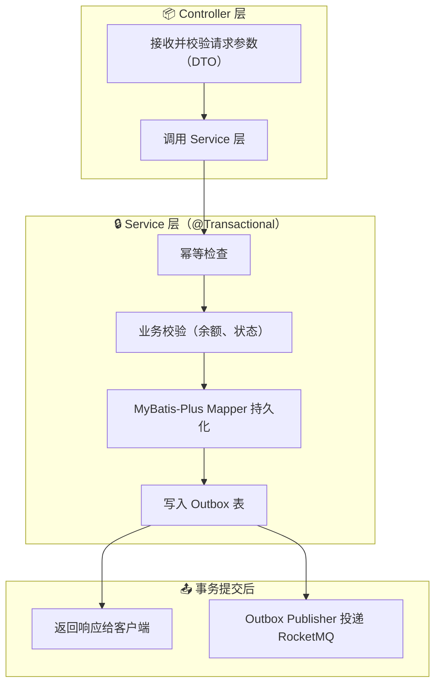

**核心原则**：
- `@Transactional` 仅在 Service 层使用，Controller 层不得标注
- 事务内只做数据库操作，不做外部 I/O（不调 Feign、不发 MQ、不调 API）
- RocketMQ 投递放在事务提交**之后**（通过 Outbox 模式保证可靠性）

#### 9.3.2 Outbox 模式（Java 实现）

```java
// billing-service: PointService.java
@Transactional(rollbackFor = Exception.class)
public FreezeResult freezePoints(FreezeRequest request) {
    // 1. 幂等检查
    var existing = pointLedgerMapper.selectByIdempotencyKey(request.idempotencyKey());
    if (existing != null) return FreezeResult.from(existing);

    // 2. 悲观锁锁定账户
    var account = pointAccountMapper.selectByUserIdForUpdate(request.userId());

    // 3. 业务校验
    if (account.getBalance() < request.cost()) {
        throw new InsufficientPointsException(...);
    }

    // 4. 更新余额 + 冻结记录 + 流水（同一事务）
    account.setBalance(account.getBalance() - request.cost());
    pointAccountMapper.updateById(account);
    var reservation = pointReservationMapper.insert(...);
    pointLedgerMapper.insert(...);

    // 5. 写入 Outbox 事件（事务内）
    outboxEventMapper.insert(new OutboxEvent(
        "generation-task-created",
        Map.of("taskId", request.taskId(), "reservationId", reservation.getId())
    ));

    return FreezeResult.success(reservation.getId());
}
// 事务提交后 → OutboxPublisher 定时扫描 → 投递 RocketMQ → 标记已投递
```

#### 9.3.3 并发扣费完整流程（若在同一服务内）

当 billing 和 generation 逻辑在同一服务本地事务内时（V1.0 简化方案），使用以下流程。跨服务事务使用 §9.2 的方案。

```java
@Transactional(rollbackFor = Exception.class, isolation = Isolation.REPEATABLE_READ)
public FreezeResult freezeAndCreateTask(FreezeRequest request) {
    // 1. 幂等检查
    OutboxEvent existing = outboxEventMapper.selectByIdempotencyKey(request.idempotencyKey());
    if (existing != null) return existing.getResult();

    // 2. SELECT ... FOR UPDATE 锁定账户
    PointAccount account = pointAccountMapper.selectByUserIdForUpdate(request.userId());

    // 3. 业务校验
    if (account.getBalance() < request.cost()) throw new InsufficientPointsException();
    if (!account.getActive()) throw new AccountFrozenException();

    // 4. 更新余额
    account.setBalance(account.getBalance() - request.cost());
    pointAccountMapper.updateById(account);

    // 5. 流水 + 冻结（INSERT only）
    PointReservation reservation = pointReservationMapper.insert(new PointReservation(...));
    pointLedgerMapper.insert(new PointLedger(...));

    // 6. Outbox（事务内写入）
    outboxEventMapper.insert(new OutboxEvent("generation-task-created", taskId));

    return FreezeResult.success(reservation.getId());
}
// 事务提交后 OutboxPublisher 投递 RocketMQ → generation-service 消费
```

### 9.4 限流方案

#### 9.4.1 分层限流架构

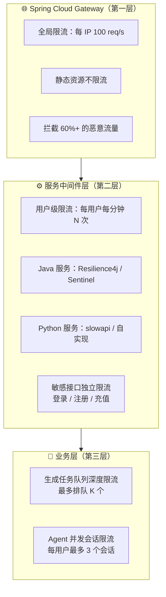

#### 9.4.2 限流算法选型

| 场景 | 算法 | 实现 | Redis Key 模式 |
|------|------|------|----------------|
| 全局限流（Gateway） | 漏桶（Leaky Bucket） | Spring Cloud Gateway `RequestRateLimiter` | `request_rate_limiter:{route}:{key}` |
| 用户请求限流 | **滑动窗口**（Sliding Window） | Redis `ZSET` + Lua | `rate:user:{user_id}:{endpoint}:{window}` |
| 登录防爆破 | **固定窗口 + 递增冷却** | Redis `INCR` + TTL | `rate:login:{ip}:{window}` |
| 生成任务排队 | **令牌桶**（Token Bucket） | Redis `SET` + 定时补充 | `rate:gen_queue_depth:{queue_name}` |
| SSE 连接数 | 简单计数器 | Redis `INCR/DECR` | `rate:sse_conn:{user_id}` |

#### 9.4.3 各接口限流阈值

| 接口 | 限流粒度 | 阈值 | 超限处理 |
|------|----------|------|----------|
| `POST /auth/login` | IP | 5 次/分钟 | 返回 429 + 递增冷却（1min→5min→15min） |
| `POST /auth/register` | IP | 3 次/小时 | 返回 429 |
| `POST /tasks` (生成) | 用户 | 10 次/分钟 | 返回 429 + 队列深度提示 |
| `GET /canvases` | 用户 | 60 次/分钟 | 返回 429 |
| `POST /canvases/{id}/nodes` | 用户+画布 | 120 次/分钟 | 返回 429 |
| SSE 事件订阅 | 用户 | 5 个并发连接 | 关闭最早的连接 |
| 全局 API | IP | 100 req/s | 返回 429 |

#### 9.4.4 限流降级策略

当 Redis 不可用时（限流数据不可读取）：

| 策略 | 说明 |
|------|------|
| **Fail Open（推荐）** | Redis 不可用时放行所有请求——宁可被刷也不误伤正常用户 |
| 告警 | Redis 连接失败时立即告警 |
| 本地降级 | 可选：使用进程内 `collections.deque` 做粗粒度限流（仅作补充） |

### 9.5 熔断方案

#### 9.5.1 熔断状态机

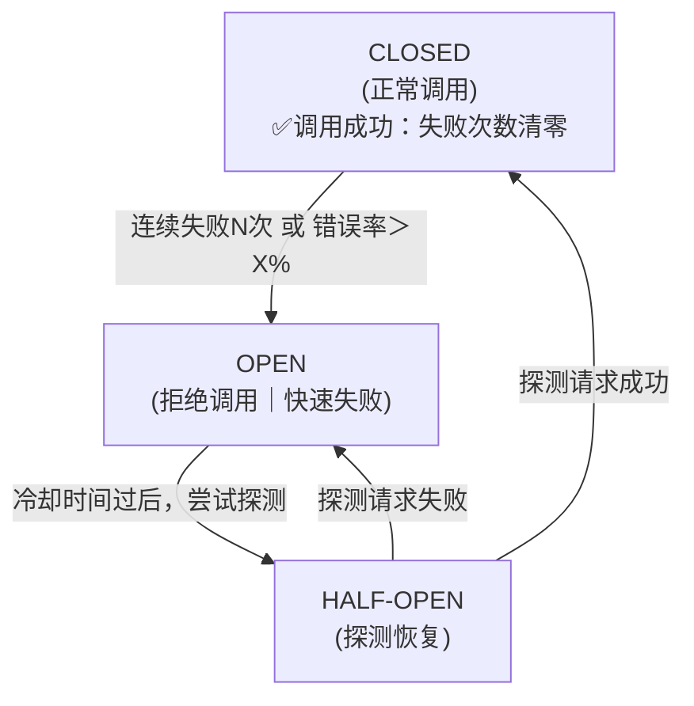

#### 9.5.2 熔断实现

| 语言 | 实现方式 | 说明 |
|------|----------|------|
| **Java 服务** | Resilience4j `@CircuitBreaker` | 注解式声明，与 Spring Boot 深度集成，支持慢调用比例熔断 |
| **Python 服务** | `pybreaker` / 自实现 | 轻量级熔断器，配置阈值与冷却时间 |

#### 9.5.3 熔断配置

| 被保护资源 | 失败阈值 | 错误率阈值 | 冷却时间 | 半开探测次数 | 降级行为 |
|-----------|----------|-----------|----------|-------------|----------|
| ComfyUI（图片） | 连续 5 次 | > 50% / 60s | 60s | 1 次 | 返回"模型繁忙"，任务保持 queued |
| ComfyUI（视频） | 连续 3 次 | > 50% / 120s | 120s | 1 次 | 返回"视频生成暂时不可用" |
| OpenAI API | 连续 3 次 | > 50% / 60s | 30s | 2 次 | 自动切换备用供应商 |
| Redis | 连续 3 次 | N/A | 10s | 1 次 | 限流失效（Fail Open）；缓存穿透 PG |
| 支付网关 | 连续 3 次 | > 50% / 300s | 300s | 1 次 | 订单标记 pending，定时补查询 |
| MinIO | 连续 3 次 | N/A | 30s | 1 次 | 上传功能暂不可用 |
| **跨服务 Feign 调用** | 连续 5 次 | > 50% / 60s | 30s | 2 次 | 返回降级响应；触发告警 |

#### 9.5.4 供应商自动切换

当主供应商熔断时，通过 `FailoverModelRouter` 自动路由到备用供应商——所有供应商通过统一的 `ModelProvider` 协议（§5.1）接入，路由器按顺序尝试，跳过已熔断的供应商，全部不可用时抛出 `AllProvidersUnavailableError`。

### 9.6 分库分表预案

**V1.0 决策：不做分库分表。** 微服务架构下每个服务数据量有限，各服务独立 PostgreSQL 在合理索引和优化下，单表千万级数据完全可承载。

**后续触发条件**：

| 指标 | 阈值 | 说明 |
|------|------|------|
| 单表行数 | > 5000 万 | 主要是 `point_ledgers`、`generation_tasks`、`audit_logs` |
| 写入 QPS | > 5000 | 集中在生成任务提交和计费流水 |
| 单表占用 | > 200 GB | 影响备份和迁移时间 |

**达到阈值后的分片策略预案**：

| 表 | 分片键 | 分片方式 | 说明 |
|----|--------|----------|------|
| `point_ledgers` | `user_id` 哈希 | PG 分区表 / Citus | 流水仅通过 user_id 查询，天然适合按用户分片 |
| `generation_tasks` | `created_at` 月份 | PG 范围分区 | 按时间范围分区，配合归档策略 |
| `audit_logs` | `created_at` 月份 | PG 范围分区 | 同上 |
| `canvas_nodes` | `canvas_id` 哈希 | PG 分区表 | 画布自包含，按画布分片不产生跨片查询 |
| 其他表 | — | 读副本扩展 | 大部分表 V1.5 阶段仅需读写分离即可 |

**分片中间件倾向**：优先使用 PostgreSQL 原生分区表（v17 功能成熟），避免引入额外的中间件复杂度。只有需要跨库分片时才考虑应用层路由或 Citus。

---

## 10. 开发工具与基础设施

### 10.1 开发环境

| 能力 | 选型 | 理由 |
|------|------|------|
| 环境编排 | **Docker Compose** | 一键启动：Nacos + RocketMQ + PostgreSQL + Redis + MinIO + 各微服务 + Web |
| Java 构建工具 | **Maven**（推荐） / **Gradle** | Maven 稳定性高，团队经验丰富；Gradle 构建速度快 |
| Java 版本管理 | **sdkman** / **jabba** | JDK 多版本管理 |
| Java 包管理 | Maven Central + 阿里云镜像 | 国内加速 |
| Python 包管理 | **uv** | 比 Poetry/pip 快 10-100x，锁文件清晰 |
| Java 代码规范 | **Checkstyle** + **SpotBugs** | 静态分析 + Bug 检测 |
| Python 代码规范 | **Ruff** + **mypy** | Ruff 替代 Flake8/Black/isort；mypy 做静态类型检查 |
| 前端代码规范 | **ESLint** + **Prettier** | 统一代码风格 |
| Git 分支策略 | **Git Flow** | `main` + `dev` + `feature/*`，PR 尽量 < 400 行 |
| API 文档 | **SpringDoc**（Java） + **FastAPI OpenAPI**（Python） | 网关聚合 Swagger UI |
| 日志 | **Logback**（Java）+ **structlog**（Python） | 结构化日志，统一输出到 ELK |

### 10.2 测试体系

| 层级 | 工具 | 覆盖内容 |
|------|------|----------|
| Java 单元 | **JUnit 5 + Mockito** | Service 逻辑、状态机、权限校验 |
| Java 集成 | **Spring Boot Test + Testcontainers** | PostgreSQL 事务、Redis、Outbox、RocketMQ |
| Python 单元 | **pytest** | 生成规则、Agent 状态机、参数校验 |
| Python 集成 | **pytest + Testcontainers** | PostgreSQL 事务、Redis、Celery、并发冻结 |
| 前端单元 | **Vitest + Testing Library** | 节点组件、Store、权限状态 |
| 契约 | **OpenAPI diff + Schemathesis** | 请求响应、错误码、兼容性 |
| 端到端 | **Playwright** | 创建画布、生成、Agent 确认、失败解冻 |
| 性能 | **k6** | API P95、并发任务、SSE |
| 混沌 | **Chaos Mesh**（可选） | 服务故障注入、降级验证 |

### 10.3 CI 门禁

每个 PR 依次执行：
1. **代码规范**：Checkstyle / SpotBugs / Ruff / mypy / ESLint
2. **单元测试**：JUnit（核心计费 ≥90% 分支覆盖）+ pytest
3. **数据库迁移测试**：Flyway（Java）+ Alembic（Python）
4. **OpenAPI 破坏性变更检测**
5. **集成测试**：Spring Boot Test + Testcontainers + pytest
6. **E2E Smoke**：Playwright
7. **构建测试镜像**

---

## 11. 完整技术栈总览

### 11.1 前端技术栈

| 层级 | 选型 | 版本/备注 |
|------|------|-----------|
| **前端框架** | React + TypeScript | React 18/19, TS 5.x |
| **构建工具** | Vite | 5/6 |
| **画布引擎** | @xyflow/react（React Flow） | 最新稳定大版本 |
| **状态管理（本地）** | Zustand | 最新 |
| **状态管理（服务端）** | TanStack Query | v5 |
| **UI 样式** | Tailwind CSS | v3/v4 |
| **无障碍组件** | Radix UI | 最新 |
| **图标** | Lucide React | 最新 |
| **富文本** | TipTap | 最新 |
| **代码编辑** | CodeMirror 6 | 最新 |
| **自动布局** | ELK.js | 最新 |
| **导演台** | react-konva | 最新 |
| **拖拽** | dnd-kit | 最新 |
| **音频** | WaveSurfer.js | 最新 |
| **图表** | Apache ECharts | 最新 |
| **包管理（前端）** | pnpm | 9.x |

### 11.2 Java 技术栈（业务微服务）

| 层级 | 选型 | 版本/备注 |
|------|------|-----------|
| **语言** | Java | 21 LTS |
| **框架** | Spring Boot | 3.x |
| **微服务治理** | Spring Cloud | 2024.x |
| **Web 层** | Spring WebFlux（推荐） | Reactor 异步非阻塞 |
| **ORM** | MyBatis-Plus | 3.5.x |
| **数据库迁移** | Flyway | 最新 |
| **连接池** | HikariCP | Spring Boot 内置 |
| **参数校验** | Jakarta Validation | Hibernate Validator |
| **API 文档** | SpringDoc OpenAPI | 2.x |
| **远程调用** | Spring Cloud OpenFeign | 最新 |
| **负载均衡** | Spring Cloud LoadBalancer | 最新 |
| **服务熔断** | Resilience4j | 最新 |
| **分布式锁** | Redisson | 最新 |
| **构建工具** | Maven | 3.9.x |
| **代码规范** | Checkstyle + SpotBugs | 最新 |

### 11.3 Python 技术栈（Agent 微服务）

| 层级 | 选型 | 版本/备注 |
|------|------|-----------|
| **语言** | Python | 3.12.x |
| **Web 框架** | FastAPI | 0.115+ |
| **ASGI 服务器** | Uvicorn | 最新稳定 |
| **数据校验** | Pydantic | v2 |
| **ORM** | SQLAlchemy | 2.0.x |
| **数据库迁移** | Alembic | 最新稳定 |
| **异步驱动** | asyncpg | 最新 |
| **异步任务** | Celery + Redis Broker | 5.x |
| **消息对接** | rocketmq-client-python | 最新 |
| **包管理** | uv | 最新 |
| **代码规范** | Ruff + mypy | 最新 |

### 11.4 基础设施

| 层级 | 选型 | 版本/备注 |
|------|------|-----------|
| **主数据库** | PostgreSQL | 17（每个微服务独立 DB） |
| **缓存** | Redis | 7.x |
| **消息队列** | Apache RocketMQ | 5.x |
| **服务注册发现** | Nacos | 2.x |
| **配置中心** | Nacos Config | 2.x |
| **API 网关** | Spring Cloud Gateway | 最新 |
| **分布式事务** | Seata（备选） + RocketMQ 事务消息 | 1.x / 5.x |
| **定时任务** | XXL-JOB | 2.x |
| **对象存储** | MinIO（S3 协议） | 最新稳定 |
| **AI 图像/视频** | ComfyUI API | 独立进程 |
| **Agent 框架** | LangGraph | 最新稳定 |
| **Agent 可视化（可选）** | LangFlow | 独立进程 |
| **多 Agent 协作（可选）** | AutoGen | 复杂场景备选 |
| **向量检索（可选）** | pgvector | PostgreSQL 扩展 |
| **媒体处理** | FFmpeg + ffprobe | 6.x/7.x - Python 服务调用 |
| **图片处理** | Pillow + OpenCV | 最新 |

### 11.5 测试与运维

| 层级 | 选型 | 版本/备注 |
|------|------|-----------|
| **Java 单元测试** | JUnit 5 + Mockito | 最新 |
| **Java 集成测试** | Spring Boot Test + Testcontainers | 最新 |
| **Python 测试** | pytest + Testcontainers | 最新 |
| **前端测试** | Vitest + Testing Library + Playwright | 最新 |
| **性能测试** | k6 | 最新 |
| **环境编排** | Docker Compose（开发） | — |
| **容器编排（生产）** | Kubernetes（可选） | — |
| **日志** | Logback（Java）+ structlog（Python） | 结构化日志 |

---
